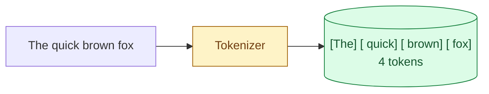
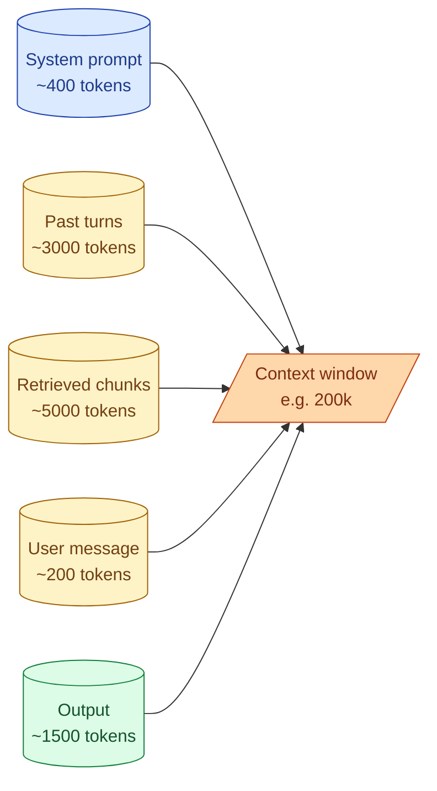

Models do not read text the way you do. They read tokens. A token is the smallest piece of input the model can handle, somewhere between a single character and a whole word. The context window is the maximum number of tokens the model can hold at once, including everything you send and everything it sends back. If you do not have a feel for these two ideas, your cost estimates will be wrong, your prompts will silently truncate, and you will spend an afternoon debugging a problem that has nothing to do with your code.

## What a token actually is

A token is roughly four English characters or three-quarters of a word, but the real answer is "it depends on the tokenizer." Each model family has its own tokenizer, and they disagree.



Notice that the leading space is part of the token, not a separator. " brown" is a different token from "brown". This trips people up the first time they try to count by hand.

```python
import tiktoken
enc = tiktoken.encoding_for_model("gpt-4o")
print(enc.encode("The quick brown fox"))
# [791, 4062, 14198, 39935]   -> 4 tokens
print(enc.encode("hello"))
# [15339]                     -> 1 token
print(enc.encode("antidisestablishmentarianism"))
# 5 tokens                     -> long words get split
```

Code, JSON, and non-English text are usually heavier per character. A line of Python often costs 2 tokens per word. Bengali or Tamil text can be 3 to 5 tokens per visible character because the tokenizer was not trained for them. If you are processing logs full of UUIDs or hashes, expect many tokens per "word" of output.

## The context window is a hard budget

The context window is the number of tokens the model can see in one call. Everything goes into it: system prompt, conversation history, retrieved context, the user's latest message, the model's output.



Go over the limit and the provider returns an error. There is no automatic truncation. There is no "best effort." The request fails.

Modern models have generous windows. As of 2026, Claude and Gemini are usually 200k-1M tokens, GPT is 128k-1M depending on the variant. That feels like a lot until you put in a long PDF and a chat history.

## "Big context window" is not the same as "uses it well"

This is the most common surprise for people new to AI engineering. The fact that a model accepts 1M tokens does not mean it pays equal attention to all of them.

Models tend to focus on the start and the end of the context. The middle gets glossed over. This is sometimes called the "lost in the middle" effect. It is well documented and it is still real.

```
Position in context:   start   middle   end
Model attention:        ████   ░░░░    ████
```

Two practical consequences:

1. The most important information goes at the start or the end of your prompt. Not buried in the middle.
2. Long contexts are not free, even when they fit. Quality usually drops past 30-50k tokens for most models.

Filling the whole context window because you can is one of the most expensive mistakes you can make.

## Tokens are also money and time

Two costs scale with tokens. The price you pay (per million input and output tokens, with output usually 3-5x more expensive). The latency, especially the prompt-processing time on long inputs. A 200k token prompt is not just expensive, it is slow.

This is why you build a habit of counting tokens before you ship a prompt. A 30% reduction in prompt size translates roughly to 30% off the bill and 30% off the latency. There is no other lever this big.

## Counting tokens in practice

You do not need to be exact. You need to be in the right order of magnitude.

```python
# Quick and good enough for estimates
def estimate_tokens(text: str) -> int:
    return len(text) // 4

# For real cost math, use the actual tokenizer
import tiktoken
enc = tiktoken.encoding_for_model("gpt-4o")
def exact_tokens(text: str) -> int:
    return len(enc.encode(text))
```

For Claude, use Anthropic's `count_tokens` API or the tokenizer in the SDK. For Llama and Mistral, use their respective tokenizers via Hugging Face. Each model family has its own tokenizer; results differ.

Wire token counting into your dev loop on day one. When you print a prompt for debugging, also print its token count. When you store a prompt template, store its expected token usage. This habit pays for itself within a week.

## What happens when you hit the limit

The provider returns a 400 error with a message like "exceeds maximum context length." Your code has to handle it before you send the request, not after.

The usual responses, in order of preference:

1. **Trim the inputs.** Drop old conversation turns. Drop retrieved chunks ranked at the bottom. Compress the system prompt.
2. **Summarize older turns.** Replace 20 old messages with one model-generated summary of "what we have discussed so far."
3. **Switch to a model with a bigger context.** Last resort. The bigger window costs more and is often slower.

If you regularly need 100k+ tokens of context, you probably need retrieval (Stage 3), not a bigger window.

## Common mistakes

- **Counting words instead of tokens.** Off by ~30% for English, much more for code or non-Latin scripts.
- **Forgetting the output counts.** "I have 199k tokens of input on a 200k window, plenty of room" then the response is 5k tokens and you get a 400.
- **Treating long context as free.** Quality drops. Cost climbs. Latency spikes.
- **Burying the important bit in the middle.** The model glosses over it. Put it at the start or the end.
- **Not counting tokens at dev time.** You ship a prompt that is 8k tokens when 2k would have done.

## Quick recap

- A token is the model's unit of input. Roughly 4 English characters, but the real number depends on the tokenizer.
- The context window is the budget for input + output combined. Go over and the call fails.
- A big window is not a license to fill it. Models pay less attention to the middle, latency climbs, cost climbs.
- Put the important content at the start or end of the prompt. Compress, trim, or retrieve instead of dumping everything in.
- Count tokens in your dev loop. The habit catches expensive mistakes before they ship.

This concept sits in **Stage 1 (Foundations: working with LLMs)** of the [AI Engineering Roadmap](/practice/ai-engineering/roadmap/).
