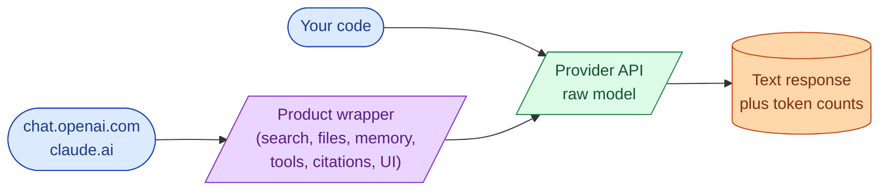

When you call the API, you do not get the experience you got on chat.openai.com or claude.ai. You get the raw model. The chat product is a wrapper around the model that does a lot of useful things: file uploads, web search, citations, memory, code execution, voice, and a polished UI. The API does none of that for you. If you assume otherwise, you ship something that looks 80% as good as the chat product and you do not understand why.

## What you actually get from the API



The right column is the model. The middle box is the product. When you build with the API, you are starting where the middle box does. Everything inside it is yours to build, buy, or skip.

## The features that look free but are not

Here is the list of things people assume work in the API because they work in the chat product:

| Feature | In the chat product | In the API |
| --- | --- | --- |
| Web search | yes, with citations | no, you build it |
| File upload (PDF, images) | yes, parsed inline | partial: vision models accept images, PDFs you parse yourself |
| Persistent memory across sessions | yes (some) | no, you store it |
| Code execution | yes, sandboxed | no, you sandbox it |
| Citation formatting | yes, automatic | no, you prompt for it |
| Refusal explanations | usually | bare-bones, you handle the UX |
| Conversation history | yes, kept by the product | no, you send it on every call |

That last row is the one that catches everyone. Each API call is stateless. If you want the model to remember the previous turn, you send the previous turn on this turn. If the chat is 30 turns deep, every call ships 30 turns.

## The "but ChatGPT does it" trap

You will hit this on day two. A stakeholder says "ChatGPT can read a PDF, why can't ours." The honest answer is: "ChatGPT-the-product reads the PDF, extracts text, possibly calls a vision model, sends the result to the model, and presents the answer with citations. We can build all of that, but it is four pieces of work, not one."

The same is true for "ChatGPT can search the web," "ChatGPT remembers what I told it last week," "ChatGPT runs code for me." None of these are properties of the model. They are products built on top of the model.

Knowing this protects you in two ways:

1. You scope work honestly. "Yes, we can add PDF support. It is a parsing step plus a vision call plus prompt tuning. About a week."
2. You stop trying to coerce the raw model into doing things it was never going to do. Hallucinated URLs, made-up citations, and confident wrong answers about "yesterday's news" are the model trying to fake a feature it does not have.

## What the raw model actually is good at

Strip away the product layer and the model is excellent at:

- Reading text and producing text in a specific shape.
- Reasoning over the context you put in front of it.
- Picking from a finite list of options when asked clearly.
- Following structured output instructions.
- Writing code that compiles, given a clear spec.
- Summarizing, classifying, extracting, transforming.

The model is bad at, or rather honest about, anything it cannot see. It cannot see the internet. It cannot see your database. It cannot see the file you uploaded if your code did not parse it and put the text in the prompt. If you want any of those, you wire them in.

## A small example

The chat product, in your head:

```
You upload invoices.pdf
ChatGPT: "I'll read the invoice. The total is $1,247.50, items are..."
```

The API, in code:

```python
# Step 1: you read the PDF
text = pdf_to_text("invoices.pdf")

# Step 2: you send the text to the model
resp = client.messages.create(
    model="claude-3-7-sonnet",
    max_tokens=1024,
    messages=[{
        "role": "user",
        "content": f"Extract line items from this invoice:\n\n{text}"
    }]
)

# Step 3: you parse the response (or use structured outputs)
print(resp.content[0].text)
```

Step 1 is yours. Step 3 is yours. The product handles all three for you. The API hands you only step 2.

## When to use which

The chat product is right when:

- You are exploring what the model can do.
- You are writing a one-off doc, code review, or analysis for yourself.
- A non-engineer needs to use AI directly.

The API is right when:

- You are building a feature for users.
- You need control over the prompt, model, and output.
- You need to log, evaluate, and price the work.
- You need the call to be repeatable in CI.

Most of this roadmap is about the API. The chat product is a fine place to test ideas before you write code.

## Common mistakes

- **Promising a feature because "the chat product does it."** It does not exist in the API; budget the work.
- **Asking the model for real-time info.** The model has no internet. Use retrieval, tool calls, or just decline the request.
- **Expecting memory between API calls.** Each call is stateless. You manage the state.
- **Confusing model versions with product features.** "GPT-4o can do voice" refers to the multimodal model, not a feature you get for free when you call the text completion endpoint.
- **Treating the playground as the API.** Playgrounds often pre-fill system prompts, tools, and parameters that your code does not have.

## Quick recap

- The model is the raw capability. The chat product is everything the company wrapped around it.
- File parsing, web search, memory, code execution, citations: built into the product, not into the model.
- The API is stateless. You ship the conversation history every call.
- Use the chat product to explore. Use the API to build.
- When a stakeholder says "ChatGPT can do this," they mean the product. Scope accordingly.

This concept sits in **Stage 1 (Foundations: working with LLMs)** of the [AI Engineering Roadmap](/practice/ai-engineering/roadmap/).
