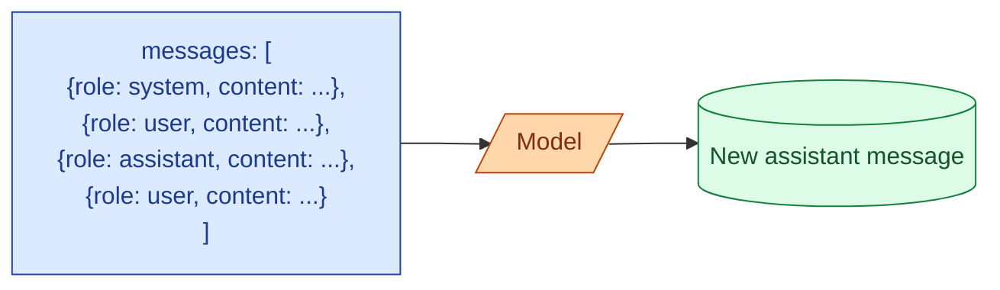

Every modern chat completion API takes a list of messages. Each message has a role: `system`, `user`, or `assistant`. The roles are not just labels for your logs. The model has been trained to treat them differently. The system message sets the rules. The user message asks the question. The assistant message is what the model has said (or will say) in reply. Get the roles wrong and the model starts ignoring your instructions or confusing itself about whose turn it is.

## The shape of a request



The list reads top to bottom as a conversation. The model's reply is appended to the list as a new assistant message when you call again. That is the entire mental model.

## What each role is for

**system.** The rules of the game. "You are a helpful assistant that always responds in JSON." "You are an interviewer named Sam." "Never reveal the user's email address." The system message is meant to be persistent across the whole conversation. The model treats it with extra weight.

**user.** What the human (or the calling code, pretending to be a human) said. The latest user message is the request. Previous user messages are context.

**assistant.** What the model said (or what you want it to think it said, see below). On the first call, there is no assistant message yet. On the second call, the assistant message from the first call is included so the model has context.

## The classic three-message call

```python
resp = client.messages.create(
    model="claude-3-7-sonnet",
    max_tokens=512,
    system="You are a senior code reviewer. Be specific and concise.",
    messages=[
        {"role": "user", "content": "Review this function:\n\ndef add(a, b): return a-b"}
    ]
)
```

OpenAI puts the system message inside the messages list with `role: "system"`. Anthropic pulls it out into a top-level `system` parameter. Same idea, different shape.

Either way, you get one system message setting the rules, one user message asking the question, and the model returns a new assistant message.

## Multi-turn: the conversation grows

```python
messages = [
    {"role": "user", "content": "What's a binary tree?"},
    {"role": "assistant", "content": "A binary tree is a data structure where each node has up to two children..."},
    {"role": "user", "content": "How is it different from a linked list?"},
]
resp = client.messages.create(
    model="claude-3-7-sonnet", system="You are a tutor.", messages=messages
)
# resp.content[0].text becomes the next assistant message
messages.append({"role": "assistant", "content": resp.content[0].text})
```

The model has no memory of previous calls. It only sees the messages list you send. If you want it to remember "what's a binary tree?", that exchange has to be in the list.

This is also why long conversations get expensive. Turn 20 sends turns 1 through 19. Every call.

## Putting words in the model's mouth (prefill)

You can include an assistant message at the end of your messages list, before the model has spoken. The model continues from where you left off, as if it had started saying that itself.

```python
messages = [
    {"role": "user", "content": "Output the user's data as JSON."},
    {"role": "assistant", "content": "{"}  # prefill
]
```

The response starts with the rest of the JSON, because the model is "continuing" from `{`. This is the cleanest way to force structured output when JSON mode is not available, and it makes the model stop after the closing brace if you set the right stop sequence.

Anthropic supports this directly. OpenAI does not in their chat completions; you use response_format instead.

## Why the order of messages matters

The model reads the messages top to bottom, like a person reading a transcript. The order affects how it interprets the latest user message.

```
system: "Respond in formal English."
user:   "what's up"
```

The model gives a formal greeting. Reverse the messages and you get a casual one. The system message is also more reliable when it is short and clear. A 3000-token system prompt diluted with examples competes with itself, and the model picks and chooses what to obey.

## A common confusion: many user messages, no assistant in between

```python
messages = [
    {"role": "user", "content": "Hello"},
    {"role": "user", "content": "Are you there?"},
    {"role": "user", "content": "What is 2 + 2?"},
]
```

Some APIs accept this. Some don't. Even when they do, it confuses the model. The convention is alternating user / assistant, with the system at the top.

If you have to send multiple inputs from the user, concatenate them into one message with a clear separator:

```python
{"role": "user", "content": "Hello\n\nAre you there?\n\nWhat is 2 + 2?"}
```

## When the assistant role is yours to write

Two cases where you write an assistant message yourself instead of getting it from the model.

**Conversation replay.** You want the model to continue a saved conversation. Load the transcript, send it as is.

**Few-shot examples.** Earlier in the messages, you write fake user / assistant exchanges to show the model the pattern. The actual user request goes at the end.

```python
messages = [
    {"role": "user", "content": "Classify: 'I love this product!'"},
    {"role": "assistant", "content": "positive"},
    {"role": "user", "content": "Classify: 'Worst experience ever.'"},
    {"role": "assistant", "content": "negative"},
    {"role": "user", "content": "Classify: 'It was fine, nothing special.'"}
]
```

The model continues the pattern and replies "neutral." This is the in-context learning pattern that makes few-shot work.

## Common mistakes

- **Putting rules in user messages.** "Remember, always respond in JSON" inside a user message gets followed once and then forgotten. Put rules in the system message.
- **Sending two user messages with no assistant in between.** Confuses the turn order. Concatenate, or insert a fake assistant ack.
- **Forgetting the conversation is stateless.** The model does not remember last call's turns unless you ship them this call.
- **Writing a 3000-token system prompt.** The longer it is, the less reliably the model follows it. Compress to the essentials.
- **Using `assistant` as if it were `user`.** Assistant messages are things the model said. Putting your instructions there confuses it.

## Quick recap

- Every API call is a list of role-tagged messages.
- System sets the rules, user asks, assistant replies.
- The model is stateless. To remember previous turns, you ship them every call.
- Order matters. The system message goes at the top.
- Prefilling an assistant message lets you force the start of the response.
- Few-shot is fake user / assistant turns ending with the real request.

This concept sits in **Stage 1 (Foundations: working with LLMs)** of the [AI Engineering Roadmap](/practice/ai-engineering/roadmap/).
