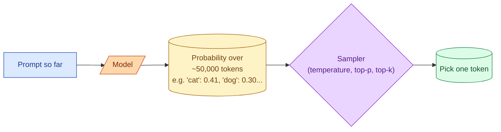
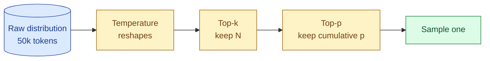

A model does not pick the next token deterministically. At each step it computes a probability distribution over the whole vocabulary and samples one. Temperature, top-p, and top-k are three knobs that change how that sampling works. They control how random the output is, in three different ways. In practice you usually set temperature, sometimes set top-p, and almost never touch top-k. Knowing why is the difference between a confident answer in an interview and "I think they all do roughly the same thing."

## What the model is doing at each step



The model produces a distribution. The sampler picks. All three knobs work on what the sampler sees and how it picks.

## Temperature: how sharp the distribution is

Temperature reshapes the probability distribution before sampling. Low temperature makes high-probability tokens even more dominant. High temperature flattens everything out.

```
T = 0.0:   'cat': 0.99, 'dog': 0.01, 'fish': 0.00, ...   -> always 'cat'
T = 0.7:   'cat': 0.55, 'dog': 0.25, 'fish': 0.10, ...   -> usually 'cat'
T = 1.5:   'cat': 0.30, 'dog': 0.22, 'fish': 0.18, ...   -> often 'dog' or 'fish'
```

Temperature 0 is as close to deterministic as the API offers. Same prompt, same model, same seed (if exposed), and you usually get the same output. "Usually" because providers still ship small non-determinism even at 0 due to batching and floating-point edge cases.

Temperature 0.7 is a common default for "natural sounding" responses. Temperature 1.0 is the model's untouched distribution.

The honest map:

| Temperature | Use case |
| --- | --- |
| 0.0 | Classification, extraction, code generation, structured outputs. Anything where there is one right answer. |
| 0.3-0.7 | Conversational chat, explanations, summarisation. |
| 0.7-1.0 | Creative writing, brainstorming, generating multiple ideas. |
| > 1.0 | Rare in production. Sometimes used to force diversity in batch generation. |

## Top-p (nucleus sampling): cap the cumulative probability

Top-p truncates the distribution to the smallest set of tokens whose combined probability is at least `p`. Everything outside that nucleus is ignored before sampling.

```
T = 1.0 (no temp change), distribution sorted:
  'cat':   0.40
  'dog':   0.25
  'fish':  0.15   <- top_p = 0.8 cuts here (0.40 + 0.25 + 0.15 = 0.80)
  'bird':  0.10
  'cow':   0.05
  ...
```

With `top_p=0.8`, the sampler picks among cat / dog / fish only. The long tail of unlikely tokens is gone.

Top-p prevents the model from picking very low-probability tokens, the kind that produce odd word choices or random topic shifts. The lower the `p`, the more conservative. `p=0.9` to `1.0` is typical. `p=0.5` is aggressive and rarely needed.

## Top-k: keep the K most likely tokens

Top-k truncates the distribution to the K most likely tokens, regardless of their probabilities.

```
top_k=3:   keep 'cat', 'dog', 'fish'.   Drop the rest.
top_k=50:  keep the top 50.
```

This is the bluntest of the three knobs. It does not care whether `top_k=10` covers 99% of the mass or 30% of it. Most providers expose temperature and top-p but only some expose top-k (Anthropic does, OpenAI's chat completions does not).

In practice top-k is rarely useful. Top-p does the same job adaptively.

## How they interact



Order matters. Temperature reshapes first, then top-k filters, then top-p filters, then the sampler picks. Setting all three with low values is over-constraining; they compound.

A clean default for production:

- **temperature**: pick deliberately, document why.
- **top_p**: leave at provider default (usually 1.0) unless you have a specific problem.
- **top_k**: do not set unless you know exactly why.

## "Deterministic" is mostly a lie

People assume `temperature=0` means "same input, same output, always." It does not, quite.

Providers still ship sources of randomness even at 0:

- Batching. Other users' calls in the same batch can change tie-breaking.
- Hardware variation. GPU non-determinism in matrix multiplies.
- Quiet model updates. Today's `claude-3-7` might not be the same weights as yesterday's, if a minor revision shipped.

Pin the model version where the provider supports it (`claude-3-7-sonnet-20260301` vs `claude-3-7-sonnet-latest`). Even then, run the same prompt twice and expect ~95% identical output, not 100%. This is why you cannot test LLM systems with `assert output == "expected"`. It is also Stage 5's whole point.

## When to actually change these

| Symptom | Knob | Direction |
| --- | --- | --- |
| Output is too random, picks weird words | temperature | down |
| Output is repetitive, never tries new phrases | temperature | up |
| Output occasionally goes off-topic | top_p | down |
| You need structured output and small variation breaks it | temperature | 0 |
| You want N different outputs from the same prompt | temperature | up + n>1 |

For most production tasks, you set temperature to either 0 (when you want repeatability) or 0.7 (when you want sensible variation), leave top_p alone, and ignore top_k. The other 90% of "quality issues" come from prompt design, not sampling parameters.

## Common mistakes

- **Tuning all three at once.** You cannot tell which one helped. Change one at a time.
- **Setting `temperature=0` and assuming the result is reproducible.** It usually is not, perfectly.
- **Cranking `top_p` very low to "stop hallucinations."** It does not. Hallucinations are about content, not sampling. Better prompt or retrieval.
- **Using `top_k` because you saw it in a tutorial.** Top-p does the same job adaptively and is provider-agnostic.
- **Ignoring sampling for classification tasks.** Use `temperature=0` so the label is stable.

## Quick recap

- The model produces a distribution; the sampler picks. Temperature, top-p, top-k change what the sampler sees.
- Temperature reshapes how sharp the distribution is. 0 for deterministic-ish, 0.7 for natural, 1.0 for varied.
- Top-p truncates to the smallest nucleus that sums to `p`. Good safety belt against weird tail tokens.
- Top-k truncates to the top K tokens. Bluntest tool. Usually unnecessary if you have top-p.
- "Temperature 0 is deterministic" is mostly true and not quite reliable. Plan for tests that tolerate small variation.
- In production: set temperature deliberately, leave top-p and top-k alone unless you have a real reason.

This concept sits in **Stage 1 (Foundations: working with LLMs)** of the [AI Engineering Roadmap](/practice/ai-engineering/roadmap/).
