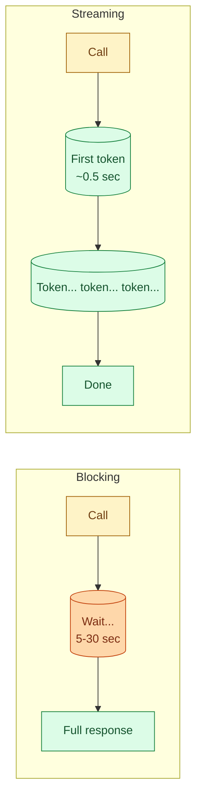

You have two ways to call a chat model. Blocking, where you wait for the whole response before doing anything. Streaming, where the model sends tokens as they are generated and you display them as they arrive. Same prompt, same tokens out, same cost. The only difference is when the user starts seeing output. That difference is usually the difference between a feature that feels responsive and one that feels broken.

## What the calls look like



Both produce the same final text. Both cost the same number of tokens. The total wall clock is almost identical. The thing that changes is how soon the user sees something.

## In code

Blocking:

```python
resp = client.messages.create(
    model="claude-3-7-sonnet",
    max_tokens=1024,
    messages=[{"role": "user", "content": "Explain entropy in 200 words."}]
)
print(resp.content[0].text)   # all at once, after ~10 seconds
```

Streaming:

```python
with client.messages.stream(
    model="claude-3-7-sonnet",
    max_tokens=1024,
    messages=[{"role": "user", "content": "Explain entropy in 200 words."}]
) as stream:
    for text in stream.text_stream:
        print(text, end="", flush=True)   # appears word by word
```

For a 200-word response, blocking might take 10 seconds with nothing on screen until the end. Streaming starts producing text in about half a second and finishes in about the same total time, maybe slightly longer.

## Why streaming is almost always worth wiring up

Perceived latency is what users feel. Total latency is what you bill against. Streaming improves the first without hurting the second.

A 10-second wait staring at a spinner feels broken. A 10-second wait where text is flowing onto the screen feels fine. Same time. Different experience.

Three uses where streaming is non-negotiable:

- **Chat UIs.** Users expect text to flow. Period.
- **Long-form generation.** Anything over a paragraph. Without streaming, you have a half-minute spinner.
- **Code generation.** Devs want to see the code being written so they can start reading it before it finishes.

Three uses where streaming does not help:

- **Background batch jobs.** Nobody is watching. Use blocking; it is simpler.
- **Tool-use loops where you need the full response before deciding the next step.** Streaming gives you partial output you cannot act on.
- **Structured output that must be validated as a whole.** Even with JSON streaming, you cannot act on half a JSON.

## The "first token" number matters

Streaming exposes a new metric: time-to-first-token (TTFT). The wall-clock time from sending the request to receiving the first chunk of output.

```
Blocking:
  Total latency:  10 sec     (user sees nothing for 10 sec)

Streaming:
  TTFT:           0.5 sec    (user starts seeing text in 0.5 sec)
  Total latency:  10 sec     (full response done in 10 sec, same as blocking)
```

A TTFT under 1 second feels instant. Above 2 seconds, users start to wonder. TTFT depends on the model size, the context length, and whether prefix caching is in play. See concept 7 for the full latency story.

## Common things that go wrong with streaming

**Buffering at the wrong layer.** The model streams, but your nginx, Cloudflare, or Lambda function buffers the response before passing it on. You see chunks, your user does not. The fix is per-platform but always involves disabling response buffering for the streaming endpoint.

**Premature parsing.** You try to parse JSON or extract fields before the stream finishes. Half a JSON is not valid JSON. Either wait for the end, or use a streaming JSON parser that handles partial input.

**Error handling halfway through.** A stream can fail mid-response. The user has seen half a paragraph. Decide upfront: show an error and discard, or keep the partial output with a "[connection lost]" tag. Both are reasonable; have a policy.

**Token counting confusion.** When streaming, you do not know the total token count until the stream finishes. Some providers send a usage summary as the last chunk. Read it; do not estimate.

## Streaming and structured output

You can stream JSON. You just cannot use it the same way.

```python
with client.messages.stream(
    model="claude-3-7-sonnet",
    max_tokens=1024,
    messages=[{"role": "user", "content": "Return a JSON object with name and age."}]
) as stream:
    for event in stream:
        if hasattr(event, "delta"):
            print(event.delta.text, end="")
```

You see `{ "name": "Pri` then `ya", "ag` and so on. Useful for UI feedback ("I'm thinking..."). Not useful for downstream code that needs the parsed object. For that, accumulate the full text and parse at the end.

If you genuinely want incremental structured output, look at OpenAI's structured outputs with streaming (which validates as it goes) or Anthropic's tool use with streaming events.

## Cost is identical (with a small caveat)

Streaming does not change what you pay. The model still generates the same number of tokens. The provider charges per token. Streaming is a delivery mechanism.

The small caveat: if your code times out on a slow blocking call and retries, you pay for both. Streaming gives you a chance to cancel cleanly mid-response. That can save costs on stuck calls, but only because your blocking retry logic was the real waste.

## The honest tradeoff

```
Streaming                                Blocking
+ Feels twice as fast                    + Simpler code
+ User can read while waiting            + Easier to test
+ Easier to cancel mid-response          + Easier to log full response
- More complex code                      - User sees a spinner for the full wait
- Buffering issues at infra layer        - Cannot use for chat UI
- Half-JSON problems if you parse early  
```

For any user-facing chat feature: stream. For batch jobs, agents that need the full reply before deciding, or simple internal scripts: block.

## Common mistakes

- **Defaulting to blocking for chat.** Users hate spinners. Stream by default in chat.
- **Defaulting to streaming everywhere.** Background jobs do not benefit. The added complexity is cost.
- **Forgetting to disable buffering on the proxy.** Nginx, ALB, Cloudflare. Each one has its own setting.
- **Parsing partial JSON.** Wait for the stream to finish before parsing structured output.
- **Assuming streaming saves money.** It does not. Same tokens, same cost.

## Quick recap

- Streaming and blocking produce the same output and cost the same.
- Streaming starts showing tokens in ~0.5 seconds. Blocking shows nothing for the full duration.
- For chat UIs and long-form output, stream. For background jobs and agents that need the full reply, block.
- Time-to-first-token (TTFT) becomes the latency number that matters when streaming.
- Watch for buffering at the infra layer. Watch for premature parsing of structured output.

This concept sits in **Stage 1 (Foundations: working with LLMs)** of the [AI Engineering Roadmap](/practice/ai-engineering/roadmap/).
