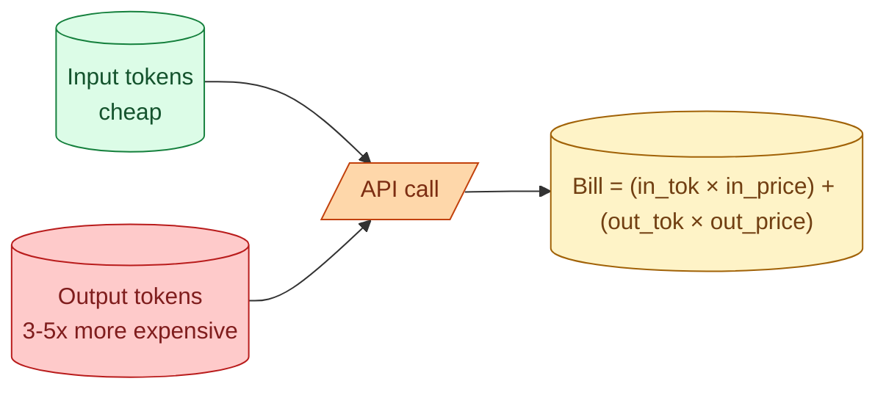

LLM pricing is per token, but input and output are priced separately, with output usually 3 to 5 times more expensive. You can predict your monthly bill with a back-of-envelope calculation if you know four numbers: input tokens per call, output tokens per call, calls per day, and the price per million tokens for each. Most surprise bills come from getting one of those four numbers an order of magnitude wrong. Doing the math before you ship costs ten minutes and saves the conversation where finance asks why the line item is six figures.

## The pricing model



Providers post prices per million tokens. As of 2026, a representative spread:

| Tier | Example model | Input ($/M) | Output ($/M) |
| --- | --- | --- | --- |
| Cheap-and-fast | Claude Haiku, GPT-4o mini, Gemini Flash | $0.25 - $1 | $1 - $5 |
| Balanced | Claude Sonnet, GPT-4o, Gemini Pro | $3 - $5 | $10 - $20 |
| Big | Claude Opus, GPT-4.5 | $15 - $30 | $50 - $100 |

Real prices change every few months. The pattern is what matters: output is 3-5x input, and the spread between tiers is roughly 10x.

## The four numbers you need

Before you build, write these down for the feature:

1. **Input tokens per call.** System prompt + history + retrieved context + user message.
2. **Output tokens per call.** Typical response length.
3. **Calls per day.** Users × calls per user per day.
4. **Prices.** Input $/M and output $/M for your chosen model.

Cost per day = `(in_tok × calls × in_price + out_tok × calls × out_price) / 1,000,000`.

Monthly = daily × 30.

That is the whole calculation.

## A worked example

You are building a support-ticket classifier. Each call:

- System prompt: 800 tokens (clear definitions of categories)
- User message: 300 tokens (the ticket text)
- Output: 30 tokens (the chosen category)

Total in: 1100 tokens. Total out: 30 tokens.

Volume: 50,000 tickets a day.

Picking Claude Haiku at $1/$5:

```
Daily input  = 1100 * 50,000 = 55,000,000 tokens = 55M
Daily output =   30 * 50,000 =  1,500,000 tokens =  1.5M

Cost = 55 * $1 + 1.5 * $5
     = $55 + $7.50
     = $62.50/day = $1,875/month
```

Now imagine you pick the balanced tier (Claude Sonnet, $3/$15):

```
Cost = 55 * $3 + 1.5 * $15
     = $165 + $22.50
     = $187.50/day = $5,625/month
```

Same workload, 3x the bill. Worth doing on a napkin before you ship.

## The traps that move costs by 10x

**System prompt left big.** A 3000-token system prompt at 50k calls a day is 150M input tokens daily. Not 50M. Compressing the system prompt by 70% drops your bill by close to 70% on input-heavy workloads.

**Conversation history grows unbounded.** If each turn appends history, turn 30 has all 29 previous turns. By turn 50 every call is 30k input tokens. Either summarize old turns or cap the window.

**Retrieved context dumped in.** A RAG that retrieves 10 chunks of 1000 tokens adds 10k tokens to every call. If 8 are unused, you paid for 8k tokens of nothing. Reranking and trimming pays off here.

**Output not capped.** Without `max_tokens`, a chatty model produces 800 tokens when 80 would do. Cap output tokens at the length you actually need.

**Wrong model tier.** Using the big model for classification is the most expensive form of "we'll switch later." Switch first. See concept 9.

## Output tokens are sneakier than they look

Because output is more expensive per token, even small output gains hurt. A change that takes the response from 100 to 150 tokens is a 50% increase in the costly half of the bill.

This is why "be concise" in the system prompt earns its tokens. Cutting verbose preambles ("Here is the requested information:...") and trailing summaries saves real money at scale.

Reasoning models (those that "think out loud" before answering) are even more output-heavy. The thinking tokens count as output. A reasoning model can use 5-10x the tokens of a non-reasoning model for the same final answer. Worth it for hard problems, expensive for easy ones.

## Prefix caching: free wins

Most providers cache the prefix of your prompt (system + early messages) when you mark it as cacheable. Subsequent calls with the same prefix pay a fraction of the input price for the cached portion. Anthropic charges around 10% of the normal input rate for cached tokens. OpenAI offers similar.

If your system prompt is large and constant across calls, prefix caching turns "we cannot afford this" into "this is fine." It costs you nothing to enable but it requires that the cacheable portion of the prompt is byte-identical across calls. Any timestamp or per-user value breaks the cache.

## Reasonable cost targets to aim for

These are rules of thumb, not budgets. Adjust for your business.

| Use case | Target cost per call |
| --- | --- |
| Classification, extraction | $0.0001 - $0.001 |
| Chat turn (short) | $0.001 - $0.01 |
| RAG question answering | $0.005 - $0.05 |
| Agentic multi-step task | $0.05 - $1 |
| Code generation (long) | $0.05 - $0.50 |

Above the high end of each band, you are usually overpaying. Time to compress prompts, switch model tiers, or route easy cases to a cheaper model.

## Track cost per call from day one

Wire a small middleware that records, per call: model, input tokens, output tokens, total cost, user ID, feature name. Aggregate it in your warehouse. Now you can answer "what does feature X cost per user per month" and "did last week's prompt change move the cost line."

Without this, you find out from a billing alert. With it, you make trade-off conversations concrete.

## Common mistakes

- **Estimating in words, not tokens.** Off by 30%+ depending on tokenizer.
- **Forgetting the system prompt counts on every call.** That 2000-token system prompt is 2000 tokens every single call.
- **Letting output run unbounded.** Set `max_tokens` to what you actually need.
- **Picking the model tier last.** A 10x cheaper tier often works. Try the cheap one first, prove it does not, then upgrade.
- **Not enabling prefix caching.** Free wins on input-heavy workloads, usually no code change beyond a flag.

## Quick recap

- Input and output tokens are priced separately. Output is typically 3-5x more expensive.
- Daily cost = `(in_tok × calls × in_price + out_tok × calls × out_price) / 1M`.
- Most surprise bills come from a bloated system prompt or unbounded history.
- Output tokens hurt more per token. Cap them. Trim verbose preambles.
- Prefix caching is free money on stable system prompts. Turn it on.
- Track cost per call in your warehouse from day one.

This concept sits in **Stage 1 (Foundations: working with LLMs)** of the [AI Engineering Roadmap](/practice/ai-engineering/roadmap/).
