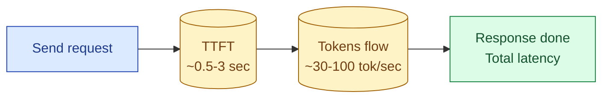
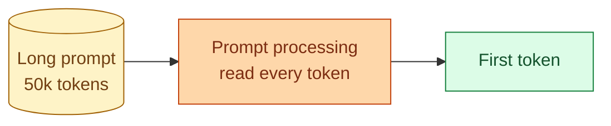

When people say "the API is slow," they usually mean one of two things. The whole response took 12 seconds, which matters for batch jobs and total throughput. Or the spinner stayed up for 4 seconds before anything appeared, which matters for users staring at a screen. These are different problems and they have different fixes. A senior AI engineer keeps both numbers in their head and knows which one a given complaint is really about.

## The two numbers



**Time to first token (TTFT).** The wall-clock time from sending your request to receiving the first chunk of output. This is the model preparing to generate.

**Total latency.** TTFT plus the time it takes to generate every token after that. The full duration of the call.

Roughly:

```
Total = TTFT + (output_tokens / tokens_per_second)
```

For a 200-token response generating at 80 tok/sec with a 1-second TTFT: 1 + 200/80 = 3.5 seconds total. Streaming users start seeing output at 1 second.

## What controls TTFT

TTFT is dominated by two things: the model has to process your entire prompt before it can produce a single token, and the provider has to route your request to a GPU.



For short prompts (under a few thousand tokens), TTFT is mostly routing time: 200-500ms. For long prompts, prompt processing dominates: a 50k-token prompt can add 2-4 seconds of TTFT.

Practical implications:

- **Shorten the prompt to improve TTFT.** Every extra 10k tokens you trim is roughly half a second off TTFT.
- **Prefix caching helps TTFT, not just cost.** When the provider has cached your system prompt, prompt processing for that part is skipped.
- **Bigger models have higher TTFT.** A 200B-parameter model is slower at prompt processing than a 70B one, even for the same input.
- **TTFT is not linear with prompt length.** Doubling the prompt does not always double TTFT, but the trend is real.

## What controls generation speed (the second half)

Once the model starts generating, the speed is mostly fixed for that model on that hardware. Measured in tokens per second.

```
Model size       Generation speed (rough, 2026)
Small (8B)       150-300 tok/sec
Mid (70B)        60-100 tok/sec
Large (>200B)    30-60 tok/sec
```

To improve total latency you can:

- **Cap output tokens.** A 1000-token response takes 10x as long to generate as a 100-token one. Use `max_tokens` to set a reasonable cap.
- **Pick a smaller model.** If the task does not need the big one, the small one is dramatically faster.
- **Use streaming.** Does not reduce total latency, but reduces perceived latency, which is often the real problem.
- **Run parts of the work in parallel.** If you can break the task into independent calls (multiple summarizations, multiple classifications), parallelize. Total wall clock drops to the slowest call.

## When to optimize which

Two examples to make the choice concrete.

**Example 1: chat UI.** A user types, waits, sees output. They care about TTFT (when do I see anything?) and tokens per second (does the answer flow naturally?). Total latency matters less because they can read while it generates. Action: stream, keep the system prompt small, use prefix caching, pick a model with strong TTFT.

**Example 2: nightly batch job classifying 100,000 tickets.** No human is waiting on any single call. Total latency × call count is the only number that matters. TTFT is irrelevant. Action: parallelize aggressively, use the cheapest model that meets quality, do not bother streaming, batch where the provider supports batch endpoints.

## p50, p99, and the long tail

For any latency conversation that touches SLAs, you need to think in percentiles, not averages.

```
TTFT distribution at p50:    1.2 sec    (median user)
TTFT distribution at p99:    8.5 sec    (the 1% worst case)
```

p50 is what most users see. p99 is what some users see and complain about. The gap between them tells you whether your latency is stable or peaky.

LLM APIs have long tails because:

- Provider GPUs queue under load. A spike in traffic raises p99 much more than p50.
- Long prompts hit prompt-processing bottlenecks unpredictably.
- Provider-side outages and degradation spike p99 silently.

Always measure p50, p95, p99 of TTFT and total latency separately. An average hides the tail.

## How to reduce TTFT, ranked

1. **Trim the system prompt and conversation history.** Free wins, no quality cost if done well.
2. **Enable prefix caching.** Drops TTFT on cached prefixes by 60-80%.
3. **Switch to a smaller model.** Often halves TTFT. Try a cheaper tier first.
4. **Compress the user input.** Long user messages add to prompt-processing time.
5. **Pre-warm by issuing a small call before the big one.** Some providers route warmer GPUs to recent users.
6. **Move to a provider with lower TTFT.** Last resort, but Anthropic, OpenAI, Google have different TTFT characteristics in different regions.

## How to reduce total latency, ranked

1. **Lower max_tokens to the actual length you need.** Most output is too long.
2. **Pick a faster model.** Smaller model = faster generation.
3. **Stream so total stops mattering for UX.** Does not change cost or total time, but the user is happy.
4. **Parallelize independent calls.** Total wall clock = slowest call, not sum of calls.
5. **Use batch APIs where available.** OpenAI's batch is 24-hour, half-price, no urgency. Great for offline work.

## The latency budget

For user-facing AI, three rules of thumb:

- TTFT under 1 second: feels instant.
- TTFT 1-3 seconds: acceptable if the UI shows progress (typing dots, "thinking...").
- TTFT over 3 seconds: feels broken unless you set expectations ("this may take 10 seconds").

For total latency, anything under 10 seconds is normal for a chat-style response. Above 20 seconds, you should consider breaking the task into smaller calls or switching to async (queue + email when done).

## Common mistakes

- **Optimizing for total latency on a chat UI.** Users do not care about total; they care about TTFT.
- **Optimizing for TTFT on a batch job.** No human is waiting; total throughput is what matters.
- **Reporting average latency.** Hides p99 spikes. Use percentiles.
- **Forgetting prefix caching exists.** Free TTFT wins for input-heavy workloads.
- **Cranking `max_tokens` to a huge default "just in case."** Slow responses, expensive bills, no upside.

## Quick recap

- TTFT: time from request to first byte of output. Dominated by prompt-processing time.
- Total latency: TTFT plus generation. Dominated by output token count and model size.
- Streaming improves perceived latency, not total latency or cost.
- TTFT matters for users. Total latency matters for batch and cost.
- Always measure in percentiles (p50, p99). Averages lie.
- The first move: shorter prompts, enable prefix caching, cap max_tokens.

This concept sits in **Stage 1 (Foundations: working with LLMs)** of the [AI Engineering Roadmap](/practice/ai-engineering/roadmap/).
