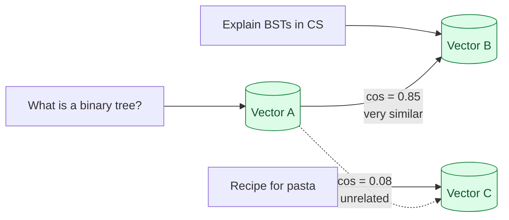

An embedding is a fixed-size vector of numbers that represents a piece of text. Texts that mean similar things get vectors that point in similar directions. Cosine similarity is the math that tells you how similar two directions are. Once you have this in your head, retrieval-augmented generation, semantic search, deduplication, clustering, and most of what people call "vector AI" stops being mysterious. It is all variations on "embed two things, compare the vectors."

## What an embedding looks like

```python
from openai import OpenAI
client = OpenAI()

vec = client.embeddings.create(
    model="text-embedding-3-large",
    input="What is a binary tree?"
).data[0].embedding

# vec is a list of 3072 floats, each between roughly -1 and 1
# [0.0127, -0.0341, 0.0892, ..., -0.0058]
```

A vector of around 1000-4000 numbers, depending on the model. The numbers themselves are meaningless to humans. The whole vector is meaningful as a direction in high-dimensional space.

## What "similar" means here

Two pieces of text are similar if their embedding vectors point in roughly the same direction. The standard way to measure that is cosine similarity, which is `cos(angle between the two vectors)`.

```
cos(0°)  = 1.0   identical direction
cos(45°) = 0.71  pretty similar
cos(90°) = 0.0   unrelated
cos(180°) = -1.0  opposite (rare with text embeddings)
```



The math, in one line of Python:

```python
import numpy as np
def cosine(a, b):
    return np.dot(a, b) / (np.linalg.norm(a) * np.linalg.norm(b))
```

If both vectors are already normalized to unit length (most embedding APIs return them this way), it simplifies to just the dot product:

```python
def cosine_normalized(a, b):
    return np.dot(a, b)   # both vectors must have length 1
```

That is the entire search operation at the heart of every vector DB.

## A small worked example

```python
docs = [
    "Python is a programming language used for data science.",
    "Cats are small furry mammals.",
    "Java is a programming language used for enterprise software.",
]

query = "What language is popular for ML?"

doc_vecs = [embed(d) for d in docs]
q_vec = embed(query)

scores = [cosine(q_vec, v) for v in doc_vecs]
# Roughly:
# [0.71, 0.12, 0.65]
```

The query is closer to the two programming-language docs than to the cat doc. That is semantic search in 10 lines. Everything fancy in retrieval (hybrid search, reranking, filtering) is built on top of this base operation.

## The thing that surprises people

The model has never seen the word "ML" in the docs, and the docs do not contain the word "popular." But the embedding still finds the relevant ones. That is the whole point: embeddings capture meaning, not exact words.

This is what makes them strictly better than keyword search for many queries. It is also why they sometimes return surprising matches. "Apple stock price" and "apple fruit nutrition" embed near each other because they share the word "apple." Pure vector search has no idea you meant the company.

That is why production retrieval almost always combines vector search with keyword search (hybrid search, Stage 3). Each catches what the other misses.

## What controls embedding quality

Three things:

**Model.** The embedding model trained on diverse text gives more meaningful vectors than a small one. OpenAI's `text-embedding-3-large`, Cohere's `embed-multilingual-v3`, BAAI's `bge-large-en-v1.5` are the well-known options in 2026. They differ in cost, dimensionality, and how well they handle non-English text.

**Dimensionality.** Higher-dim vectors (3072 for OpenAI's large) usually retrieve better than lower-dim (768 for many small models). They cost more to store and search. Most models let you pick a smaller dim with a small quality cost.

**What you embed.** Embedding a 5000-word document as one vector smooths out the meaning into mush. The vector is the average direction of everything. Better to chunk the doc into smaller pieces (a few hundred words each) and embed them separately. See Stage 3.

## Why two embeddings for the same text rarely match exactly

```python
vec_a = embed("Hello world")
vec_b = embed("Hello world")
cosine(vec_a, vec_b) == 1.0   # not guaranteed
```

Most providers run the embedding model with batching and floating-point hardware that does not produce bit-identical output across runs. The result is very close (cosine 0.9999+), but rarely exactly 1.0.

This means:

- Hash-based dedup over embeddings does not work. Use cosine similarity above a threshold (e.g., 0.99) to call two texts "the same."
- Storing embeddings for later comparison is fine, but recomputing the query embedding each time is normal. Just compare cosines.

## Embedding cost is real

Embedding APIs are cheap per call but not free. A representative range in 2026:

```
OpenAI text-embedding-3-large:  $0.13 per million tokens
Cohere embed-v3:                $0.10 per million tokens
Self-hosted BGE on a small GPU: ~$0.01-0.05 per million tokens, plus infra
```

For a corpus of 100,000 documents averaging 500 tokens each, that is 50M tokens or about $6 to embed once. Cheap. Until you re-embed every day because your pipeline does not cache, in which case it adds up.

Store the embeddings. Re-embed only when the source text changes.

## Normalisation

Some models return unit-length vectors (norm = 1). Some do not. Normalisation matters because cosine similarity assumes it.

```python
def normalize(v):
    n = np.linalg.norm(v)
    return v / n if n > 0 else v

# Apply once at ingest time, store the normalized vectors
```

Check your model's docs. OpenAI's text-embedding-3 returns normalized. Some Hugging Face models do not. Normalize at ingest time; it costs nothing later.

## Where embeddings are not the right tool

Embeddings are bad at:

- **Exact lookups.** Looking up a known ID, finding a specific phrase. Use a regular index.
- **Numerical reasoning.** "Find documents where revenue > $1M" is not a semantic question.
- **Long documents as one unit.** Average direction loses the specific meaning of any part. Chunk first.
- **Updating frequently.** Re-embedding a million docs every time anything changes is wasteful. Embed once, version, refresh in batches.

When embeddings are the wrong tool, keyword search, exact match, or structured query are usually right.

## Common mistakes

- **Comparing embeddings from different models.** A vector from OpenAI's model and a vector from BGE are not in the same space. Cosine between them is noise.
- **Embedding huge documents as one vector.** Loses meaning. Chunk first.
- **Forgetting to normalize.** Cosine math relies on unit vectors. Normalize at ingest.
- **Using cosine as a hash.** Two embeddings of the same text rarely produce identical floats. Use a similarity threshold for dedup.
- **Skipping hybrid search.** Pure vector misses exact-match queries (proper nouns, codes). Add BM25.

## Quick recap

- An embedding is a vector of numbers representing a text's meaning.
- Cosine similarity tells you how aligned two vectors are. 1.0 = same direction, 0.0 = unrelated.
- Two texts with similar meaning have high cosine even when they share no words.
- Embed at the right granularity (chunks, not whole documents). Store the vectors.
- Two embeddings of the same text rarely match exactly. Use a threshold for "equal."
- Vector search is half the answer. Hybrid search adds keyword matching on top.

This concept sits in **Stage 1 (Foundations: working with LLMs)** of the [AI Engineering Roadmap](/practice/ai-engineering/roadmap/).
