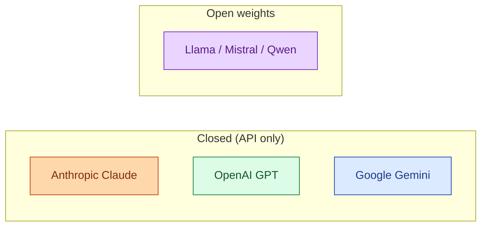
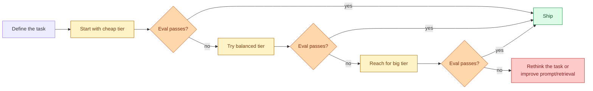

There are four model families that matter in production AI as of 2026: Anthropic's Claude, OpenAI's GPT, Google's Gemini, and the open-source Llama / Mistral / Qwen family. Each one ships in three rough tiers: cheap-and-fast, mid-balanced, and big-and-expensive. The right pick depends on your task, your budget, and your tolerance for vendor lock-in. Defaulting to "GPT-4 because everyone uses it" is the most common waste of money in early-stage AI projects. Picking deliberately costs an afternoon and changes the math on every project that follows.

## The big four, in honest terms



**Anthropic Claude.** Strong at reasoning, writing, code, and following long instructions. Tends to be more cautious about edge cases. Best-in-class long-context behaviour. The Sonnet tier is the most-used balanced model in 2026.

**OpenAI GPT.** Strong all-rounder. Best tooling ecosystem (assistants, structured outputs, batch). Multimodal (vision, voice) is a step ahead. The 4o-mini tier is the cheapest among the closed providers that still feels capable.

**Google Gemini.** Very long context (1M+ tokens), competitive on cost. Strong on multilingual. Tooling around Gemini is more enterprise-flavoured (Vertex AI). Quality has improved fast but ecosystem polish lags.

**Llama / Mistral / Qwen (open weights).** Strong for self-hosting. Llama is the broadest ecosystem. Mistral is the European bet, often the leanest. Qwen leads on multilingual, especially Chinese. Pick when you need control, privacy, or fine-tuning. The mid tiers (70B-class) are now competitive with closed mid-tier models on many tasks.

## The three tiers, in plain English

Every family has roughly three tiers. The names change quarterly; the pattern does not.

**Cheap-and-fast.** Per-token cost in the $0.25-$2 / million range. Latency in tens of milliseconds per token. Good enough for classification, extraction, simple Q&A, and any high-volume background work. Modern cheap models are surprisingly capable. Start here.

**Balanced.** $3-$5 input, $10-$20 output per million. Strong reasoning, code, structured outputs. Most "AI features" in real products ship on this tier.

**Big.** $15-$30 input, $50-$100+ output. Use only when the cheaper tiers fail your evals. The price gap is 10-20x the balanced tier; the quality gap is rarely that wide. Reserve for hard reasoning, long context, or final review steps.

## How to pick, in order



The discipline is bottom-up. Start at the cheapest tier that could plausibly work. Run your evals (Stage 5). Only upgrade when the numbers force you to.

The pattern most teams get wrong is the opposite: start with the big tier, ship, then panic at the bill. Going back down requires re-running evals across the cheaper tiers and possibly reworking the prompt for them, which feels like a step backwards. Better to start cheap.

## The senior-flavoured picks for common tasks

Rough defaults to argue against, not to copy blindly.

| Task | Reasonable starting model |
| --- | --- |
| Classification (5 buckets) | cheap tier any provider |
| Extraction (line items from PDF text) | cheap-to-balanced, structured outputs |
| Q&A over your docs (RAG) | balanced tier, with strong reranking |
| Chat assistant with tool use | balanced tier, escalate hard cases to big |
| Code generation (short snippets) | balanced tier |
| Code generation (long, multi-file) | big tier |
| Long-document summarisation (100k+ tokens) | Gemini big tier or Claude big tier |
| Multilingual chat | Claude Sonnet or Qwen self-hosted |
| Anything privacy-sensitive | self-hosted Llama/Mistral |
| Anything where the answer needs to be auditable | balanced, with citations from retrieval |

These are not rules. They are starting points to argue against with your evals.

## When self-hosting earns its keep

Open weights become the right answer when one of three things is true.

**Volume.** At a few million calls per day on the same task, the per-token math turns. A self-hosted Llama on vLLM or TGI is cheaper than calling a provider for that volume, even after counting GPU and ops cost.

**Privacy / data residency.** When data cannot leave your VPC, region, or country, self-hosting is not optional. EU healthcare, government, defence, regulated finance.

**Fine-tuning.** When generic prompts and retrieval do not get you there and you have labeled data, a fine-tuned small open model often beats prompting a big closed one. See concept in Stage 6.

Outside those three, self-hosting is usually a hobby project disguised as infrastructure work. The closed providers have done the hard parts.

## Vendor lock-in is real but manageable

Switching providers used to mean rewriting prompts. Today, with a thin abstraction layer (LiteLLM, the OpenAI-compatible endpoint that Anthropic and most providers expose, or a hand-written `call_llm(provider, model, messages)` wrapper), you can swap in an afternoon.

What still locks you in:

- Provider-specific tool use formats.
- Provider-specific structured output formats.
- Prompts tuned for one model's quirks.
- Prefix caches that only work on one provider's prefix-cacheable shapes.

What doesn't lock you in:

- Token counting (each provider has a counter).
- Basic chat completion.
- Embedding calls (you re-embed if you switch).

Design the abstraction layer on day one, even if you only use one provider. Failover (concept in Stage 6) depends on it.

## The "GPT-4 by reflex" trap

When you ask three engineers what model to use, two of them say GPT-4. This is reflex, not analysis. As of 2026, GPT-4 is not always the best choice for:

- Long-context tasks (Claude and Gemini lead).
- Cost-sensitive workloads (Haiku and Flash are dramatically cheaper).
- Self-hosting (you cannot, it is closed).
- Strict structured outputs (OpenAI's structured outputs are great, but Anthropic's tool use is as good).
- Cautious or edge-aware behaviour in regulated domains (Claude tends to be more careful).

Default to "let the evals decide" rather than "let the brand decide."

## A rough cost-quality plot, in your head

```
quality
   ▲
   │                Big tier (Opus, GPT-4.5, Gemini Pro big)
   │              ●
   │       Balanced (Sonnet, GPT-4o, Gemini Pro)
   │     ●
   │   Cheap (Haiku, GPT-4o mini, Flash)
   │ ●
   │                                                    cost
   └─────────────────────────────────────────────────────►
```

The interesting part of the curve is the leftmost two dots. For most production tasks, the cheap-to-balanced gap matters more than the balanced-to-big gap. Spend your time choosing well between cheap and balanced, not between balanced and big.

## Common mistakes

- **Defaulting to the biggest model.** Burns money for marginal quality on most tasks.
- **Picking by brand reputation.** "GPT is the best AI" is marketing, not engineering.
- **Trying every model with no eval.** You cannot decide without numbers.
- **Locking in to one provider's tool format.** Day-1 abstraction layer pays off later.
- **Self-hosting for vibes.** Unless volume, privacy, or fine-tuning forces it, the cost is higher and the ops are real.

## Quick recap

- Four families that matter: Claude, GPT, Gemini, Llama-family open weights.
- Each ships cheap / balanced / big tiers. The cheap tier is more capable than people think.
- Start cheap. Upgrade based on evals, not vibes.
- Self-host when volume, privacy, or fine-tuning forces it. Otherwise stay closed.
- Build a thin provider abstraction on day one. Switching later is much easier with it than without.

This concept sits in **Stage 1 (Foundations: working with LLMs)** of the [AI Engineering Roadmap](/practice/ai-engineering/roadmap/).
