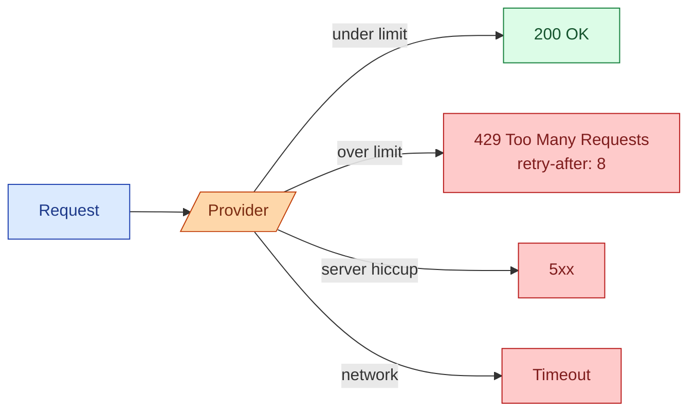

Every model provider rate-limits your calls. There is a cap on requests per minute, tokens per minute, and sometimes tokens per day. Hit any of them and the provider returns a 429 with a hint of how long to wait. Network errors, timeouts, and 5xx errors also show up under load. A production AI feature needs a retry layer that handles all of this calmly, with exponential backoff and respect for the provider's hints. Build it once, wrap every call, never think about it again.

## What the limits actually look like

Three numbers per model, per organization (sometimes per key):

- **RPM**: requests per minute. The simplest cap.
- **TPM**: tokens per minute (input + output). The bigger lever.
- **TPD**: tokens per day, in some tiers. The slowest to hit.

Example tier (Anthropic Claude Sonnet, tier 2 in 2026, illustrative):

```
RPM:  4,000
TPM:  400,000
TPD:  no daily cap on this tier
```

You can be under RPM and still hit TPM if your prompts are long. You can be under TPM and hit RPM if you make many small calls. Two failures, two different fixes.

## How the provider tells you you hit the limit



Three error categories, three retry behaviours.

**429 rate limit.** Honor the `retry-after` header. If absent, wait per your backoff schedule. Always retryable.

**5xx server errors.** Provider's problem. Usually transient. Always retryable.

**Timeouts and network errors.** Connection reset, DNS, slow first byte. Retryable, but consider whether the provider received and processed the request.

The fourth case, **4xx other than 429**, is your bug. Bad request, auth error, content policy violation. Do not retry. Surface to the caller.

## The retry layer in plain code

```python
import time, random
from typing import Callable

def with_retry(fn: Callable, *, max_retries: int = 5, base: float = 1.0):
    for attempt in range(max_retries):
        try:
            return fn()
        except RateLimitError as e:
            wait = float(e.retry_after) if e.retry_after else exponential_backoff(attempt, base)
        except (ServerError, TimeoutError, ConnectionError):
            wait = exponential_backoff(attempt, base)
        except BadRequestError:
            raise   # do not retry, this is your bug

        time.sleep(wait)

    raise RetryExhaustedError(f"failed after {max_retries} attempts")

def exponential_backoff(attempt: int, base: float = 1.0) -> float:
    # 1, 2, 4, 8, 16... with jitter
    return base * (2 ** attempt) * (0.5 + random.random())
```

Five things to notice:

1. **Honor the `retry-after` header.** The provider knows when capacity will free up.
2. **Exponential backoff.** Doubling each time, capped at some max (60 seconds is a common cap).
3. **Jitter.** Multiply by a random factor so that retries do not all hit at the same moment when many requests fail together.
4. **Cap retries.** 5 is a reasonable default. Past that, the call is probably never succeeding; better to surface and let upstream handle.
5. **Different errors, same handler, different waits.** One layer, three sources.

## Why jitter matters more than people expect

Without jitter, if 100 of your calls hit a 429 at the same time, they all retry exactly `wait` seconds later. The provider gets 100 retries at the same moment, throws another wave of 429s, and you cascade.

```
Without jitter:    101 fails, 101 retries at T+1, 101 retries at T+3, ...
With jitter:       101 fails, retries spread between T+0.5 and T+1.5
```

The fix is a random multiplier on the backoff. Half the time you wait less, half the time you wait more. The retries get spread out and the provider can serve them.

Always use jitter. It is one extra line.

## Stay under the limit on purpose

The retry layer is the safety net. The real win is not hitting the limit in the first place. Three strategies.

**Local rate limiter.** Cap your own request rate at, say, 80% of the provider's limit. A token bucket or leaky bucket. Most languages have a library for this in 20 lines.

**Adaptive concurrency.** Watch your 429 rate. If it goes above 1%, lower your concurrency. If it stays at 0%, raise it. AIMD (additive increase, multiplicative decrease) is the classic algorithm.

**Provider-side batching.** OpenAI's batch API processes large jobs at half price within 24 hours and does not count against your live RPM. Great for offline work.

For most teams the local rate limiter is enough. The retry layer catches the gaps.

## The idempotency story

If your retry layer retries a request that actually succeeded on the provider side (the response was lost in the network), you double-charge yourself and may double-act on the result.

For pure chat completions, this is mostly harmless: you got two answers, you keep one, you paid twice. Annoying but not destructive.

For tool calls that touch external systems (send email, write to DB, charge a credit card), the double-call is destructive. Two patterns to defend.

**Idempotency keys at the boundary.** Most providers support an `Idempotency-Key` header. Send the same key on the retry; the provider deduplicates server-side. Anthropic and OpenAI both support this for relevant endpoints.

**Idempotency at the tool level.** If your agent's tool is "send email," make the tool itself idempotent. Hash the email contents; refuse to send the same one twice within a window. Same pattern as data pipelines (see DE concept 25).

## Tier limits and how to grow them

Providers move you up tiers based on usage and trust. You start with low limits. You increase by:

- **Spending consistently.** Tier 1 to tier 2 often happens automatically.
- **Verifying your organization.** Provide tax info, company details.
- **Requesting higher limits.** A form for unusual workloads. Usually approved if your usage history is clean.

If you are planning a big launch, request the higher limit two weeks ahead. Asking on launch day is too late.

## What to log on every call

For retry analysis, log:

- Request ID, model, timestamp.
- HTTP status, error code, response time.
- Attempt number (was this the 1st, 2nd, 3rd retry).
- `retry-after` value when 429.
- Whether the call ultimately succeeded.

Then a simple query tells you:

```sql
SELECT
  DATE(ts) AS day,
  COUNT(*) AS total,
  COUNTIF(status = 429) / COUNT(*) AS rate_limit_rate,
  COUNTIF(status >= 500) / COUNT(*) AS server_error_rate,
  AVG(attempts) AS avg_attempts
FROM llm_calls
GROUP BY day;
```

That dashboard is the difference between "we sometimes have AI outages" and "we know what is happening."

## Common mistakes

- **Retrying every error including 400s.** Bad request, auth, content policy: surface, do not retry.
- **No jitter.** Cascading retries the moment any limit is hit.
- **Retrying forever.** A cap of 5 or 6 is enough. Past that, the call is dead; let the caller handle.
- **Ignoring `retry-after`.** The provider knows; your fixed backoff is guessing.
- **No idempotency on tool calls.** A retried "send email" sends two.
- **No logging of attempts.** Every outage becomes a guessing game.

## Quick recap

- Providers rate-limit by RPM and TPM (sometimes TPD). Either can fail your request.
- 429 means slow down. Honor `retry-after`. 5xx and timeouts also retry.
- 4xx other than 429 is your bug. Do not retry.
- Exponential backoff with jitter, capped at some max wait, cap retries at ~5.
- Stay under the limit with a local rate limiter and adaptive concurrency.
- Use idempotency keys for tool calls that touch external systems.
- Log every attempt. It is the only way to debug rate-limit issues at 2 AM.

This concept sits in **Stage 1 (Foundations: working with LLMs)** of the [AI Engineering Roadmap](/practice/ai-engineering/roadmap/).
