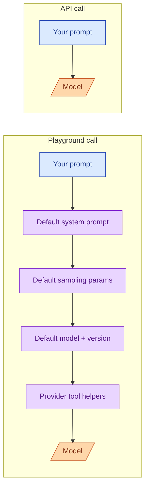

You craft a prompt in the provider's playground. It works perfectly. You paste it into your code. It does not work. The output is different. Sometimes worse. Sometimes completely off. You did nothing wrong, exactly. The playground is helping you in ways you cannot see, and your code is not getting that help. The fix is to understand what the playground is doing for you and either reproduce it in your code or stop relying on it.

## What the playground silently adds



Five things the playground adds that your code does not, by default.

**A default system prompt.** "You are a helpful assistant." Sometimes longer. It seems harmless. It is not. The model's default behaviour shifts when a system prompt is present, even a generic one. Your bare API call has no system prompt unless you add one.

**Sampling defaults.** The playground might use `temperature=0.7, top_p=1.0, max_tokens=1024`. Your code might use the SDK defaults (often `temperature=1.0` or no max_tokens at all). Different sampling, different output.

**A model alias that quietly moves.** The playground often shows `gpt-4o` or `claude-3-sonnet`. These are aliases for the latest version of that model line. Tomorrow they might point at a different snapshot. Your code might pin to `gpt-4o-2024-08-06` (good) or use the alias (now you also moved).

**Conversation memory across the session.** The playground keeps the chat history visible. Your code is stateless. If you tested with three turns of context in the playground, your single-turn API call is missing that context.

**Built-in tools turned on.** Some playgrounds quietly enable structured outputs, function calling, vision input, or system-prompt prefix caching. Your code starts with none of these enabled.

Each of these is a small difference. Together they change behaviour enough to break a prompt that "worked yesterday."

## How to make the playground match your code

The trick is to make the playground send the same payload your code does. Most playgrounds have a "show raw request" or "view code" toggle. Use it.

```python
# What the playground actually sends, copy-pasted from "view code"
{
    "model": "claude-3-7-sonnet-20260301",
    "max_tokens": 1024,
    "temperature": 0.7,
    "system": "You are a helpful assistant.",
    "messages": [
        {"role": "user", "content": "Your prompt here"}
    ]
}
```

Now copy that into your code, exactly. Same model snapshot, same max_tokens, same temperature, same system prompt (or absence thereof). Now you are comparing apples to apples.

If the output still differs, the difference is elsewhere: your conversation history, your retrieved context, or your code doing something to the prompt before sending it (newline normalization, escape characters, formatting).

## The "I changed nothing" version of this bug

You go to bed with a working feature. You wake up to a flood of complaints. You changed nothing. The model is now producing weird output.

What probably happened:

- The model alias rotated. `claude-3-sonnet` now points at a new snapshot. Pin to a dated version.
- The provider deprecated a parameter or changed a default. Read their changelog.
- The provider tweaked the model. Even pinned snapshots get small revisions. This is rare but real.
- Your input changed. A new user is sending input you have not seen, with characters that break your prompt template.

The defence is the same: pin model versions, log inputs and outputs, run an eval suite that catches regressions. See Stage 5.

## When the playground is genuinely better

Some things the playground does are real wins, not invisible help.

**Prefix caching.** The playground sometimes auto-enables this. If you copy the prompt and your code does not, you lose the cache benefit. Enable it explicitly.

**Structured outputs.** The playground might show a "JSON mode" toggle. Off by default in your code. Turn it on.

**Tool definitions.** The playground gives you a UI to define tools. Your code has to construct the tool definitions in the SDK's format. Easy to mis-copy. Use the "view code" output to be safe.

None of these are tricks. They are features you can turn on in your code. The playground just does it for you.

## A clean development loop

The senior pattern: use the playground for fast iteration, then immediately port to a script with the same parameters, then immediately put that script under eval. The playground is the sketch. The script is the model. The eval is the safety net.

```
1. Hypothesis in head           (5 min)
2. Sketch prompt in playground  (10 min)
3. Port to script, same params  (5 min)
4. Run on 20-example eval set   (5 min)
5. Look at the numbers          (5 min)
```

The whole loop is half an hour. Going from "it worked in the playground" straight to "deploy it" skips steps 3-5 and that is where the wheels come off.

## Two playground habits that bite at scale

**Iterating on the same conversation.** You tune a prompt over a long playground conversation. The model has been told "I want X, but make it more Y" three times. The final answer reflects the whole conversation, not just the final prompt. Your code sends only the final prompt. Different answer.

The fix: clear the playground conversation between iterations. Or write the prompt in a fresh chat each time.

**Tuning on one example.** You make the prompt work on the one example you tested. Production has a thousand variations. The prompt that works on "What's a binary tree?" fails on "explain Bayesian inference to a six-year-old." Always test on a small, varied set. Even five examples is enough to catch the worst overfits.

## When to keep using the playground

The playground is great at:

- Exploring what a model can do for the first time.
- Quick prompt edits when an eval shows a regression.
- Showing a non-engineer what the AI does.
- Comparing models side-by-side on the same prompt.

It is bad at:

- Reproducing what production does.
- Anything involving history, retrieved context, or tools.
- Measuring behaviour quantitatively.

Use it as a sketchpad, not as ground truth.

## Common mistakes

- **Shipping the playground prompt verbatim.** It works in the playground because of helpers you do not have in your code.
- **Pinning to a model alias instead of a dated snapshot.** Yesterday's behaviour walks out from under you.
- **Tuning on one example.** Works for that example, fails for the next ten.
- **Forgetting the playground keeps conversation state.** Your code is stateless. The same final prompt produces a different result.
- **Treating "view code" as optional.** It is the most accurate description of what the playground actually sent.

## Quick recap

- The playground adds defaults: system prompt, sampling, model alias, history, tools. Your code has none of these unless you ask.
- "Show raw request" or "view code" is the source of truth. Copy from there.
- Pin model versions, not aliases. Aliases move.
- Iterate in the playground, port to a script, run on an eval set. Half an hour, repeatable.
- Test on a small varied set, not one example. Five is the floor.
- The playground is a sketchpad. Your code is the model. The eval is the safety net.

This concept sits in **Stage 1 (Foundations: working with LLMs)** of the [AI Engineering Roadmap](/practice/ai-engineering/roadmap/).
