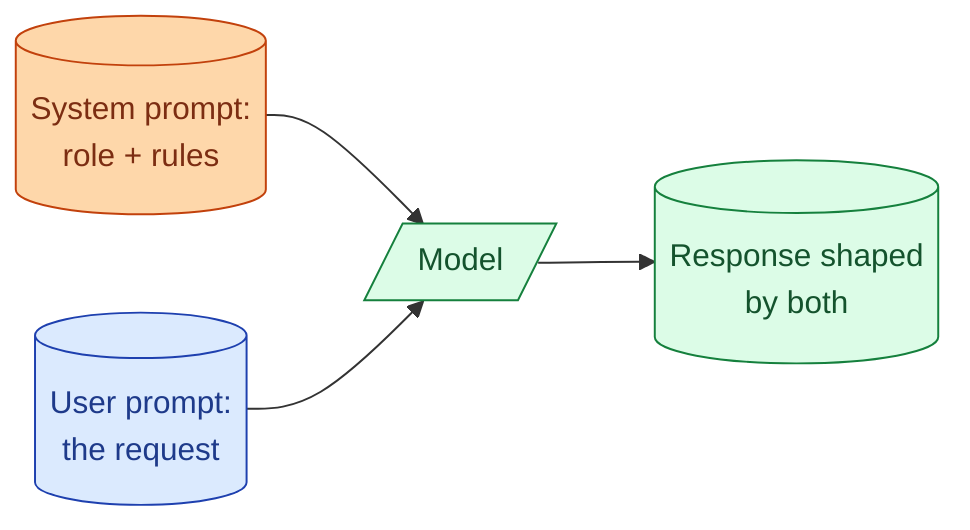
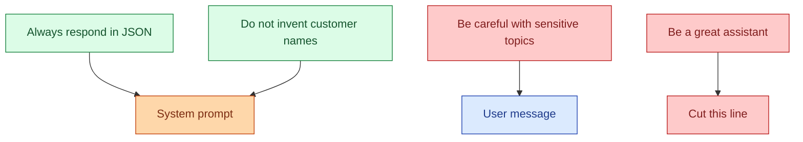

A system prompt is the place where you tell the model what it is and what rules to follow. People treat it as a free dumping ground. They paste a wishlist of behaviour, a personality, three pages of rules, and a few examples. The model now sees 3000 tokens of vague instructions on every single call. The bill goes up. The model gets worse, not better, because it cannot tell which rules matter. A good system prompt is short, specific, and earns every token it spends. This concept is about how to write one.

## What a system prompt is for



The system prompt sets the rules of the game. It runs in front of every user message. It does four jobs well: tells the model who it is, sets the output format, lists hard rules, and gives just enough context to do the task. Outside those four jobs, every extra word is paying tokens with no clear win.

## A bad system prompt, in the wild

```
You are an extremely helpful, very smart, polite assistant who is an
expert in all topics. You should always be friendly and answer in a
detailed way. Be thorough but not too thorough. Always be honest. Try
to be concise but also complete. When asked questions, please respond
clearly. You are good at coding, writing, math, science, and many
other things. Do not make up information. Be careful with sensitive
topics. Use markdown when appropriate. Avoid jargon when possible.
Format your responses well. Always be respectful.
```

This is 100 tokens of words that mean almost nothing. "Helpful and polite" is already the model's default. "Be detailed but concise" tells it nothing useful. "Do not make up information" is impossible to act on without specific anchors.

The model gets a vague vibe instead of specific instructions. Output quality goes down because the model picks and chooses what to obey.

## A good system prompt, same task

```
You answer questions from new engineers learning data engineering.

Rules:
- Use plain English. Avoid jargon unless you define it.
- If you do not know the answer or it depends, say so first.
- Cite which warehouse, tool, or pattern you are talking about.
- Keep answers under 200 words unless asked for more.

Output format: a short answer paragraph, then a 3-bullet "key points"
summary at the end.
```

About 70 tokens. Every line earns its place. The persona is concrete (data-eng learners), the rules are specific and checkable, the output format is named. The model now has a clear job.

## The four jobs of a system prompt

Treat these as the only sections worth writing.

**Role.** What the model is. One sentence. "You answer support tickets for a payments product." Not "you are a smart assistant."

**Output format.** What the response should look like. JSON shape, paragraph then bullets, headline then body. The clearer this is, the less the model improvises.

**Hard rules.** Things the model must do or must not do. Five or fewer. Each one is specific enough that you could write a test for it.

**Just-enough context.** Domain words the model needs ("our refund window is 30 days"). One paragraph max. Long context belongs in the user message or in retrieved chunks, not in the system prompt.

If a line you wrote does not fit one of these four, cut it.

## Putting rules where they actually work



A useful test for each rule: could a junior take this line and tell me whether the output passed or failed it? If yes, keep it. If no, cut or rewrite it.

"Be helpful" is uncheckable. "Always include a one-sentence summary at the start" is checkable. Write the second kind.

## The cost of getting it wrong

Every token in the system prompt is billed on every single call. A 3000-token system prompt over 100,000 calls a day is 300 million input tokens daily, just for instructions the model often ignores.

Compress the system prompt by 70 percent and your input cost drops by close to 70 percent on input-heavy tasks. There is no other lever this cheap. See concept 6 for the cost math.

Also, the longer the system prompt, the less reliably the model follows any one rule. Models do not weight rules equally. A focused 200-token system prompt is followed more closely than a sprawling 2000-token one, on the same task.

## A pattern that works

For most production tasks, a system prompt looks like this:

```
{Role in one sentence.}

You will receive {what the user message will contain}.

Respond with {output format, very specific}.

Rules (do not break these):
- {Rule 1, checkable}
- {Rule 2, checkable}
- {Rule 3, checkable}

{Optional: 1-2 sentences of domain context the model cannot guess.}
```

Fill that template and resist the urge to add anything else. The "additional notes" section that everyone adds is usually the part that hurts quality.

## When persona helps and when it does not

Setting a persona ("you are a senior code reviewer") helps when the role has a real shape: known vocabulary, known concerns, known style. A senior code reviewer thinks about edge cases, mentions trade-offs, names patterns.

It hurts when the persona is too vague. "You are an expert" is famously the worst possible persona because every model is already trying to sound like one. The line adds zero information and burns tokens.

Test before keeping persona text: run the prompt with and without it on the same 10 examples. If the without-persona version is worse, keep it. If they look the same, cut it.

## Negative rules: how to say "do not do that"

Negative rules ("do not invent customer names") are useful but a model is sometimes better at following positive versions of the same rule ("only use customer names that appear in the input").

For high-stakes negative rules (PII, safety, illegal content), state them as positive constraints when you can. "Use only the names provided" beats "do not invent names" for the same outcome.

For low-stakes formatting rules, negative is fine. "Do not wrap the output in markdown code fences" works.

## Examples (few-shot) go in the user message, mostly

You can put few-shot examples in the system prompt. You usually should not. Examples grow over time, sometimes get tuned per-request, and rotate based on what the user is asking. Keeping them in the user message (or in a turn-based pattern) keeps the system prompt stable and lets you cache it.

See concept 13 for when few-shot earns its keep.

## Common mistakes

- **Dumping every nice-to-have rule into the system prompt.** The model treats all rules with equal weight; the important ones get diluted.
- **Writing "you are a helpful assistant."** That is the default. The line costs 7 tokens and adds nothing.
- **Rules a human cannot test.** "Be thoughtful" is not a rule, it is a wish.
- **Examples in the system prompt that change every call.** Cache breaks. Move them to the user message.
- **Long context loaded into the system prompt.** Belongs in retrieval or in the user message, not in the always-on prefix.

## Quick recap

- A system prompt has four jobs: role, output format, hard rules, just-enough context.
- Every line that does not fit one of those four is paying tokens for nothing.
- Hard rules should be testable by a human reading the output.
- Compressing the system prompt by 70 percent is a 70 percent cut in input cost for input-heavy tasks.
- Persona helps when the role is specific; "you are an expert" is wasted tokens.
- Examples belong in user messages, not in the always-on system prompt.

This concept sits in **Stage 2 (Prompting as engineering)** of the [AI Engineering Roadmap](/practice/ai-engineering/roadmap/).
