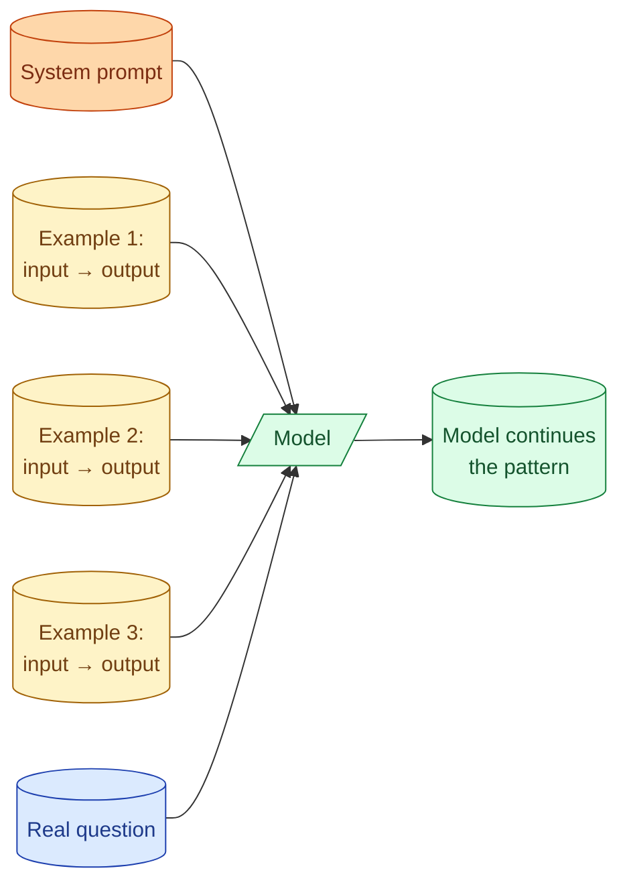
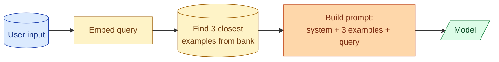

Few-shot prompting is when you include 2 to 5 example input-and-output pairs in the prompt before the real question. The model copies the pattern. It is one of the cheapest quality wins in AI engineering when it works. It also wastes tokens when the task is too simple or too varied for examples to help. Knowing the difference is the skill.

## What few-shot looks like



The model is a pattern-matcher. Show it three labelled examples, and it figures out the rule, then applies it to the new input. This is called in-context learning. It is not fine-tuning. The model has not actually learned anything; it is matching the local pattern in front of it.

## A working example

Task: classify support tickets into one of five categories.

Without few-shot:

```
You classify support tickets. Categories: billing, login, bug,
feature_request, other.

Ticket: "I cannot remember my password and the reset email never came."
```

The model usually picks "login," but sometimes picks "other" or invents a new label. About 80 percent right.

With four few-shot examples:

```
You classify support tickets. Categories: billing, login, bug,
feature_request, other.

Ticket: "Got charged twice for my March subscription."
Category: billing

Ticket: "App crashes when I tap the camera button."
Category: bug

Ticket: "Would love to be able to export to CSV."
Category: feature_request

Ticket: "Can you add my partner to my account?"
Category: other

Ticket: "I cannot remember my password and the reset email never came."
Category:
```

Now the model picks "login" almost every time. The examples taught it the format (single word, exact spelling, comes after `Category:`) and the boundaries (account help goes to "other," not "login"). Accuracy goes from 80 percent to 95+ percent on this kind of task.

## When few-shot is the right move

Three signs the task is a good fit.

**The output has a specific shape.** Classification labels, JSON structures, a particular tone. Examples show the shape better than rules.

**The task has fuzzy boundaries.** Is a question about "my login expired" a login issue or a billing issue? Rules cannot fully resolve it. Examples can.

**The model is small.** Smaller models benefit more from examples because they need more help inferring the pattern. A big model often gets it right without help.

## When few-shot is the wrong move

Equally specific signs it does not help.

**The task is obvious.** "Translate this English sentence to French." The model knows what translation looks like. Examples just burn tokens.

**The task is too varied.** A general chat assistant cannot be examplified. Showing three example conversations does not teach the model what to do with the fourth, which is unrelated.

**You have no labelled examples handy.** Bad examples are worse than no examples. The model copies them too.

**You are using a big reasoning model.** For Claude Opus or GPT 4.5, structured rules in the system prompt often work as well as examples, with fewer tokens.

## How many examples to use

```
1 example:    model picks up the shape, often misses edge cases.
3 examples:   sweet spot for most classification or extraction tasks.
5 examples:   useful for tasks with several distinct patterns.
10+ examples: rare, only when the task has many varied subtypes.
```

Beyond 5 or 6 examples, you are usually better off either fine-tuning or restructuring the task. The marginal example after the fifth rarely earns its tokens.

For 50,000 calls a day, 5 examples at 100 tokens each is 25 million extra input tokens per day. Worth it if accuracy goes from 85 percent to 95 percent. Not worth it if accuracy goes from 90 percent to 91 percent.

## Picking the right examples

Three rules.

**Pick examples that cover the edges.** Not three easy cases. Three hard or boundary cases that teach the pattern. The model learns from the hard ones.

**Pick examples that match the input distribution.** If your real inputs are 60 percent billing and 30 percent login, your examples should reflect that, not show one of each category.

**Update examples when the model fails.** Keep a small file of "hard examples." When the model picks "other" on something obviously billing, add that case to the example set. The example set grows with the failure modes you have seen.

## The dynamic few-shot trick

For systems with many input types, you do not want all examples on every call. A dynamic version picks examples per request, based on similarity.



You store a bank of 200 labelled examples. At call time, you embed the user input, find the 3 most similar examples, and include only those. The model sees the most relevant patterns for this specific request.

This adds a vector lookup to every call but uses the example token budget more efficiently. For varied tasks with many subtypes, dynamic few-shot often beats static.

## Few-shot in chat format

For chat-based models, the cleanest way to do few-shot is alternating fake user and assistant turns:

```python
messages = [
    {"role": "user", "content": "Classify: 'Got charged twice for March.'"},
    {"role": "assistant", "content": "billing"},
    {"role": "user", "content": "Classify: 'App crashes on tap.'"},
    {"role": "assistant", "content": "bug"},
    {"role": "user", "content": "Classify: 'Reset email never came.'"}
]
```

The model continues the pattern with "login." This works better than a single user message that contains "Example 1:, Example 2:," because it matches how the model was trained.

## Few-shot vs fine-tuning

Both teach the model patterns. The difference is when and where the learning happens.

| | Few-shot | Fine-tuning |
| --- | --- | --- |
| When | At inference, in the prompt | Once, before deployment |
| Cost per call | Higher (more tokens) | Lower (no extra tokens) |
| Setup cost | Zero (just write examples) | Real (training data, training run) |
| Iteration speed | Fast (edit a file) | Slow (retrain) |
| Good for | Variable tasks, fast iteration | Stable, high-volume tasks |

The senior rule: try few-shot first. If at very high volume the per-call token cost adds up, then fine-tune. Most projects never need fine-tuning. See Section F concept 74.

## A test for whether your examples are working

Run the prompt with examples and without. Compare on the same 20 to 50 inputs. If accuracy is the same, drop the examples. If accuracy is better with them, keep them.

This sounds obvious. Most teams never do it. They add examples because a tutorial said to, and pay the token cost forever.

## Common mistakes

- **Examples for tasks that do not need them.** "Translate this" or "summarize this." The model knows.
- **Examples that are too easy.** Three obvious cases teach the model nothing about the hard ones.
- **Examples in the system prompt that change every call.** Cache breaks; cost goes up.
- **Never measuring whether they help.** If you cannot show the lift, drop them.
- **Five examples when three is plenty.** Diminishing returns kick in fast past three.

## Quick recap

- Few-shot is putting 3 to 5 example input-output pairs in the prompt before the real one.
- The model copies the pattern. This is the cheapest single quality win when the task fits.
- Use it for fuzzy classification, specific output shapes, small models. Skip it for general chat and obvious tasks.
- Pick examples that cover edge cases and match your input distribution.
- For varied tasks, dynamic few-shot (pick examples per call by similarity) beats static.
- Measure whether examples actually help. Drop them when they do not.

This concept sits in **Stage 2 (Prompting as engineering)** of the [AI Engineering Roadmap](/practice/ai-engineering/roadmap/).
