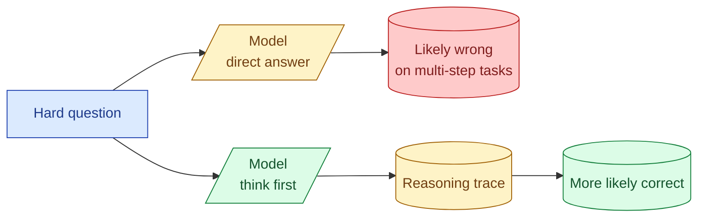
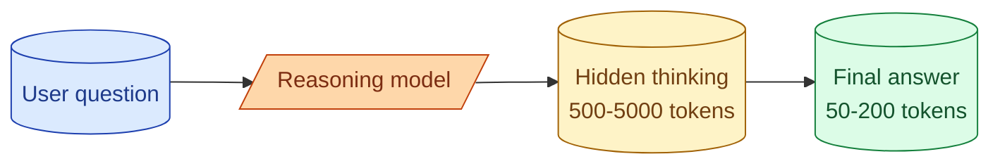

Chain of thought is the prompting pattern where you ask the model to reason out loud before it answers. Instead of jumping straight to "the answer is 42," it works through "the question asks X, so I need to compute Y, then Z, and that gives 42." On hard problems with multiple steps, this can lift accuracy by 10 to 30 percentage points. On easy problems it doubles your token cost for the same answer. Knowing when to use it, and when not to, separates the senior from the cargo-culter.

## What chain of thought looks like

The trigger is usually one short phrase in the prompt.

```
Question: A farmer has 17 sheep. All but 9 run away. How many sheep
does the farmer have left?

Answer:
```

Without chain of thought, models often answer "8" (17 minus 9). That is wrong. "All but 9 run away" means 9 remain.

With chain of thought, you add one line:

```
Question: A farmer has 17 sheep. All but 9 run away. How many sheep
does the farmer have left?

Think step by step, then give your answer.
```

The model writes: "The question says 'all but 9 run away.' That means 9 sheep did not run away. So the farmer has 9 sheep left." Correct.

That single phrase "think step by step" is often enough. Sometimes more structure helps, but the basic trick is that simple.

## Why it works



A model generates one token at a time, conditioned on what came before. When you ask for the answer directly, the model has to compute the whole answer in the small amount of work it can do before producing the first token. For a multi-step problem, that is not enough.

When you ask for reasoning first, the model writes intermediate steps. Each step is itself useful work that conditions the next step. By the time it writes the final answer, it has done the work in the open instead of trying to do it all at once internally.

This is why chain of thought is not magic. It is the model using its own output as a scratchpad.

## When chain of thought helps

The honest list, based on what works in practice.

**Math, especially word problems.** Multi-step arithmetic, ratio reasoning, conditional reasoning. The lift is biggest here.

**Logic and constraint-satisfaction.** Sudoku-style puzzles, deciding which of three rules applies, multi-condition filtering.

**Code reasoning.** "Why does this function return the wrong value when n=5?" Tracing through execution benefits from explicit steps.

**Multi-hop questions.** "Which of these three customers has the largest gap between sign-up and first purchase?" Requires intermediate calculation.

**Anything you would write on a whiteboard.** If a smart human would draw arrows and intermediate notes to solve it, the model needs to do the same.

## When chain of thought wastes tokens

Equally honest.

**Single-step questions.** "What is the capital of France?" The model knows. Reasoning out loud just adds latency and cost for the same answer.

**Classification with a small label set.** "Categorize this ticket as billing, login, bug, feature, or other." A direct answer is fine. The model is not deciding through multi-step logic.

**Style or formatting tasks.** "Rewrite this paragraph more formally." Reasoning does not help; the model is doing surface transformation.

**Translation, summarisation.** Direct generation tasks. CoT adds latency for the same output.

If the task does not have intermediate steps a human would write down, CoT is not helping.

## The cost

Reasoning text is output tokens. Output tokens are 3 to 5 times more expensive than input tokens (see concept 6). A 50-token answer becomes a 300-token answer with the reasoning included.

That is fine if accuracy goes from 60 percent to 90 percent. That is a waste if accuracy goes from 90 percent to 91 percent.

The rule: measure with and without on the same eval set. If the lift is real, pay for the tokens. If it is small or zero, drop the CoT instruction.

## Reasoning models: CoT built in

In 2026, several model families ship with reasoning built in. OpenAI's o-series, Anthropic's Claude with extended thinking, Google's Gemini with deep reasoning. These models do extensive reasoning internally before producing the user-visible answer.



You do not see the thinking, but you pay for it. Reasoning tokens count as output. A reasoning model on the same hard problem might use 5x to 10x the tokens of a standard model.

Pick a reasoning model when:

- The task is genuinely hard and you have measured that standard models fail at it.
- Latency tolerance is generous (reasoning takes time).
- Quality on the hard cases matters more than cost on the easy ones.

Skip reasoning models when:

- The task is simple.
- You need fast responses.
- High volume + tight budget.

A common production pattern: route easy cases to a standard model and hard cases to a reasoning model. See Section F concept 61.

## Hidden chain of thought

Sometimes you want the model to reason but you do not want the user to see the reasoning. Two patterns.

**Reason then summarise.** "Think through the answer carefully. Then give a one-paragraph final answer." The model reasons, then the last paragraph is what you display. Costs the same as visible CoT.

**Tagged sections.** Ask the model to write `<thinking>...</thinking>` around its reasoning. Strip those tags before showing to the user. Same cost. Cleaner output.

Both add tokens. Worth it when the reasoning helps quality but the user only cares about the conclusion.

## When CoT goes wrong

Three failure modes worth knowing.

**The model reasons confidently to the wrong answer.** This happens. CoT is not truth-finding; it is structured generation. A long reasoning trace ending in a wrong answer reads as more authoritative than a direct wrong answer, which is dangerous in user-facing settings.

**The reasoning contradicts the final answer.** The model writes correct steps, then gives the wrong number anyway. Catch this with a second pass: "Verify your answer matches your reasoning. If they conflict, correct."

**The reasoning is plausible but irrelevant.** "Let me think about this. The question is asking X. The answer involves Y... [the answer is unrelated to either]." Especially on out-of-distribution questions, the model produces fluent reasoning that goes nowhere.

These are why CoT is not a free safety net. It is a useful pattern with its own failure modes.

## Self-consistency: many reasoning paths

A trick to squeeze more accuracy out of CoT on hard problems: ask the model to reason 5 different ways, then take the most common final answer.

```python
answers = [
    call_model("Think step by step:\n" + question, temperature=0.7)
    for _ in range(5)
]
final = mode([extract_answer(a) for a in answers])
```

If 4 of 5 reasoning paths land on the same answer, you can trust it more than a single CoT trace. Costs 5x the tokens, but quality often beats running a single big model.

Used in production for high-stakes hard problems where the budget exists. Overkill for everyday tasks.

## Common mistakes

- **Adding "think step by step" to every prompt.** Burns tokens on tasks that do not need it.
- **Using a reasoning model for classification.** Pays for hidden thinking that is not helping.
- **Trusting the reasoning trace.** It can be confident and wrong. Verify the final answer separately when stakes are high.
- **Never measuring the lift.** If you cannot show CoT improves your eval, drop it.
- **Mixing CoT with strict structured output.** The reasoning often breaks the JSON shape. Use a separate pass or tagged thinking.

## Quick recap

- Chain of thought is asking the model to reason out loud before answering.
- It works because the model uses its own output as a scratchpad.
- Big lift on math, logic, multi-step reasoning. No lift on classification, translation, simple lookup.
- The cost is real: 3 to 10x output tokens. Measure the lift before keeping it.
- Reasoning models do CoT internally. Pick them for hard tasks, skip for easy ones.
- Self-consistency (multiple reasoning paths, majority vote) squeezes more accuracy out at higher cost.

This concept sits in **Stage 2 (Prompting as engineering)** of the [AI Engineering Roadmap](/practice/ai-engineering/roadmap/).
