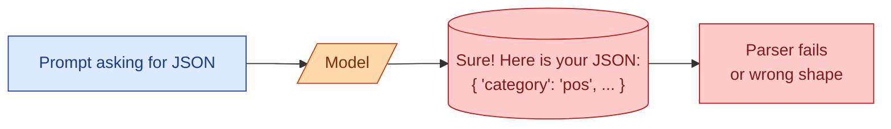

Half of all real-world AI code has the same shape: send a prompt, get text back, parse it into a struct. For years the way to do this was "ask nicely for JSON in the prompt, then `json.loads()` the output and hope." It worked 80 percent of the time and broke on the other 20. Every provider now offers structured outputs, where the model is forced to produce JSON that matches a schema you supply. This concept is about how those work, when to use which mode, and why "ask for JSON in the prompt" should not be your default any more.

## The old way and why it broke

```
System: You return JSON only. Format: {"category": "...", "score": ...}
User: Classify: "I love this product."
Model: Sure! Here is the JSON:
       {"category": "positive", "score": 0.9}
```

The model returned the JSON, but it also returned "Sure! Here is the JSON:" first. Your `json.loads()` fails. You write a regex to extract the JSON. The regex works until the model writes "Here are the results:" instead. You write a better regex. Then the model returns valid-looking JSON with a missing comma. You give up and call OpenAI.



This pattern is everywhere. It is also why structured outputs exist.

## What structured outputs actually do

The provider constrains the model's output to match a JSON schema you supply. Not by prompting. By forcing the tokens.

```mermaid
flowchart LR
    P[Prompt]:::u --> M[/Model/]:::m
    S[(Schema:<br/>{category: enum,<br/>score: number})]:::sch --> CT[Constrained<br/>token generation]:::tx
    M --> CT
    CT --> O[("Valid JSON,<br/>guaranteed shape")]:::ok

    classDef u fill:#dbeafe,stroke:#1e40af,color:#1e3a8a
    classDef m fill:#fed7aa,stroke:#c2410c,color:#7c2d12
    classDef sch fill:#fef3c7,stroke:#a16207,color:#713f12
    classDef tx fill:#dcfce7,stroke:#15803d,color:#14532d
    classDef ok fill:#dcfce7,stroke:#15803d,color:#14532d
```

At each step, when the model would normally pick from the whole vocabulary, the system masks out any token that would make the output invalid against the schema. The model can only sample from tokens that keep the output legal.

Result: you get valid JSON in the right shape every time. The "Sure! Here is" preamble cannot happen because the schema starts with `{` and the model is forced to start there.

## OpenAI: response_format with strict schemas

```python
from pydantic import BaseModel
from openai import OpenAI

class TicketClassification(BaseModel):
    category: str  # "billing" | "login" | "bug" | "feature" | "other"
    confidence: float

client = OpenAI()
resp = client.beta.chat.completions.parse(
    model="gpt-4o-2024-08-06",
    messages=[{"role": "user", "content": "Classify: 'Got charged twice for March.'"}],
    response_format=TicketClassification,
)

result = resp.choices[0].message.parsed
# result is a TicketClassification instance, fully typed
print(result.category, result.confidence)
```

OpenAI converts the Pydantic class into a JSON schema, passes it to the model with strict mode, and parses the result back into a typed Python object. If the model would produce something invalid, the system prevents it.

This is the cleanest pattern in any provider's SDK as of 2026. Use it where you can.

## Anthropic: tool use with structured input

Anthropic's approach is "use the tool-use system, even when you do not have a real tool."

```python
from anthropic import Anthropic

client = Anthropic()
resp = client.messages.create(
    model="claude-3-7-sonnet",
    max_tokens=512,
    tools=[{
        "name": "record_classification",
        "description": "Records the classification of the ticket.",
        "input_schema": {
            "type": "object",
            "properties": {
                "category": {
                    "type": "string",
                    "enum": ["billing", "login", "bug", "feature", "other"]
                },
                "confidence": {"type": "number"}
            },
            "required": ["category", "confidence"]
        }
    }],
    tool_choice={"type": "tool", "name": "record_classification"},
    messages=[{"role": "user", "content": "Classify: 'Got charged twice for March.'"}]
)

result = resp.content[0].input
# {"category": "billing", "confidence": 0.95}
```

Slightly more code, same outcome. The model is forced to call the tool with arguments matching the schema. Setting `tool_choice` to force this specific tool removes the "should I call a tool?" decision.

## The three modes most providers offer

To pick the right one, know what each guarantees.

| Mode | Guarantee | Use when |
| --- | --- | --- |
| **Plain text** | Nothing. You parse. | Free-form chat, creative writing. |
| **JSON mode** (loose) | Output is valid JSON. Shape is your problem. | Quick prototypes. |
| **Schema-constrained** (strict) | Output is valid JSON matching your schema. | Production. Anything you parse. |

The lift from "JSON mode" to "strict schema" is bigger than the lift from plain text to JSON mode. Schema constraints are what makes the output reliable.

## When the schema is your contract

A schema is not just a parser hint. It is the contract between your code and the model.

```python
class InvoiceLine(BaseModel):
    description: str
    quantity: int
    unit_price: float
    line_total: float

class InvoiceExtraction(BaseModel):
    vendor: str
    invoice_number: str
    invoice_date: str  # ISO 8601
    lines: list[InvoiceLine]
    total: float
```

When the model produces output, every field is typed, every required field is present, every enum value is in the allowed list. Your downstream code does not need to validate. The validation already happened at generation time.

This changes how you write the prompt. You no longer say "respond with a JSON object containing..." because the schema already enforces that. You say what you want extracted, and the schema tells the model how to give it to you.

```
Extract the line items from this invoice text.

[invoice text here]
```

The schema does the rest.

## What schemas cannot enforce

A schema enforces shape, not meaning.

The schema says `confidence: number between 0 and 1`. The model gives 0.95. The schema is satisfied. Whether 0.95 is the right confidence is a different question, and one your eval suite has to answer.

The schema says `category: one of {billing, login, ...}`. The model picks "login." The schema is satisfied. Whether "login" is the correct label is a model quality question.

This is why structured outputs reduce parsing bugs to zero, but quality is still on you. They make the shape reliable. They cannot make the content correct.

## Cost and latency

Structured outputs are roughly the same cost as plain text generation. Sometimes slightly higher for the initial schema validation. Not a meaningful difference.

Latency is sometimes slightly higher on first call because the provider pre-processes the schema. Cached after that. Negligible in steady state.

The win is on the other side: you stop paying engineers to write parsers and regex retries. That savings dwarfs any per-call overhead.

## Streaming and structured outputs

You can stream structured output. You can also try to parse it before it finishes. Do not.

Half a JSON is not valid JSON. Use a streaming JSON parser if you really need to (some libraries handle incremental parsing), or just accumulate the full text and parse at the end.

OpenAI's structured outputs and Anthropic's tool use both work with streaming. The token-by-token validation happens during the stream. You still wait for the close brace before you have a usable object.

## When not to use structured outputs

Two cases.

**Free-form generation.** Writing an email, summarising a document, generating a story. There is no shape to constrain. Plain text is right.

**Output should genuinely vary in shape.** "Either return a list of items, or a message explaining why none were found, or ask a clarifying question." You can model this with a tagged union, but it gets fiddly. Sometimes plain text plus light parsing is simpler.

For everything else that gets parsed, structured outputs are the right default.

## Common mistakes

- **Still using "respond with JSON" in the prompt in 2026.** Structured outputs have been GA for over a year. Use them.
- **Plain JSON mode without a schema.** You get valid JSON. The shape is still your problem.
- **Building Pydantic schemas with vague field names.** Bad field names produce bad outputs. `category` is clearer to the model than `cat`.
- **Putting validation logic in both the schema and the prompt.** Pick one. Schema wins.
- **Parsing streaming output before it finishes.** Wait for the close brace.

## Quick recap

- Structured outputs force the model to produce JSON matching your schema, at generation time.
- OpenAI: `response_format` with a Pydantic class. Anthropic: tool use with `input_schema`.
- The lift from JSON mode (loose) to strict schemas is big. Use strict whenever you parse the output.
- Schemas enforce shape, not meaning. Quality is still on you.
- Cost and latency are roughly the same as plain text. The savings come from no more parsers.
- Skip structured outputs only for free-form generation or genuinely varied shapes.

This concept sits in **Stage 2 (Prompting as engineering)** of the [AI Engineering Roadmap](/practice/ai-engineering/roadmap/).
