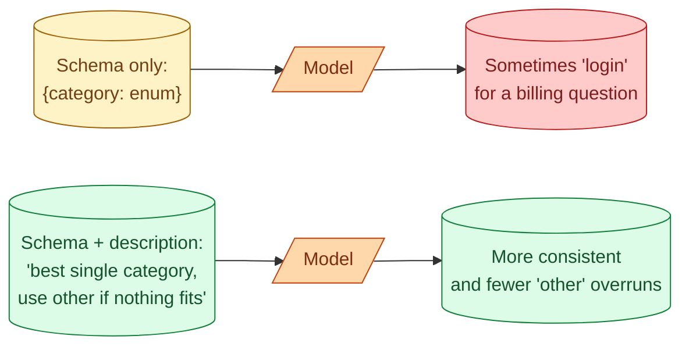

Structured outputs solve "is the JSON valid?" Schemas solve "is the JSON useful?" A schema that just says "object with three fields" is a hint. A schema that uses enums, constraints, descriptions, and required fields is a contract. The difference shows up in production: models follow tight schemas more closely, parsers do less work, downstream code can trust the data. This concept is about how to write schemas that earn their place in the pipeline.

## Three levels of schema strictness

Same data, three quality levels of schema.

**Level 1: loose**

```json
{
  "type": "object",
  "properties": {
    "category": {"type": "string"},
    "score": {"type": "number"}
  }
}
```

Valid JSON. Any string. Any number. Almost as bad as no schema.

**Level 2: typed**

```json
{
  "type": "object",
  "properties": {
    "category": {"type": "string", "enum": ["billing", "login", "bug", "feature", "other"]},
    "score": {"type": "number", "minimum": 0, "maximum": 1}
  },
  "required": ["category", "score"]
}
```

Category must be one of five values. Score must be between 0 and 1. Both required. The model is now constrained at generation time to produce valid values, not just valid types.

**Level 3: typed with descriptions**

```python
from pydantic import BaseModel, Field
from typing import Literal

class TicketClassification(BaseModel):
    category: Literal["billing", "login", "bug", "feature", "other"] = Field(
        description="The single best category. Use 'other' only if no other fits."
    )
    score: float = Field(
        ge=0, le=1,
        description="Confidence in the category, 0 to 1."
    )
    reason: str = Field(
        description="One sentence explaining the choice."
    )
```

Now the model knows what each field is for. The descriptions get passed to the model along with the schema. This is the level senior engineers ship.

## Why descriptions matter so much

Schemas without descriptions are like function signatures without docstrings. The model can infer what `category` means from context, but it does not always infer correctly.



The field-level description is read by the model the same way a system prompt is. Better descriptions, fewer surprises.

A practical rule: if a junior engineer would have to ask "what does this field mean?", the model has the same question. Write the description for the junior.

## Enums beat strings

Whenever a field has a small fixed set of valid values, use an enum, not a string.

| Field type | What the model can produce | Result |
| --- | --- | --- |
| `string` | Any text. "billing", "BILLING", "Billing - account-related" | Inconsistent labels, downstream code has to normalize |
| `enum: ["billing", "login", ...]` | Exactly one of the listed values | Clean labels, no normalization |

Enums also tell the model "these are the only options," which prevents the model from inventing new categories. With a free string field, models occasionally produce `"billing/login"` or `"unsure"`. With an enum, that is impossible.

## Required vs optional fields

A required field must be present. An optional field can be omitted. Both have failure modes.

```python
class InvoiceExtraction(BaseModel):
    invoice_number: str        # required
    vendor: str                # required
    invoice_date: str          # required
    purchase_order: str | None # optional, may be absent
    notes: str | None          # optional
```

For required fields, the model is forced to produce something. If the invoice does not have an invoice number, the model writes "unknown" or "N/A" or invents one. None of those are useful.

For required fields where absence is possible, make the field optional. The model writes `null` when it does not see the value. Downstream code handles `None`.

The rule: only mark a field required if it is genuinely required and always extractable. Otherwise optional, with `None` allowed.

## Lists and nested structures

Real extraction tasks are rarely flat objects.

```python
class InvoiceLine(BaseModel):
    description: str
    quantity: int = Field(ge=0)
    unit_price: float = Field(ge=0)
    line_total: float = Field(ge=0)

class InvoiceExtraction(BaseModel):
    vendor: str
    invoice_number: str
    invoice_date: str
    lines: list[InvoiceLine]
    subtotal: float = Field(ge=0)
    tax: float = Field(ge=0)
    total: float = Field(ge=0)
```

Lists of typed objects work well. The model produces an array of line items, each one matching the schema. Nested objects are the most natural way to model real-world extraction.

Watch out for arbitrary depth. A schema with five levels of nesting is hard to follow for both the model and the human reading the code. If you find yourself nesting deeply, flatten or split into two passes.

## Constraints catch the "shape ok, value wrong" bug

```python
class ExtractedDate(BaseModel):
    date: str = Field(pattern=r"^\d{4}-\d{2}-\d{2}$")
```

Without the pattern, the model produces "March 15, 2026" or "15/03/2026" or "20260315." Each is "valid string." Your downstream code that parses dates breaks.

With the pattern, the model is forced to produce `YYYY-MM-DD`. The downstream parser does not need to guess the format.

Same idea for ranges (`ge`, `le`), string lengths (`min_length`, `max_length`), and regex patterns. Each constraint that catches a real failure mode pays for itself.

## The "use 'unknown' instead of guessing" pattern

A common bug: the schema requires a `vendor` field. The invoice text is partial and the vendor is illegible. The model invents a plausible vendor name. The downstream system books an invoice from a vendor that does not exist.

The fix: tell the schema the value can be "unknown."

```python
class InvoiceExtraction(BaseModel):
    vendor: str = Field(
        description="Vendor name. Use 'UNKNOWN' if not clearly readable."
    )
```

Or use an optional field and instruct the model to leave it null when uncertain. Either way, the model has a way to say "I cannot tell" without making something up.

This pattern alone removes the most common class of hallucination bug in extraction tasks.

## Schemas that change at runtime

Sometimes the schema depends on input. A document type drives which fields to extract. A user role drives which fields are allowed.

```python
def build_schema(doc_type: str) -> type[BaseModel]:
    if doc_type == "invoice":
        return InvoiceExtraction
    elif doc_type == "receipt":
        return ReceiptExtraction
    elif doc_type == "purchase_order":
        return PurchaseOrderExtraction

schema = build_schema(detected_doc_type)
response = client.responses.parse(model=model, response_format=schema, ...)
```

This is a clean pattern. Each schema is its own typed class. The classifier picks one. The extraction call uses the picked schema.

What is not clean: trying to build one giant schema that covers all document types with optional fields for everything. The model gets confused about which fields are relevant. Quality drops.

## Two-pass: schema for shape, follow-up for quality

For complex extraction, a two-pass pattern often beats one big schema.

Pass 1: extract the easy structural fields (invoice number, vendor, date).
Pass 2: extract the line items, given the structural context.

Each pass uses a simpler schema. Errors are caught early. Cost is roughly the same as one big pass because the total prompt tokens are similar.

The senior version of "the model is making mistakes on this schema" is often "the schema is doing too much. Split it."

## Validation past the schema

The schema catches type and value errors. It does not catch business rule violations.

```python
def validate_invoice(inv: InvoiceExtraction) -> list[str]:
    errors = []
    if abs(sum(line.line_total for line in inv.lines) - inv.subtotal) > 0.01:
        errors.append("Subtotal does not match sum of line totals")
    if abs(inv.subtotal + inv.tax - inv.total) > 0.01:
        errors.append("Subtotal + tax does not equal total")
    return errors
```

Run these checks after parsing. When they fail, you have a clear signal: the model produced valid JSON but the numbers do not add up. Surface to a human reviewer, or feed back to the model in a second pass.

This is the layer that catches "the JSON parsed, but it is still wrong."

## Common mistakes

- **Loose schemas with just types.** Add enums, ranges, patterns where applicable. Every constraint catches a real bug.
- **Required fields that should be optional.** Forces the model to invent values when none exists.
- **No descriptions on fields.** The model guesses what each field means.
- **One giant schema for everything.** Split by use case. Each schema does one job.
- **No business-rule validation after parsing.** The schema catches shape, not meaning.

## Quick recap

- A schema is the contract between the model and your code. Tight schemas are followed more closely.
- Use enums for fixed sets, patterns for formats, ranges for numbers. Each constraint catches a real failure.
- Mark fields required only when truly required. Optional + nullable handles absence cleanly.
- Field descriptions are read by the model like a system prompt. Write them for clarity.
- Provide an explicit "unknown" path to prevent hallucination on ambiguous inputs.
- Validate business rules after parsing. The schema catches shape; rules catch meaning.

This concept sits in **Stage 2 (Prompting as engineering)** of the [AI Engineering Roadmap](/practice/ai-engineering/roadmap/).
