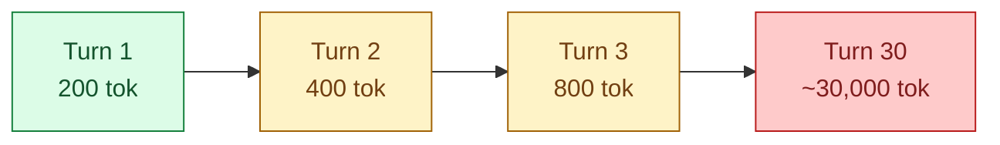
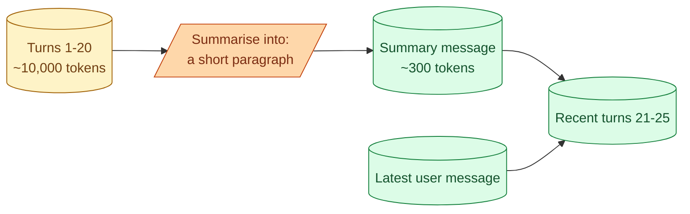
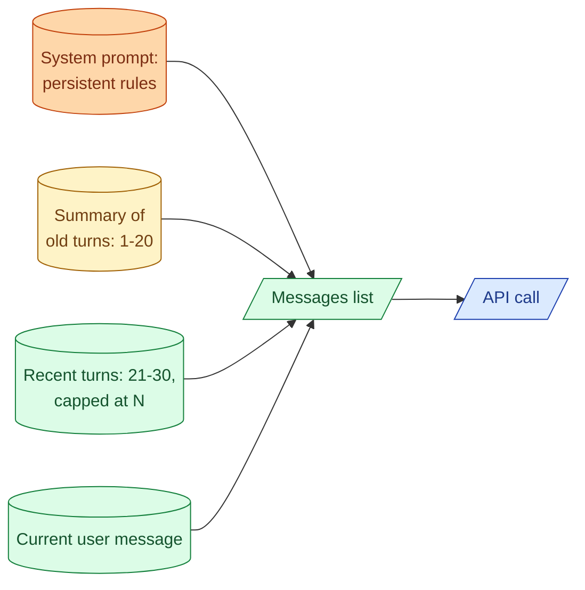

The model has no memory. Each API call is a one-shot. If you want the model to remember turn 3 when answering turn 4, you ship turns 1, 2, and 3 along with turn 4. By turn 50, you are shipping 49 previous turns on every call. Token costs grow linearly with conversation length. So does latency. And the model gets worse, not better, because the early turns dilute its attention. Three patterns keep multi-turn conversations affordable and useful: capping, summarising, and pruning.

## What "shipping history" actually looks like

```python
messages = [
    {"role": "user", "content": "What's a binary tree?"},
    {"role": "assistant", "content": "A binary tree is..."},
    {"role": "user", "content": "How does it compare to a linked list?"},
    {"role": "assistant", "content": "A binary tree has up to two children..."},
    {"role": "user", "content": "When would I use one over the other?"},
]
resp = client.messages.create(model=..., messages=messages)
messages.append({"role": "assistant", "content": resp.content[0].text})
```

Every call ships everything that came before. For a chat that goes 30 turns, every call sends 30 turns of context. The conversation grows quadratically in total cost: turn N pays for N-1 previous turns, and you do that for every N.



For a typical chat with 30 turns, you pay for roughly 450,000 input tokens across the whole conversation. Without managing history, this is the default behaviour.

## Why ignoring this is dangerous

Three problems compound as the conversation grows.

**Cost.** Each turn is more expensive than the last. Turn 30 costs ten times turn 3.

**Latency.** Time to first token grows with prompt length. Turn 30 takes noticeably longer to respond than turn 3.

**Quality.** Models pay less attention to the middle of long contexts. The system prompt and the latest message stay sharp, but the discussion about quicksort from turn 7 fades. The model forgets what it has been told, then contradicts itself.

The third problem surprises new builders. "But the model has a 200k context window." The window fits the data. The model just does not use the middle of it well. See concept 1.

## Pattern 1: cap the window

The simplest pattern. Keep the last N turns. Drop the rest.

```python
def trimmed_history(messages: list, keep_last_n: int = 10) -> list:
    if len(messages) <= keep_last_n:
        return messages
    return messages[-keep_last_n:]
```

For most chat applications, the last 10 turns is plenty. The user is asking about something they said in the last few minutes, not what they said 40 turns ago.

This pattern is right when each turn is relatively self-contained and the conversation does not depend heavily on early context.

It is wrong when early context matters. "I am a vegan, allergic to peanuts, on a low-sodium diet" said at turn 1 must survive to turn 30. A pure cap loses this.

## Pattern 2: summarise the old turns

When early context matters, summarise instead of drop.



```python
def summarise_old_turns(old_messages: list, client) -> str:
    transcript = "\n".join(f"{m['role']}: {m['content']}" for m in old_messages)
    resp = client.messages.create(
        model="claude-3-7-haiku",
        max_tokens=512,
        messages=[{
            "role": "user",
            "content": f"Summarise the key facts and decisions from this conversation in 5 sentences:\n\n{transcript}"
        }]
    )
    return resp.content[0].text
```

Every 20 turns, you compress turns 1 to 20 into a short summary, then keep the summary plus the most recent turns. The summary preserves the important context at a fraction of the token cost.

Two practical details.

**Use a cheap model for summarisation.** This is a background task; latency does not matter. Haiku or GPT-4o mini is enough.

**Add the summary as a system message or a special user message.** Tag it clearly so the model knows it is summarised context, not a live turn.

## Pattern 3: prune by relevance

A more advanced pattern: keep the turns that matter for the current question, drop the rest.

```python
def relevant_turns(messages: list, current_question: str, top_k: int = 5) -> list:
    if len(messages) <= top_k:
        return messages
    embeddings = [embed(m["content"]) for m in messages]
    q_emb = embed(current_question)
    scored = [(cosine(q_emb, e), i) for i, e in enumerate(embeddings)]
    scored.sort(reverse=True)
    keep_indices = sorted([i for _, i in scored[:top_k]])
    return [messages[i] for i in keep_indices]
```

You embed each past turn and the current question. You keep the most relevant turns. The model sees only what matters.

This is more code and adds embedding latency per turn. Worth it when conversations get very long and topics shift, like a customer support chat that bounces between billing, login, and feature questions. Each new question gets the relevant past context, not all of it.

## A combined strategy

The pattern that scales well in production combines all three.



System prompt at the top, never changes. A summary message of everything older than 20 turns ago. The most recent 10 to 20 turns verbatim. The new user message.

You get the system rules, the long-term context (compressed), the recent state (uncompressed), and the live question. Total prompt stays under a few thousand tokens regardless of conversation age.

## When to throw it all away

Sometimes the right answer is to reset the conversation.

If the user's new question has nothing to do with the previous topic, send only the system prompt and the new question. The model gets a clean slate. The user does not even need to know.

A simple heuristic: if the cosine similarity between the new question and the recent conversation is low (under 0.3, say), start fresh.

This pattern is useful in long-running assistants where topics shift, like an internal tool that handles questions across many product areas.

## Personalisation without unbounded history

If the user has preferences ("I prefer Python, I am on macOS, I work at a startup"), do not let those facts live in the conversation history alone. They will get dropped or summarised away.

Store user-level facts in a separate place, an actual database. On each call, build the system prompt to include the relevant facts.

```python
def build_system_prompt(user_id: str) -> str:
    facts = db.get_user_facts(user_id)  # ["prefers Python", "on macOS", ...]
    facts_block = "\n".join(f"- {f}" for f in facts)
    return f"{BASE_SYSTEM_PROMPT}\n\nUser facts:\n{facts_block}"
```

Now user facts persist across conversations and across history pruning. The conversation history holds only the current discussion. The user model holds the long-term state.

## Cost of these patterns

Capping is free. Just take a slice of the list.

Summarising costs one cheap-model call per summarisation. If you summarise every 20 turns, that is one extra small call per 20 user turns. Roughly 1 percent overhead.

Pruning by relevance costs one embedding per turn plus a cheap nearest-neighbour search. Adds about 100ms per turn and pennies of cost. Worth it past 50+ turn conversations.

For most teams, capping or summarising is enough. Relevance pruning is a Stage 6 production pattern.

## Common mistakes

- **Shipping unbounded history forever.** Cost and latency grow without limit.
- **Letting the system prompt grow with the conversation.** It should be stable; conversation state is what grows.
- **Storing user preferences in chat history.** They get summarised away. Store separately.
- **Summarising too aggressively.** Compressing to 50 tokens loses important detail.
- **Never measuring the impact.** Watch cost-per-call grow as conversations get longer. That number is your warning.

## Quick recap

- The model is stateless. You ship the conversation history every call.
- Cost and latency grow with history length. Quality drops because models gloss over the middle.
- Three patterns: cap to the last N turns, summarise older turns, prune by relevance.
- In production, combine: system prompt + old-turns summary + recent turns + current message.
- Store user-level facts in a database, not in chat history.
- Watch cost-per-call as a signal. A growing number means history is getting away from you.

This concept sits in **Stage 2 (Prompting as engineering)** of the [AI Engineering Roadmap](/practice/ai-engineering/roadmap/).
