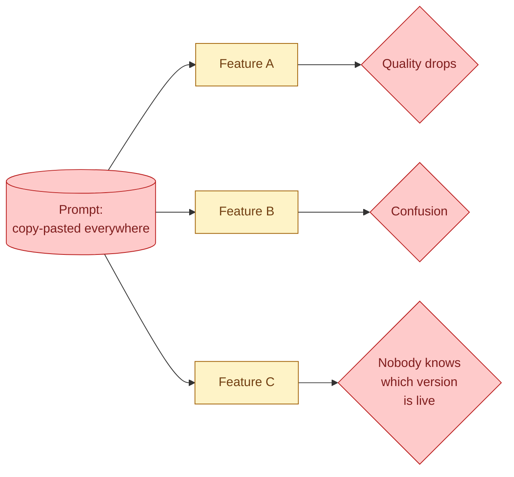

A prompt is code. It is a thing your application runs, it changes behaviour when you edit it, and breaking it breaks the product. Yet most teams treat prompts like documents. They live in a wiki, a chat message, a copy-pasted snippet. The next change has no review, no diff, no rollback. When the AI feature gets worse on Monday, nobody can answer "what changed." This concept is about putting prompts under the same engineering discipline as the rest of your code.

## The cost of unversioned prompts



When prompts are not versioned, three things happen, all bad.

Engineers copy the prompt into their code. Three engineers, three slightly different copies. The bug fix in one does not reach the others.

Someone updates the prompt in the wiki. The code keeps using the old one. Nobody notices for weeks.

The model gets an update from the provider. Quality changes. Nobody can tell whether the change was the model or the prompt because there is no record of the prompt's history.

These are real outages people have shipped. They are all preventable.

## The minimum viable version control: put prompts in git

The simplest fix solves 80 percent of the problem. Move every prompt out of code and chat and into files in the repo.

```
src/
  prompts/
    classify_ticket.md
    extract_invoice.md
    summarise_thread.md
```

Each prompt is a file. Code loads the file by name and uses it. Git tracks every change to the file. A diff on a prompt change is real and reviewable.

```python
from pathlib import Path

def load_prompt(name: str) -> str:
    return (Path("prompts") / f"{name}.md").read_text()

# Use it
prompt = load_prompt("classify_ticket")
resp = client.messages.create(model=..., system=prompt, messages=[...])
```

10 lines of code. The team now has prompt version control. Every change goes through PR review. The team can answer "what changed in the classifier last week" with `git log`.

## Treat prompts as a first-class part of code review

A PR that changes a prompt should:

- Be reviewed by someone besides the author.
- Include the eval suite output before and after the change (Stage 5).
- Describe what behaviour the change is meant to alter.
- Have a roll-back plan if quality drops.

Treat a 5-word prompt change with the same care as a 5-line code change. They have the same blast radius on user experience.

## Naming prompts: versions in the filename

When a prompt changes meaningfully, version the file.

```
prompts/
  classify_ticket_v1.md   (deprecated, can delete after 30 days)
  classify_ticket_v2.md   (live)
  classify_ticket_v3.md   (in eval, behind a flag)
```

Why bother when git already tracks history? Because two versions can be live at the same time. A/B tests, feature flags, gradual rollouts. v2 serves 90 percent of traffic, v3 serves 10 percent. After a week of comparing eval scores, v3 wins. Cut over and delete v2 30 days later.

You can also keep version numbers in the file's frontmatter and load by version. Whichever pattern fits your stack. The key is that version is explicit, not implicit in "the latest file."

## Loading prompts: keep it simple

You will be tempted to build a prompt management framework. Resist. The framework overhead usually exceeds the time it saves.

A simple loader that reads files, optionally with template substitution, is enough.

```python
import string
from pathlib import Path

class Prompt:
    def __init__(self, name: str, version: str = "latest"):
        path = Path("prompts") / f"{name}_{version}.md"
        self.template = path.read_text()
        self.name = name
        self.version = version

    def render(self, **kwargs) -> str:
        return string.Template(self.template).safe_substitute(**kwargs)

# Usage
p = Prompt("classify_ticket", version="v2")
system_prompt = p.render(categories="billing, login, bug, feature, other")
```

That is the whole framework. Variables get substituted with simple template syntax. The prompt's filename tells you which version is in use.

Heavy frameworks (LangChain's PromptTemplate, LlamaIndex's PromptHelper) add abstraction that pays off only in large multi-prompt projects. For most use cases, the simple loader is better.

## Variables in prompts: be careful

```
prompts/classify_ticket_v2.md:

You classify support tickets into one of: ${categories}.

Be concise. Use only the listed categories.
```

`${categories}` gets substituted at runtime. Useful for keeping the prompt generic and allowing customisation.

The danger: untrusted user input substituted into a prompt is a prompt injection vector. If a variable comes from the user, treat it the same as raw user input. Do not substitute it into a system prompt without escaping or bounding what is allowed.

See concept 67 on prompt injection.

## A prompt registry: when you have 30+ prompts

At small scale, prompts in a folder is enough. Past 30 or 40 prompts, a registry layer helps.

A registry tracks:

- Every prompt by name and version.
- Which version is live for each environment (dev, staging, prod).
- Who owns it.
- Last eval score.

```python
# Conceptual API
registry = PromptRegistry.load()
prompt = registry.get("classify_ticket", env="prod")
```

This stays simple. The registry is a JSON or YAML file in the repo, updated by PR. Promotion from staging to prod is a config change. Rollback is a config change in the other direction.

Production tools (Braintrust, LangSmith, Phoenix) provide hosted prompt registries with UI. Worth it when many engineers are editing prompts in many features. Probably overkill for a team of three.

## Couple prompts with their eval sets

Each prompt should have a corresponding eval set, in the same repo, in the same folder.

```
src/prompts/
  classify_ticket_v2.md
  classify_ticket_v2.eval.jsonl    # 50 labelled examples
```

The CI runs the eval set against the prompt on every PR that touches either file. If the eval score drops, the PR fails. See Section E for the eval details.

This is the difference between "we changed the prompt and hope it is better" and "we changed the prompt and the numbers say it is better."

## What goes in the prompt file and what does not

Things that belong in the prompt file:

- The system prompt itself.
- Few-shot examples that rarely change.
- Output format definitions.
- Hard rules.

Things that do not belong in the prompt file:

- User messages (those are inputs).
- Dynamic context from retrieval (built at runtime).
- User data (privacy and injection issues).
- Test cases (those go in the eval file).

Keep the prompt file focused on what is stable.

## The "I'll fix it later" anti-pattern

The most common bad pattern: the engineer is iterating, the prompt is hardcoded in their `chat.py`, "I'll move it to a file before merging." Then it does not get moved. Six months later, the prompt is still in the code, has been edited 30 times without review, and is the source of the next outage.

The senior version: move the prompt to a file the moment it works. The cost of doing it then is two minutes. The cost of fixing the technical debt later is hours.

## Common mistakes

- **Prompts hardcoded in code.** Editing the prompt requires a code change, but the diff is "+1 word in a 200-word string" and reviewers skip it.
- **Prompts in wikis or docs.** Drifts from the live prompt. Out of date within a week.
- **Heavy frameworks for managing prompts.** Often overhead exceeds value.
- **No eval set per prompt.** Changes ship blind.
- **No version in the filename.** A/B testing two versions becomes hard.
- **No PR review for prompt changes.** Quality regressions slip through.

## Quick recap

- Prompts are code. Put them in git, with PR review and rollback paths.
- Move prompts out of code into named files in a prompts folder. 10 lines of loader.
- Version meaningful changes in the filename. Multiple versions can be live at once.
- Couple every prompt with an eval set. CI catches regressions before merge.
- Keep variables careful. Untrusted input in a prompt is a prompt injection vector.
- Registries help past ~30 prompts. Below that, files are enough.

This concept sits in **Stage 2 (Prompting as engineering)** of the [AI Engineering Roadmap](/practice/ai-engineering/roadmap/).
