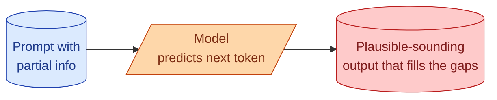
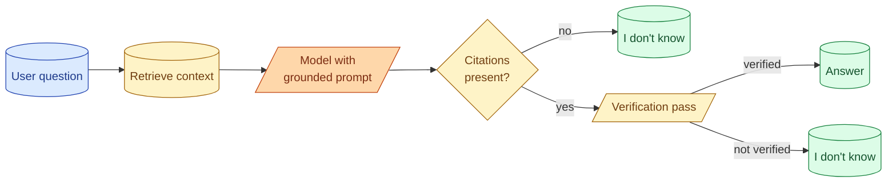

A model hallucinates when it produces a confident answer that is wrong. The customer is named "Mike Davis" when the input says "Sara Davis." The function signature includes a parameter that does not exist. The citation points to a paper that was never written. People call this lying. It is not. The model has no concept of truth; it picks the next most likely token given the input. When the input does not give it enough to anchor on, plausibility wins over accuracy. This concept is about why that happens, what kinds of hallucination look like in practice, and the patterns that reduce it.

## Why models hallucinate



The model's job at every step is to produce the next most probable token. Probable given what? Given the prompt and everything it has produced so far.

When the prompt clearly contains the answer, the most probable next token is the correct one. The model "knows" the answer because the answer is right there in the input.

When the prompt does not contain the answer, the model still has to produce a next token. It picks the most plausible one. Plausibility is not truth. The most plausible-sounding completion of "the customer's name is" is a common name, properly capitalised. If the actual name was never given, the model writes one that sounds like a name.

This is not deception. It is the model doing exactly what it was trained for.

## The three common shapes of hallucination

**Factual hallucination.** The model states a fact that is wrong. "Paris is the capital of Germany." "Python's `sorted()` has a `descending` parameter." Easy to catch when you can check.

**Attribution hallucination.** The model invents a source. "According to a 2023 paper by Smith et al..." The paper does not exist. The hardest kind to catch because it sounds authoritative.

**Subtle fabrication.** The model produces output that mixes correct and incorrect details. A customer name is correct, the customer's email is invented. A code snippet uses the right library but calls a function that does not exist. The most dangerous kind because the rest of the output looks fine.

```mermaid
flowchart LR
    F[Factual<br/>"Capital is wrong"]:::cat
    A[Attribution<br/>"Smith et al, 2023"<br/>not real]:::cat
    S[Subtle<br/>"name right,<br/>email invented"]:::cat

    classDef cat fill:#fecaca,stroke:#b91c1c,color:#7f1d1d
```

## Where hallucination shows up most

The honest list of high-risk situations.

**Open-ended questions about facts.** "Who founded company X?" The model knows famous companies, guesses on small ones.

**Cited sources.** "Cite a paper that supports this." The model invents the citation if it does not know one.

**Long-form generation.** A 2000-word essay on a niche topic. Most of it is plausible, some specific claims are wrong.

**Code with rare libraries.** The model knows pandas. It does not know your internal SDK, but it confidently produces code that calls "your internal SDK," with made-up function names.

**Extraction from partial inputs.** "Find the invoice number." If the input does not have one, the model often produces a plausible-looking one anyway.

## The patterns that reduce it

Five patterns, ordered by how much they help.

**1. Give the model the information.** Retrieval augmented generation (RAG, Stage 3) gives the model the documents to ground its answer in. The model now answers from what is in front of it, not what it half-remembers. Hallucination drops dramatically.

**2. Allow "I don't know."** Most hallucination happens because the model feels forced to produce something. Tell it explicitly that an empty or "unknown" answer is acceptable.

```
If the answer is not in the provided context, respond:
"I do not see this in the provided information."
```

The model takes this option more than you would expect. It is the single biggest non-RAG fix.

**3. Tight schemas with explicit null.** For extraction, use schemas that let fields be null when uncertain. See concept 16. The model fills "vendor: null" instead of making up a vendor.

**4. Verification step.** A second pass that checks the answer against the source.

```python
def verify(question: str, answer: str, context: str) -> bool:
    resp = client.messages.create(
        model="claude-3-7-sonnet",
        max_tokens=50,
        messages=[{
            "role": "user",
            "content": f"""
            Question: {question}
            Answer: {answer}
            Context: {context}

            Is the answer fully supported by the context? Respond YES or NO.
            """
        }]
    )
    return "yes" in resp.content[0].text.lower()
```

Costs a second model call. Catches hallucinations that slipped through the first pass. Worth it on high-stakes outputs.

**5. Citations as a forcing function.** Require the model to cite which part of the input supports each claim. The act of citing forces the model to check that the claim is grounded.

```
For each statement in your answer, include a citation in the form
[doc_id:line_range]. If you cannot cite a source for a statement,
do not include the statement.
```

Models comply with this surprisingly well, and unsupported claims drop out because the model cannot cite them.

## What does not work

Equally honest about the wrong moves.

**"Don't hallucinate" in the prompt.** Useless. The model does not know it is hallucinating; it is just predicting tokens. Telling it not to is like telling a falling object not to.

**Cranking down temperature.** Reduces creative variation. Does not reduce hallucination. A confident wrong answer is still wrong at temperature 0.

**Bigger model alone.** Helps marginally. The big model hallucinates less on common topics but still does on rare ones. The win comes from grounding, not raw size.

**Vague rules.** "Be careful with facts." The model has no way to act on this.

The pattern is clear: the things that work all involve giving the model something concrete to check against, or letting it admit ignorance. The things that do not work are wishful thinking.

## A working chain of defences

For a feature where hallucination matters, layer these patterns.



Retrieval gives the model something to cite. The prompt allows "I don't know." Citations are required, otherwise the answer is dropped. A verification pass checks the answer matches the source.

Each layer catches what the previous one missed. None is perfect alone. Together they make hallucination rare enough that high-stakes use cases become possible.

## Hallucination is a quality metric, not a bug

For interview answers and senior thinking: hallucination is not a defect to fix once. It is a measurable quality the eval suite tracks over time.

Define "groundedness" as "what percentage of factual claims in the output are supported by the input." Track it on a sample of production traffic weekly. If it drops below a threshold, treat that as a regression that pages someone.

This converts "the model hallucinates sometimes" into "groundedness has dropped 4 percentage points this week." Actionable. See Stage 5.

## When hallucination is a feature, not a bug

For some uses, you want the model to make things up. Creative writing, brainstorming, "give me 20 product name ideas." Here, refusing to invent is the bug.

The point is to be deliberate. For high-accuracy use cases, every pattern in this concept matters. For generative use cases, none of them apply.

Most production features fall on the accuracy side. Pick layers that match your use case.

## Common mistakes

- **Telling the model not to hallucinate.** It does not help and is not actionable.
- **Trusting confident outputs.** Confidence is a property of phrasing, not accuracy.
- **No "I don't know" path.** The model is forced to invent.
- **No verification pass on high-stakes outputs.** The cheapest second layer of defence, often skipped.
- **Treating hallucination as one-time fixable.** It is a metric you track, not a bug you close.

## Quick recap

- Hallucination is the model picking plausible tokens when it lacks grounded information.
- Three shapes: factual, attribution (made-up citations), subtle (mostly right with invented bits).
- The fixes that work: retrieval, "I don't know" as an option, tight schemas with null, verification passes, citations.
- The fixes that do not work: telling the model not to, low temperature, just a bigger model.
- For high-stakes outputs, layer defences. No single pattern is enough.
- Track groundedness as an eval metric, not a one-time bug.

This concept sits in **Stage 2 (Prompting as engineering)** of the [AI Engineering Roadmap](/practice/ai-engineering/roadmap/).
