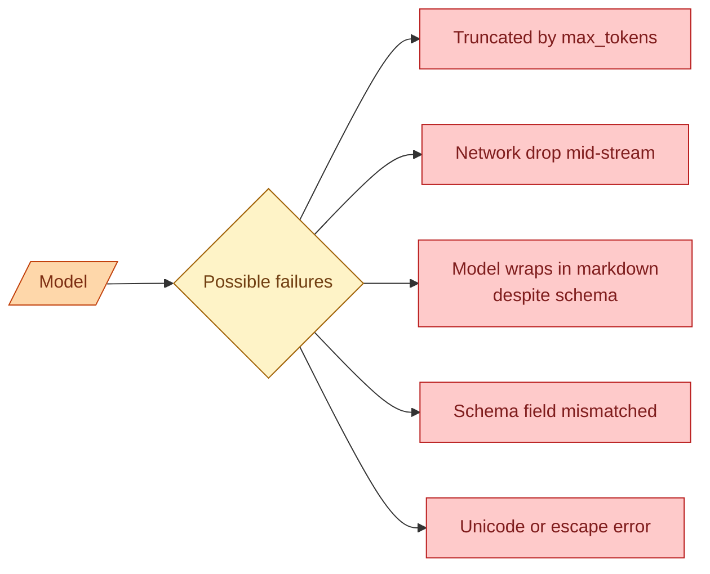

Structured outputs (concept 15) make valid JSON the default, but not the guarantee. The model can still produce broken output when you hit a token limit mid-object, when the network drops mid-stream, when a provider quietly degrades a rare edge case. A production AI feature needs to handle malformed JSON gracefully. This concept is about what goes wrong, how to detect it, and the three patterns that keep the feature alive when it does.

## What can still go wrong



**Truncated by max_tokens.** The model was producing valid JSON. It hit the output token limit. The last chunk got cut off in the middle of a string. Now the JSON is invalid because there is no closing brace.

**Network drop mid-stream.** Streaming was working. The connection dropped. You have half a JSON in your buffer.

**Model wraps in markdown.** Even with strict schemas, some providers occasionally wrap output in `\`\`\`json ... \`\`\``. Your parser fails.

**Schema field mismatched.** The schema says `score: float`. The model produces `"score": "0.9"` (string instead of number). Strict providers reject this; loose ones do not.

**Unicode or escape errors.** Unescaped quotes inside string values, lone surrogate characters, control characters. The JSON parser chokes.

Each one is rare. With enough volume, each happens daily.

## Pattern 1: max_tokens that fits the schema

The most common cause of malformed JSON is hitting the output limit. The fix is to set `max_tokens` high enough for the expected schema.

```python
# Rough rule of thumb for output sizing
def estimate_max_tokens(schema_complexity: str) -> int:
    return {
        "small":  512,   # 1-3 fields, short strings
        "medium": 2048,  # 5-15 fields, lists with a few items
        "large":  8192,  # lists of items, long descriptions
        "huge":   16384, # extraction from large documents
    }[schema_complexity]
```

The cost of setting max_tokens too high is wasted budget on the rare case the model would have gone over. The cost of setting it too low is broken outputs on the common case. Err high.

Better yet, measure. Look at the output token count on the 99th percentile in production. Set max_tokens to that plus a 30 percent margin.

## Pattern 2: detect-and-retry

When parsing fails, do not crash. Try again with adjustments.

```python
import json
from json import JSONDecodeError

def parse_with_retry(text: str, max_attempts: int = 2) -> dict:
    for attempt in range(max_attempts):
        try:
            return json.loads(text)
        except JSONDecodeError:
            text = clean_text(text)
            if attempt == max_attempts - 1:
                return retry_model_call(original_prompt)
    return retry_model_call(original_prompt)

def clean_text(text: str) -> str:
    text = text.strip()
    # Strip markdown fences
    if text.startswith("```"):
        text = text.split("```")[1]
        if text.startswith("json"):
            text = text[4:]
    # Sometimes the JSON object is preceded by junk
    first_brace = text.find("{")
    if first_brace > 0:
        text = text[first_brace:]
    # Try to close an unterminated object
    open_braces = text.count("{") - text.count("}")
    if open_braces > 0:
        text = text + "}" * open_braces
    return text.strip()
```

`clean_text` handles the most common shapes: markdown wrapping, leading text, missing close braces. Half the malformed outputs become valid after this.

If cleaning fails, retry the call with a more specific prompt or a smaller max_tokens to avoid the original failure mode. The retry should not be silent: log it as a signal that something is wrong.

## Pattern 3: validation as a separate step

Even when JSON parses, the result can still be wrong shape.

```python
from pydantic import BaseModel, ValidationError

def parse_and_validate(text: str, schema: type[BaseModel]) -> tuple[BaseModel | None, str | None]:
    try:
        data = json.loads(text)
    except JSONDecodeError as e:
        return None, f"Invalid JSON: {e}"

    try:
        return schema.model_validate(data), None
    except ValidationError as e:
        return None, f"Schema mismatch: {e}"
```

Pydantic raises specific errors when fields are missing, types are wrong, enums are invalid. You can catch these and decide what to do.

For some fields, a sensible default is fine. For required fields, you have to retry or surface the failure.

## Streaming: when half the JSON is all you have

If you are streaming JSON and the stream is interrupted, you have a partial object. Three options.

**Discard.** Treat the call as a failure. Retry from the start.

**Salvage what you can.** A partial-JSON parser (libraries exist) can extract the fields that are complete.

```python
from json_repair import repair_json   # one of many libraries that do this

raw = "..."  # the partial stream content
fixed = repair_json(raw)
data = json.loads(fixed)
```

Some libraries close braces, fix common errors, and produce a best-effort parse. Quality varies. Test on your data before relying on it.

**Stream into a state machine.** For very long structured outputs (extraction of 1000 line items), you can stream individual items as they arrive and process them one at a time. The buffer never holds the whole object.

For most use cases, discard-and-retry is the simplest right answer.

## When the model "just sometimes" produces bad output

Even with strict schemas, models can fail in rare edge cases. The character encoding of a specific input might confuse the tokenizer. A long Unicode sequence might cause the model to produce a malformed escape.

If you see less than 1 percent malformed output, that is acceptable; handle it with retries and log for visibility.

If you see more, the cause is usually the prompt. Specific input shapes that trip the model. The fix is to find them in your eval set, then either:

- Change the prompt to give clearer instructions for that shape.
- Add a preprocessing step that normalises the troublesome input.
- Use a different schema that does not produce the failure mode.

## Logging for visibility

Every malformed-output incident should leave a trail:

```python
def parse_and_log(text: str, schema: type[BaseModel]) -> BaseModel | None:
    result, error = parse_and_validate(text, schema)
    if error:
        log.warning("Parse failed", extra={
            "error": error,
            "raw_text": text[:1000],
            "schema": schema.__name__,
        })
    return result
```

After a week, query the logs:

```sql
SELECT
  DATE(ts) AS day,
  schema,
  COUNT(*) AS failures,
  COUNT(DISTINCT raw_text) AS unique_failures
FROM logs WHERE error IS NOT NULL
GROUP BY day, schema;
```

If a specific schema has a spike of failures, that is your bug. Hand-inspect 10 of the failures. Pattern shows up fast.

## Provider quirks worth knowing

**OpenAI strict schemas.** When `strict: true`, malformed output is essentially impossible. The provider enforces the schema during generation. The trade-off is that some schema features (recursion, oneOf, complex unions) are not supported in strict mode. Read the docs for limits.

**Anthropic tool use.** When you use tool calling for structured output (concept 15), schema enforcement is strong. Failures are rare. The output sits in `tool_use.input`, not in free text.

**Open models (vLLM, TGI).** Many can be run with constrained decoding (grammar-based, JSON schema enforcement) using libraries like outlines, Guidance, or vLLM's structured output support. Worth the setup for production self-hosted use.

## Why "ask nicely" is not enough

```
Prompt: Respond with valid JSON. Do not include any other text.
```

This works most of the time. It does not work every time. The model can decide to be helpful and add a friendly "Sure! Here is the JSON:" before the data. The model can produce JSON with a missing comma.

The senior pattern is to treat the prompt's "please be valid" as a hope, the schema enforcement as the rule, and the parsing retry as the safety net. Each layer catches what the others miss.

## Common mistakes

- **max_tokens set too low.** Truncates valid output mid-string.
- **Crashing on parse failure.** Wrap in try/except, retry, log.
- **Trusting "respond with JSON" without schema enforcement.** Works 90 percent. Production needs 99.9.
- **Silent retries.** You miss the signal that something is degrading.
- **No metric for parse failure rate.** You learn about it from user complaints.

## Quick recap

- Even with structured outputs, JSON can fail: truncation, network drops, edge cases.
- Set max_tokens high enough for the schema. Measure p99 output size.
- On parse failure, clean common issues (markdown wrap, leading text, missing braces), then retry.
- Validate parsed data against a Pydantic schema. Catch type and field errors.
- For streaming failures, discard-and-retry is simplest. Salvage libraries can help for long outputs.
- Log every malformed output. Watch the rate. A spike means a real bug.

This concept sits in **Stage 2 (Prompting as engineering)** of the [AI Engineering Roadmap](/practice/ai-engineering/roadmap/).
