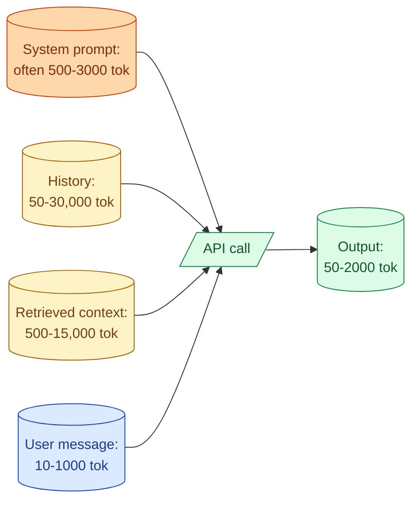

A prompt has two costs you pay every time it runs: input tokens and output tokens. Multiply by your call volume and you get the monthly bill. Half of prompt engineering is making the model do the right thing. The other half is making it do so with the smallest token budget that still works. The teams that ignore the second half ship features that work in dev and become expensive in production. This concept is about the patterns for writing prompts that are cheap by design without sacrificing quality.

## Where the tokens go



Five places spend tokens. Three of them are usually overinflated.

The system prompt is the first place to look. Every call carries it. A 2500-token system prompt over 100,000 calls a day is 250 million input tokens daily, just on instructions.

The retrieved context is the second. A RAG that returns 10 chunks of 800 tokens each adds 8,000 tokens to every call. If only 2 chunks were actually needed, 6,000 tokens are waste.

The output is the third. A model that writes "Here is your answer: ..." adds 5 unnecessary tokens to every response.

## Trim the system prompt

Most system prompts have three kinds of bloat.

**Wishful instructions.** "Be helpful, accurate, thorough, concise, friendly, professional, polite, expert." None of these are actionable. The model is already trying to be most of these. Cut them.

**Redundant rules.** "Always respond in JSON. Output should be JSON. Use JSON format." One line is enough.

**Explanation of the task.** "The user will provide a ticket. You will read it. You will figure out the category. You will return the category." None of this is necessary because the model can see the user message.

A 3000-token system prompt can usually be compressed to under 500 tokens without changing behaviour. The discipline: read each line, ask "does cutting this hurt quality?" If you can show it hurts quality on the eval set, keep it. If you cannot, cut it.

See concept 12.

## Use prefix caching

If your system prompt is constant across calls, prefix caching is free money. The provider caches the prefix server-side. Subsequent calls with the same prefix pay roughly 10 percent of the normal input cost for the cached portion.

```python
# Anthropic: mark the prefix as cacheable
resp = client.messages.create(
    model="claude-3-7-sonnet",
    max_tokens=1024,
    system=[
        {
            "type": "text",
            "text": LONG_SYSTEM_PROMPT,
            "cache_control": {"type": "ephemeral"}
        }
    ],
    messages=[...]
)
```

For OpenAI, prefix caching is automatic for system messages over 1024 tokens. No code change needed.

The catch: any change to the prefix breaks the cache. No timestamps, no per-user values, no variables that change. Keep the cacheable portion constant.

For input-heavy workloads, prefix caching can drop input costs by 60 to 80 percent. It costs you almost nothing to enable.

## Set max_tokens to the actual need

The default `max_tokens` in some SDKs is "unlimited" or a very high number. The model often produces more output than you need because there is no cap.

For classification, set max_tokens to 10 or 20. The answer is one or two words.

For extraction, set max_tokens to the largest schema output you expect. Measure the 99th percentile. Add a margin. Set the cap there.

For chat, set max_tokens to the longest response a user would actually read. 500 to 1500 tokens for most cases. Anything longer and the user has stopped reading anyway.

This is the single cheapest output-side optimization.

## Trim verbose preambles

The model is trained to be helpful, which often means a friendly preamble.

```
"Here is the requested information:
[useful content]
Hope this helps!"
```

Those preamble and closing lines are 30 to 60 tokens per call. At scale, they add up.

The fix is in the system prompt:

```
Respond with just the answer. No preamble. No closing remarks.
```

Two lines. Removes 30 tokens per response, every time. Pure win.

## Compress few-shot examples

Few-shot examples (concept 13) are expensive when they are long. A pattern can often be shown in much less space.

Verbose:

```
Example 1:
Input: "I was charged twice for my March subscription. Can someone help me get a refund?"
Output: {"category": "billing", "confidence": 0.95}

Example 2:
Input: "The app crashes when I try to open the camera screen."
Output: {"category": "bug", "confidence": 0.92}
```

Compressed:

```
"Charged twice for March, want refund" → billing 0.95
"App crashes opening camera" → bug 0.92
```

The model still learns the pattern. Cost per example drops by half. Multiply across 5 examples and 100,000 calls.

The win is biggest on high-volume tasks. For low-volume tasks, the engineering time saved by readable examples is worth the small extra cost.

## Use small models for small tasks

The cheapest tier of every provider is now competitive for many tasks. Classification, extraction, summarisation, routing. Often a Haiku, 4o-mini, or Flash call is 80 percent of the quality at 10 percent of the cost of a balanced model.

The pattern that scales: use the cheap model by default, escalate to a bigger model only for hard cases.

```python
def classify(text: str) -> str:
    small_result = call_small_model(text)
    if small_result.confidence < 0.7:
        return call_big_model(text)
    return small_result.category
```

The cheap model handles 90 percent of cases at low cost. The expensive model handles the 10 percent of hard cases. Average cost per call drops by something like 70 percent.

See Section F concept 61 for model routing.

## Trim retrieval results

For RAG, the number of retrieved chunks is a direct cost lever. 10 chunks at 800 tokens = 8,000 input tokens per call. Cut to 5 chunks = 4,000 tokens. Half the input cost.

The trick is reranking (concept 32). Retrieve 20 candidates cheaply, rerank them, and only pass the top 4 to the chat model. The reranker is cheap. The token savings on the chat model are significant.

Most teams over-retrieve. The default of "top-10" was wrong for 90 percent of their queries.

## Output structure that saves tokens

A well-shaped output schema saves tokens compared to free-form text.

```
Free-form:
"The category is billing. The confidence is around 0.95. The reason is
that the user mentioned being charged twice."

Structured (with schema):
{"category": "billing", "confidence": 0.95, "reason": "charged twice"}
```

The structured version is half the tokens. Easier to parse, cheaper, and easier to validate. Use schemas where you can.

## Measure cost per call

A discipline that pays for itself: log token counts on every call. Build a dashboard that shows cost per call by feature.

```sql
SELECT
  feature,
  COUNT(*) AS calls,
  AVG(input_tokens) AS avg_input,
  AVG(output_tokens) AS avg_output,
  SUM(input_tokens * 0.000003 + output_tokens * 0.000015) AS total_cost
FROM llm_calls
WHERE day = CURRENT_DATE - 1
GROUP BY feature
ORDER BY total_cost DESC;
```

This tells you which features are most expensive. Optimization effort goes to the top of this list, not to the features people happen to be working on this week.

When the bill spikes, this query also tells you where. Without it, you guess.

## The 10x-2x-1x rule

Most prompt cost reduction follows this pattern.

- Trimming the system prompt: 10x easier than people think, big win.
- Enabling prefix caching: 10x cost reduction on the input side, no code change.
- Picking a cheaper model: 10x cost reduction when the cheap model works.
- Smaller max_tokens: 2x reduction on output cost.
- Reranking to reduce retrieved chunks: 2x reduction on input cost.
- Compressing examples: 2x reduction on the few-shot portion.

The first three are the highest leverage. Do them before chasing the smaller wins.

## Common mistakes

- **Treating the system prompt as free.** Every token is billed on every call.
- **Skipping prefix caching.** A flag away, large savings.
- **Default max_tokens.** Often too high; output bloat is real.
- **Using the big model for easy tasks.** Pay 10x for marginal quality.
- **No per-feature cost tracking.** You optimize blind.
- **Compressing without measuring.** Quality drop is real if you cut wrong. Use the eval set.

## Quick recap

- Five places spend tokens: system prompt, history, retrieved context, user message, output.
- System prompt and retrieval are usually overinflated. Trim and rerank.
- Prefix caching is the biggest free win on stable system prompts.
- Set max_tokens to what you actually need. Defaults are often too high.
- Use the cheap model by default, escalate to a bigger model for hard cases.
- Log tokens per call. Build a per-feature cost dashboard. Optimization goes to the top of the list.

This concept sits in **Stage 2 (Prompting as engineering)** of the [AI Engineering Roadmap](/practice/ai-engineering/roadmap/).
