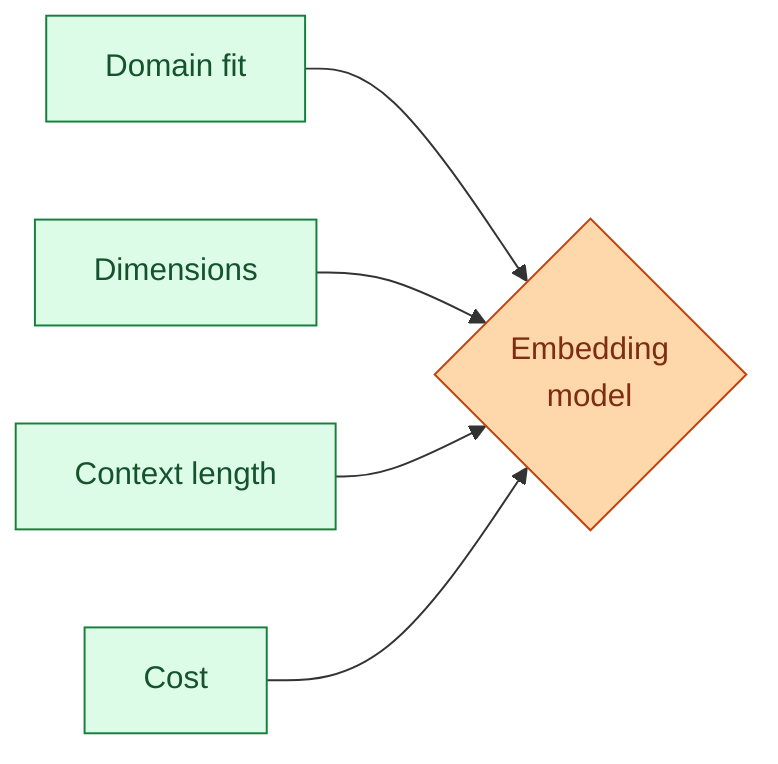

The embedding model is the foundation under your RAG. Every chunk you ingest gets embedded with it. Every query gets embedded with it. The match between query and chunk vectors decides what your model sees. Pick a bad embedding model and no amount of chunking, reranking, or prompt tuning will save you. Pick well and a lot of "RAG quality" problems do not happen in the first place. This concept is about how to pick.

## The four numbers that matter

When you compare embedding models, four things actually drive the decision.

**Quality on your domain.** How well does it understand the kind of text you actually have? An embedding trained on news articles may struggle on legal contracts.

**Dimensions.** The size of the vector. More dimensions usually mean better quality but cost more storage and search time.

**Context length.** The longest text the model can embed in a single call. If you have to chunk smaller than your data calls for, this number is your reason.

**Cost.** API cost per million tokens, or compute cost if you self-host.



These four are the only conversation. Brand, hype, "what does everyone use" come after these.

## The big options in 2026

The four that show up in most production setups.

**OpenAI `text-embedding-3-large`.** 3072 dimensions, strong on general English, decent on multilingual. Easy to integrate if you already use OpenAI. Around $0.13 per million tokens.

**OpenAI `text-embedding-3-small`.** 1536 dimensions, half the quality of large but five times cheaper. Good default for high-volume cheap RAG.

**Cohere `embed-multilingual-v3`.** 1024 dimensions, leads on multilingual. The right pick if your corpus is more than one language.

**Open source BGE family (`bge-large-en-v1.5`, `bge-m3`).** Self-hosted on a small GPU. Quality close to closed providers. Costs you the GPU time. M3 is multilingual; v1.5 is English-strong.

There are dozens of others. Most teams pick from these four and one of them is usually right.

## How to actually compare them

You cannot pick by benchmark scores alone. Public benchmarks like MTEB rank models, but the ranks are noisy and may not reflect your domain.

The reliable way: build a tiny eval, run all candidates on it, compare.

```python
# A 30-example "is the right chunk in the top 5?" eval
queries_and_correct_chunks = [
    ("How do refunds work?", "doc_43"),
    ("What is the API rate limit?", "doc_12"),
    # ...28 more
]

for model_name in ["text-embedding-3-large", "embed-multilingual-v3", "bge-large-en"]:
    correct_at_5 = 0
    for query, correct_doc in queries_and_correct_chunks:
        results = vector_search(embed(query, model_name), top_k=5)
        if correct_doc in [r.doc_id for r in results]:
            correct_at_5 += 1
    print(f"{model_name}: recall@5 = {correct_at_5}/30")
```

Half an hour of work. Result: a real number for each model on your data. You pick the highest. If two are close, pick the cheaper or the faster.

This is the eval-driven approach for picking models in general. The same logic applies to chat models (concept 9).

## Why "what does everyone use" is wrong

The most-used embedding model in any given quarter is OpenAI's because it is easy. That does not make it the best for your data.

A medical record RAG often does better with a model fine-tuned on biomedical text. A code-search RAG does better with a code-specific embedding. A French-only support RAG does better with a multilingual model that is strong on French.

The "everyone uses it" model is often acceptable, sometimes good, occasionally terrible. The eval is what tells you which.

## Dimensions: more is not always better

Big embeddings (3000+ dimensions) usually retrieve better than small ones, but the win is not linear.

```
text-embedding-3-small (1536 dim) on news:       recall@5 = 82%
text-embedding-3-large (3072 dim) on news:       recall@5 = 88%

Storage and search cost: roughly 2x for the large.
```

A 6 percentage point lift for 2x the cost. Worth it for a small RAG. Probably not worth it for one with billions of chunks.

Some models also offer dimension reduction (matryoshka representations): you can take a 3072-dim vector and use the first 768 dimensions with minor quality loss. A free win for storage and search cost on huge corpora.

## Context length and chunk size

If your embedding model's context limit is 512 tokens, you cannot embed longer chunks. You have to chunk smaller, which loses some semantic information.

Modern embedding models support 8k to 32k context. The practical chunk size is usually 200 to 800 tokens regardless (see concept 25), so the context limit rarely binds. But for hierarchical or large-chunk patterns, check the limit.

## Self-hosting embeddings

If your volume is high and you control the infrastructure, self-hosted BGE on a single GPU can be 10x cheaper than API calls.

Numbers, illustrative:

```
OpenAI text-embedding-3-large:  $0.13 per million tokens
Self-hosted bge-large on A10G: ~$0.01 per million tokens (after amortising GPU)
```

The catch: you operate it. GPU monitoring, scaling, queue management. For most teams, the API is the right answer. For a few teams running massive RAG, self-hosting is the obvious choice.

A middle ground: hosted providers (Hugging Face Inference Endpoints, Together, Fireworks) serve open-source embeddings as APIs at lower cost than the big closed providers.

## Switching embedding models is painful

Once you have embedded a corpus, you cannot mix embeddings from different models. Vectors live in different spaces. Cosine similarity between them is noise.

If you decide to switch embedding models later, you re-embed the whole corpus. For a billion documents, this is expensive and time-consuming.

Plan for this. Either:

- Pick once, commit. Use evals to make a deliberate first choice.
- Keep the source text. Re-embedding becomes a batch job. Plan storage to support it.
- Use stable open-source models (BGE family) so the model does not retire on you. Closed APIs sometimes deprecate.

This is one reason the embedding choice is more load-bearing than people initially think.

## Normalization matters

Most modern embedding APIs return normalised vectors (unit length). Cosine similarity simplifies to dot product. Faster, simpler.

If you self-host or use a model that does not normalise, normalise at ingest. One pass over the corpus.

```python
def normalize(vec):
    import numpy as np
    return vec / np.linalg.norm(vec)
```

This avoids subtle bugs where your similarity scores are off because some vectors were normalised and some were not.

## Embedding the query: same model

A common bug: the corpus was embedded with model A six months ago. Someone updated the code to use model B for the query embeddings. Cosine similarity between A-vectors and B-vectors is meaningless.

Pin the embedding model to the corpus. Store the model name as metadata on the vector store. Refuse to query with a different model.

```python
def search(query: str, store: VectorStore):
    if not store.embedding_model == CURRENT_MODEL:
        raise Error(f"Store uses {store.embedding_model}, code uses {CURRENT_MODEL}")
    query_vec = embed(query, CURRENT_MODEL)
    return store.search(query_vec)
```

Five lines. Saves a class of subtle "retrieval suddenly got worse" bugs.

## Common mistakes

- **Picking by hype.** "Everyone uses OpenAI." Often acceptable, rarely best for your domain.
- **Not building a tiny eval.** Half an hour saves picking wrong for six months.
- **Switching models without re-embedding.** Cosine across spaces is noise.
- **Forgetting to normalize.** Subtle similarity bugs that look like quality drops.
- **Self-hosting prematurely.** API is right for low and medium volume. Self-host past a clear cost threshold.

## Quick recap

- The four numbers: domain fit, dimensions, context length, cost.
- Build a 30-example eval on your data. Run candidate models. Pick by numbers.
- Big dimensions help but with diminishing returns. Consider matryoshka for huge corpora.
- Self-host past a volume threshold. API otherwise.
- Pin the embedding model to the corpus. Switching means re-embedding.
- Always normalize, or be sure your model already does.

This concept sits in **Stage 3 (RAG and retrieval)** of the [AI Engineering Roadmap](/practice/ai-engineering/roadmap/).
