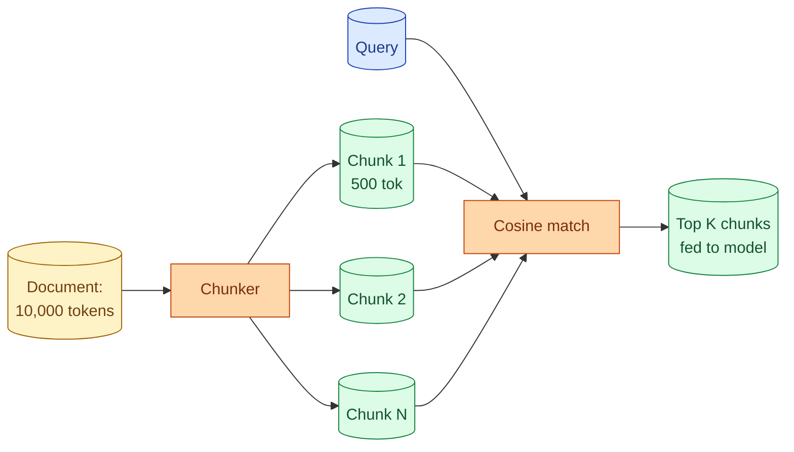
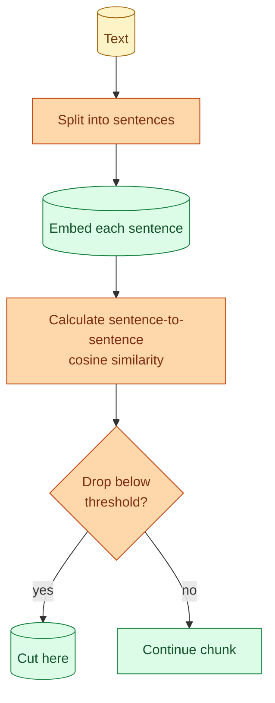

To put a document into a vector store, you cut it into chunks and embed each one. The chunks become the unit of retrieval. Small chunks lose context. Large chunks lose precision. Bad chunking is the root cause of a surprising number of RAG quality problems, and it is one of the few RAG problems where the fix is not "throw more retrieval at it" but "rethink the cut." This concept is about how to chunk well.

## Why chunking decides quality



The model never sees the full document. It sees a few chunks. If the chunks are too small, no single chunk has enough context to answer the question. If too large, the chunk contains too much unrelated material and dilutes the relevance signal.

Three things go wrong with bad chunking.

**Answer is split across chunks.** The question "What is the refund window?" needs information on a single page that got cut between paragraphs. The first chunk says "Customers can request a refund." The second chunk says "within 30 days." Neither alone answers the question.

**Chunks too large for embedding to be useful.** A 5000-token chunk gets one embedding. That single vector represents the average direction of everything in the chunk. The specific answer inside gets washed out.

**Chunks too small to be useful.** Each sentence its own chunk. The model retrieves a sentence and has no surrounding context to interpret it.

## What size to start with

For most document types, 200 to 800 tokens per chunk is the safe range.

| Chunk size | When it works |
| --- | --- |
| 100-200 tokens | Highly structured FAQ, glossary entries, short reference data |
| 200-500 tokens | Most prose: docs, articles, support knowledge bases |
| 500-1000 tokens | Long-form analysis where context matters, technical specs |
| 1000-2000 tokens | Whole sections of long reports, code files |

The honest starting point: 500 tokens. Most teams converge to something between 200 and 800 after measuring.

## Token-aware splitting

The simplest pattern that works.

```python
def chunk_by_tokens(text: str, chunk_size: int = 500, overlap: int = 50) -> list[str]:
    tokens = tokenize(text)
    chunks = []
    i = 0
    while i < len(tokens):
        chunk = tokens[i:i + chunk_size]
        chunks.append(detokenize(chunk))
        i += chunk_size - overlap
    return chunks
```

`overlap` is the trick. Each chunk shares a small tail with the previous one. The answer that spans the boundary appears in at least one chunk, intact.

50 to 100 tokens of overlap is usually enough. More is wasted. Less risks losing boundary content.

This is the chunker most people start with, and it is fine for many uses.

## Semantic chunking: cut where the topic shifts

Token-aware splitting cuts at arbitrary positions. Semantic chunking tries to cut where the meaning shifts.



The idea: when two adjacent sentences have low semantic similarity, the topic has changed. Cut there. The result is chunks that each focus on a single sub-topic.

```python
def semantic_chunk(text: str, threshold: float = 0.6) -> list[str]:
    sentences = sentence_split(text)
    embeddings = [embed(s) for s in sentences]
    chunks, current = [], [sentences[0]]
    for i in range(1, len(sentences)):
        sim = cosine(embeddings[i-1], embeddings[i])
        if sim < threshold:
            chunks.append(" ".join(current))
            current = [sentences[i]]
        else:
            current.append(sentences[i])
    chunks.append(" ".join(current))
    return chunks
```

The trade-off: more expensive (one embedding per sentence at ingest), but produces chunks that match how humans would naturally divide the text. Better quality on prose, especially long-form.

Use semantic chunking when token-aware chunking gives noticeably bad results. For simple FAQs, it is overkill.

## Structural chunking: respect the document

For documents with clear structure (markdown, HTML, code), the structure tells you where to cut.

Markdown:

```python
def chunk_by_markdown(text: str) -> list[str]:
    # Split on top-level headings
    sections = re.split(r'\n(?=# )', text)
    chunks = []
    for section in sections:
        if token_count(section) > 800:
            # Further split on sub-headings
            chunks.extend(re.split(r'\n(?=## )', section))
        else:
            chunks.append(section)
    return chunks
```

Each chunk is a heading section. The structure of the doc tells you where coherent units begin and end. Quality usually beats token-aware on well-structured documents.

Code:

```python
def chunk_by_function(text: str, language: str) -> list[str]:
    tree = parse(text, language=language)
    return [node.text for node in tree.functions]
```

Each chunk is one function. Use a parser (tree-sitter, etc.) so the structure is respected. Beats character-based chunking on code by a wide margin.

The principle: when the document has visible structure, use it.

## The "chunk has no context" problem

A chunk on its own can lack important context.

```
Chunk text:
"This setting controls how many concurrent requests are allowed."
```

What setting? In what product? Where do you change it? The chunk does not say.

The fix is to prepend context to each chunk at ingest time.

```python
def add_context(chunk: str, doc_title: str, section: str) -> str:
    return f"[{doc_title} > {section}]\n\n{chunk}"
```

Now the embedded text reads:

```
[API Configuration Guide > Rate Limiting]

This setting controls how many concurrent requests are allowed.
```

Both the embedding and the retrieved text now have context. Quality improvement is usually significant. Cost is small: a few extra tokens per chunk.

This is "contextual retrieval" in some literature. The pattern is cheap, easy, and underused.

## The hard limit: embedding model context

The embedding model has a max input. If you exceed it, the call fails.

Modern embedding models support 8k to 32k tokens. The practical chunk size is well below that, so the limit rarely binds. Worth checking when ingesting unusual document types.

## Iterating: measure, do not guess

Pick a chunk size. Build a tiny eval set. Run retrieval. Measure recall (did the right chunk show up).

Try a different chunk size. Measure again.

```
Test:                            500-tok chunks   200-tok chunks
"What is the refund window?"     hit              hit
"How do I reset my password?"    hit              miss (split)
"What is the rate limit?"        hit              hit
"What does error 503 mean?"      miss (no ctx)    hit
...
```

The numbers tell you what to use. The general pattern in production:

- Start with 500-token chunks with 50-token overlap.
- Measure on a 30-query eval set.
- Adjust based on the failure modes.
- Try semantic or structural chunking on the failures.

This is iterative work. Two afternoons. Better than weeks of "why is retrieval bad."

## Storing the source location

For every chunk, store where it came from.

```python
{
  "chunk_id": "doc_43_chunk_2",
  "doc_id": "doc_43",
  "doc_title": "API Configuration Guide",
  "section": "Rate Limiting",
  "position": "tokens 1024-1524",
  "url": "https://docs.example.com/api/rate-limiting"
}
```

This metadata enables citations (concept 35), filtering (concept 34), and debugging when a chunk shows up that should not.

It also lets you rebuild the source view when a user wants to see "where did this answer come from?" Surfacing the source builds user trust.

## Chunk dedup

When you ingest the same content twice (a tutorial referenced from two places, a FAQ pasted across pages), you get duplicate chunks. Retrieval returns the same content multiple times in the top-K, wasting the budget.

A quick dedup at ingest:

```python
def dedup_chunks(chunks: list[str], threshold: float = 0.95) -> list[str]:
    embeddings = [embed(c) for c in chunks]
    seen = []
    keep = []
    for chunk, emb in zip(chunks, embeddings):
        if all(cosine(emb, s) < threshold for s in seen):
            keep.append(chunk)
            seen.append(emb)
    return keep
```

Saves storage and improves retrieval quality on corpora with duplication.

## Common mistakes

- **One chunk per document.** Embeddings average out; specific answers get lost.
- **Tiny chunks (under 50 tokens).** No context; chunks are interpretable only with surrounding text.
- **No overlap.** Boundary answers get lost.
- **Ignoring document structure.** Cutting in the middle of a markdown heading section is wasteful when the heading is the natural unit.
- **No chunk-level metadata.** Cannot cite, filter, or debug.
- **Not iterating.** First chunking choice is rarely the best one. Measure and adjust.

## Quick recap

- Chunks are the unit of retrieval. Their size and shape decide quality.
- Start with 500-token chunks and 50-token overlap. Adjust from measurement.
- Use document structure (markdown headings, code functions) when available; usually beats token chunking.
- Semantic chunking (cut at topic boundaries) beats token chunking on long prose, at extra ingest cost.
- Add context to each chunk (doc title, section path). Cheap, big quality win.
- Store source metadata per chunk for citations, filtering, debugging.

This concept sits in **Stage 3 (RAG and retrieval)** of the [AI Engineering Roadmap](/practice/ai-engineering/roadmap/).
