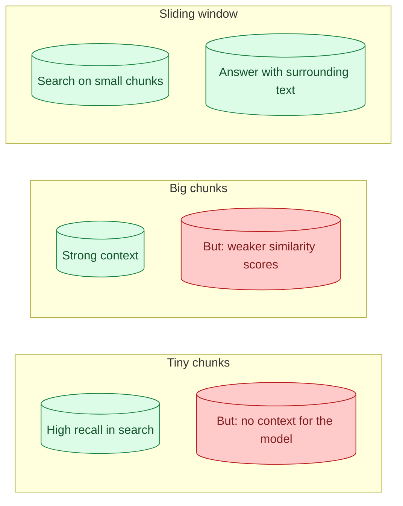

A sliding window chunk is a short text used for embedding and matching, paired with a longer surrounding text used when feeding context to the model. You search at fine resolution, but you answer with broader context. The pattern fixes the trade-off between "small chunks match queries better" and "small chunks lack context." This concept is about when sliding window helps and how to set it up.

## The problem it solves



A 100-token chunk has a sharp, focused embedding. The query matches it well. But when the chunk is sent to the model, 100 tokens may not contain enough to answer the question. The model has the right needle but no haystack.

A 1000-token chunk has the context, but its embedding is mushy. The relevant 100 tokens are diluted by 900 unrelated ones. Queries that should match the chunk score lower than they should.

Sliding window decouples these two needs. Search on a short text. Answer with a longer text.

## How the pattern works at ingest

```python
def chunk_with_window(text: str, target_size: int = 200, window_size: int = 800):
    tokens = tokenize(text)
    chunks = []
    for i in range(0, len(tokens), target_size // 2):
        # The chunk for embedding: small, focused
        chunk_text = detokenize(tokens[i : i + target_size])

        # The window for retrieval: bigger surroundings
        window_start = max(0, i - (window_size - target_size) // 2)
        window_end = min(len(tokens), window_start + window_size)
        window_text = detokenize(tokens[window_start : window_end])

        chunks.append({
            "embed_text": chunk_text,
            "window_text": window_text,
            "position": i
        })
    return chunks
```

You embed `chunk_text` and store it in the vector DB. The `window_text` is stored alongside (in the metadata). When this chunk wins retrieval, you pass `window_text` to the model instead of `chunk_text`.

The model gets a 800-token window. The match was done on a 200-token slice. Best of both.

## A worked example

Document:

```
The API supports OAuth 2.0 authentication. Tokens expire after 30
minutes by default. You can configure shorter token lifetimes
through the Admin settings page under Security > API Access.

Refresh tokens last 14 days. When a refresh token expires, the user
must re-authenticate. This is a hard limit and cannot be extended
through the API.
```

User asks: "How long do refresh tokens last?"

Without sliding window (one big chunk of the whole passage):
- Match score: 0.62 (the question shares few words with the average of the passage)
- Model gets the whole passage as context: answers correctly

Without sliding window (small chunks):
- "Refresh tokens last 14 days." matches at 0.91
- Model gets that one sentence: answers correctly, but if you ask "what happens when it expires?" the small chunk no longer covers the answer

With sliding window:
- Embedding text: "Refresh tokens last 14 days. When a refresh token expires..."
- Match score: 0.89 (still strong)
- Window text: the full passage including the surrounding paragraph
- Model gets the full context: answers any related question correctly

The pattern wins both ways.

## Trade-offs

Sliding window is not free.

**Storage.** You store both the embed text and the window text per chunk. Storage roughly doubles vs basic chunking.

**Ingest complexity.** Two-stage chunking with overlapping windows. More code.

**Retrieval bloat.** The windows are bigger, so the top-K total prompt size is bigger. The model pays for more input tokens.

These costs are usually worth it for RAG over technical documents, knowledge bases, and anything where context matters. They are usually not worth it for short FAQs or chat history.

## When the pattern shines

Three situations.

**Technical documentation.** Tables, code, specifications. Each piece needs surrounding context to interpret. Sliding window keeps the match precise and the context complete.

**Long-form articles.** A paragraph in the middle of a 10-page article makes sense only with the surrounding flow. Sliding window gives the model the flow.

**Code retrieval.** A function name is what you match on. The function body is what the model needs. Sliding window naturally gives you both.

## When it does not help

Sliding window adds complexity for no gain when:

- Documents are short and self-contained (FAQs).
- The corpus is already structured into atomic units (definitions, glossary entries).
- Queries are exact lookups that do not need context.

For these, simple chunking is the right tool.

## Variant: window after retrieval

A simpler version of the pattern: chunk normally, but at retrieval time, expand the retrieved chunk to include neighbouring chunks before passing to the model.

```python
def retrieve_with_neighbours(query: str, top_k: int = 5, expand_by: int = 1):
    matches = vector_search(query, top_k=top_k)
    expanded = []
    for match in matches:
        # Fetch chunks before and after by position
        neighbours = fetch_chunks(
            doc_id=match.doc_id,
            position_range=(match.position - expand_by, match.position + expand_by)
        )
        expanded.append(combine(neighbours))
    return expanded
```

Result: each top-K result becomes a "match + neighbours" block. The model gets the matched chunk plus its surroundings.

This is simpler than full sliding window because you do not store overlapping windows at ingest. You just expand at retrieval. The downside is you pay the cost of fetching neighbours per query instead of pre-computing it.

For most teams, this simpler variant is a good middle ground.

## A practical setup

For a knowledge-base RAG, here is a reasonable stack:

```
Embed text:    300 tokens (focused, sharp embeddings)
Window text:   1000 tokens (the embed text plus 350 tokens on each side)
Overlap:       150 tokens between consecutive embed chunks
Retrieval:     top 5 chunks
Total context: ~5000 tokens passed to the chat model
```

Quality from this setup beats simple chunking on most technical content by 5 to 10 percentage points in retrieval recall.

## Variant: parent-child

A close cousin to sliding window: parent-child chunking. You embed children (small, sharp) but always retrieve parents (large, contextual). The parent is the immediately surrounding section, not a window.

See concept 27 for the parent-child pattern.

## Common mistakes

- **Embedding text and window text are too similar.** If both are 500 tokens, you have basic chunking with overhead. The whole point is the embed text is shorter than the window text.
- **No overlap between consecutive windows.** Answers near boundaries get lost.
- **Storing the window text in the vector DB main field.** The search would match on the big text, defeating the point. Store it as metadata.
- **Sliding window for short FAQ-style data.** Adds complexity for no benefit.

## Quick recap

- Sliding window embeds small focused chunks but feeds the model a larger surrounding window.
- Solves the trade-off between match precision (small chunks) and context (big chunks).
- Best for technical docs, long-form prose, code with context.
- The simpler variant: chunk normally, expand to include neighbours at retrieval time.
- Costs are real (storage, ingest complexity, larger model inputs). Worth it for most RAG over substantive content.

This concept sits in **Stage 3 (RAG and retrieval)** of the [AI Engineering Roadmap](/practice/ai-engineering/roadmap/).
