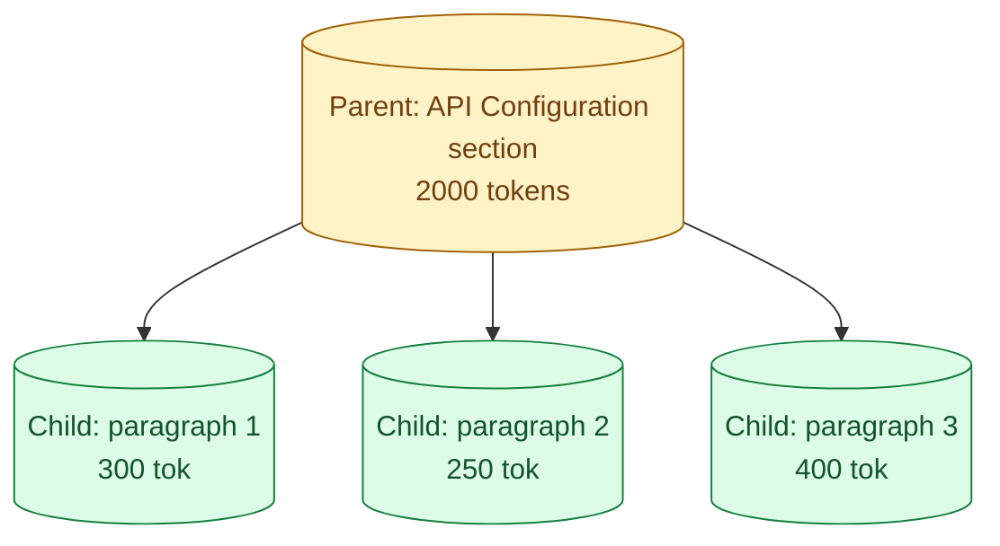

Hierarchical chunking is a pattern where each document is split into two levels: small "child" chunks for matching the query and larger "parent" sections for feeding to the model. The query embeds well against children (precise, focused), but the model receives parents (full context). It is similar in spirit to sliding window (concept 26) but uses the document's own structure as the parent unit instead of a fixed-size window. For docs with sections, headings, or natural hierarchy, this is often the cleanest pattern.

## What the structure looks like



At ingest time, you walk the document. Each child gets its own embedding. The vector DB stores child embeddings only. Each child carries a reference to its parent (the larger surrounding section).

At query time, the search returns matching children. You collect their parents and pass those to the model. The model never sees children directly; it always sees the broader context.

## A working example

Document structure:

```
# API Configuration

## Authentication
Para 1: OAuth 2.0 setup
Para 2: Token lifetimes
Para 3: Refresh tokens

## Rate Limiting
Para 1: Default rate limits
Para 2: Per-endpoint limits
Para 3: Burst tolerance
```

Hierarchical chunking would produce:

- Six children, one per paragraph.
- Two parents, one per `##` heading.
- Each child stores `parent_id` pointing to its `##` section.

A query about token expiry matches "Para 2: Token lifetimes" with high cosine. The retrieval system fetches the Authentication parent and passes the full Authentication section to the model. The model now has all related context (OAuth setup, lifetimes, refresh tokens) without scrolling through unrelated rate limit content.

## Why this beats flat chunking

Two wins, neither obvious until you ship a real RAG.

**Cleaner answers.** The model gets coherent sections, not arbitrary cut-pieces. The answer reads as if it came from one place.

**Less duplication in retrieval.** Top-5 children that all live in the same parent collapse to one parent. You get one large coherent block instead of five overlapping small ones.

```python
def deduplicate_to_parents(child_matches: list) -> list:
    parent_ids = set()
    parents = []
    for child in child_matches:
        if child.parent_id not in parent_ids:
            parent_ids.add(child.parent_id)
            parents.append(fetch_parent(child.parent_id))
    return parents
```

If five children from the Authentication section win the top-5, you return one parent (Authentication), not five children. Context is denser and more useful.

## Picking the parent boundary

The hardest decision in hierarchical chunking: what is a parent?

For markdown, `#` or `##` headings are natural parents. Code, the function is the natural parent. Legal contracts, the section is the natural parent.

If the document has no structure, fall back to fixed-size windows (sliding window, concept 26). The structure is what makes hierarchical chunking better than its alternatives.

A rough sizing rule:

```
Child:   200-400 tokens (one paragraph or one sub-section)
Parent:  1000-3000 tokens (one major section)
```

If parents are too big, you blow up the context window with one or two retrievals. If too small, you lose the context benefit.

## Building the index

```python
def hierarchical_chunk(doc: Document) -> tuple[list[Parent], list[Child]]:
    parents = []
    children = []

    sections = split_by_heading(doc.text, level=2)
    for section_idx, section in enumerate(sections):
        parent_id = f"{doc.id}_section_{section_idx}"
        parents.append(Parent(
            id=parent_id,
            text=section.text,
            doc_id=doc.id,
            section_title=section.heading
        ))

        for para_idx, paragraph in enumerate(split_paragraphs(section.text)):
            children.append(Child(
                id=f"{parent_id}_para_{para_idx}",
                text=paragraph,
                parent_id=parent_id,
                position=para_idx
            ))

    return parents, children
```

Embed only the children. Store the parents in a regular key-value store (or a separate table in your DB).

Vector DB: only the children's embeddings, with `parent_id` in metadata.
KV store: parents, keyed by `parent_id`.

## At query time

```python
def retrieve_hierarchical(query: str, top_k_children: int = 8) -> list[Parent]:
    query_vec = embed(query)
    child_matches = vector_search(query_vec, top_k=top_k_children)

    parent_ids = []
    seen = set()
    for c in child_matches:
        if c.parent_id not in seen:
            parent_ids.append(c.parent_id)
            seen.add(c.parent_id)

    parents = [fetch_parent(pid) for pid in parent_ids]
    return parents[:5]  # cap on number of parents
```

You may match 8 children, but they collapse to maybe 3 parents. You send 3 dense, coherent chunks to the model.

## Cost trade-offs

**Storage.** Children embed cost is the main cost. Parents are stored as plain text, cheap. Net storage is similar to flat chunking.

**Embed cost at ingest.** Same as flat: one embedding per child. No extra embedding work for the parent.

**Retrieval cost.** Same vector search as flat chunking. The parent fetch is a key-value lookup, fast.

**Context size at the model.** Larger than flat (parents are bigger than children). Cost goes up here. Often worth it because answer quality is meaningfully better.

The net is "more model input tokens for better quality." Whether that trade-off is worth it depends on your quality bar and budget.

## A middle ground

For some documents, two levels feels like too much machinery. A simpler version: embed children, expand to a fixed-size window when retrieving.

```python
def retrieve_with_expansion(query: str, top_k: int = 5, window_tokens: int = 1500):
    child_matches = vector_search(embed(query), top_k=top_k)
    expanded = []
    for c in child_matches:
        # Fetch chunks around this one until window_tokens is reached
        window = expand_to_window(c.doc_id, c.position, window_tokens)
        expanded.append(window)
    return dedupe_overlapping(expanded)
```

You do not need explicit parents. You just walk neighbours at query time. Simpler code, same general benefit, slightly less precise context boundaries.

## When NOT to use hierarchical

For flat content with no structure (a long single-block essay, an unbroken transcript), hierarchical does not help because there are no parents to define.

For very short documents (under 2000 tokens), there is no benefit. Just embed the whole thing.

For chat history, the structure is the conversation itself. Hierarchical is overkill.

## Three-level hierarchies

You can extend the pattern to three levels: chunk → section → document.

Matching is done on chunks. Retrieval can return the section, or the whole document, depending on the query.

```
"What is the refund window?" → return the Refunds section
"What does this API do?" → return the document summary at the top
```

In practice, two levels handle 95 percent of cases. Three levels is for advanced use, like document-level summarization combined with detail retrieval.

## Common mistakes

- **Embedding the parents.** They are too large; embeddings get mushy. Embed children only.
- **No structural cue for parents.** Without natural boundaries (headings, function bodies), the pattern offers little over flat chunking.
- **Parents too big.** Two retrievals fill the context. Cap parent size; further-subdivide huge sections.
- **Forgetting parent deduplication.** Five children from one parent should send one parent, not five.
- **Hierarchical for short flat content.** Adds complexity for no gain.

## Quick recap

- Hierarchical chunking embeds small children for matching, sends larger parents for context.
- Parents come from the document's own structure (sections, functions, headings).
- The win: cleaner context to the model, less duplication when many children share a parent.
- Cost is mostly in model input tokens. Quality lift usually pays for it.
- For unstructured content, sliding window is the simpler alternative.
- Two levels handle most cases; three levels for advanced use.

This concept sits in **Stage 3 (RAG and retrieval)** of the [AI Engineering Roadmap](/practice/ai-engineering/roadmap/).
