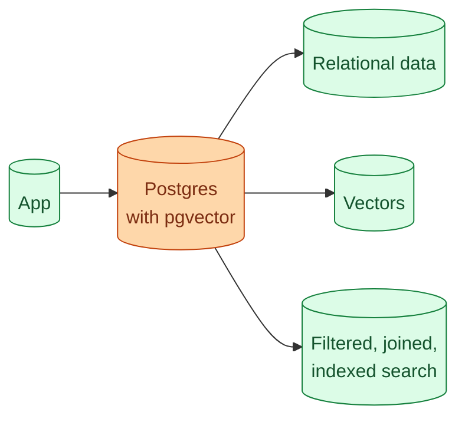

pgvector is a Postgres extension that adds a `vector` data type and approximate nearest neighbour search. Once you install it, your existing Postgres database can store and search embeddings. No new service. No new infrastructure. No new monitoring. For teams that already run Postgres and have a corpus under tens of millions of vectors, this is usually the cleanest architecture. This concept is the practical setup and where the limits actually show up.

## What it gives you



One database holds vectors and relational data. You can write SQL that joins the two. You can filter vector search with `WHERE` clauses you already know how to write. Backups, replication, monitoring, your existing Postgres ops apply.

The result is that vector search becomes "just another column." No conceptual overhead.

## Installing and basic use

```sql
-- Install the extension once
CREATE EXTENSION IF NOT EXISTS vector;

-- A table with a vector column
CREATE TABLE documents (
    id BIGINT PRIMARY KEY,
    title TEXT,
    body TEXT,
    embedding VECTOR(1536),       -- pick the dim of your embedding model
    user_id BIGINT,
    created_at TIMESTAMPTZ
);

-- Insert
INSERT INTO documents (id, title, body, embedding, user_id, created_at)
VALUES (1, 'Refund policy', '...', '[0.1, 0.2, ...]', 42, now());

-- Search: top 5 nearest
SELECT id, title
FROM documents
ORDER BY embedding <=> '[0.05, 0.18, ...]'::vector
LIMIT 5;
```

The `<=>` operator is cosine distance. `<->` is L2 (Euclidean). `<#>` is negative inner product. For normalised embeddings, cosine and inner product are equivalent.

## The index that makes it fast

Without an index, a query scans every row. Slow on anything beyond toy scale.

pgvector supports two index types: HNSW (graph based, fast) and IVFFlat (cluster based, simpler). HNSW is the modern default.

```sql
CREATE INDEX ON documents
USING hnsw (embedding vector_cosine_ops)
WITH (m = 16, ef_construction = 64);
```

`m` and `ef_construction` are tuning parameters. The defaults are usually fine. At query time, you can adjust `ef_search` to trade speed for recall:

```sql
SET hnsw.ef_search = 100;
```

Higher `ef_search` means better recall at higher query cost. Tune based on your latency requirement.

For up to 10 million vectors on a modest box, HNSW gives sub-100ms queries. Past that, performance still holds but you start needing more memory and faster disks.

## Filtering is the killer feature

Where pgvector wins big over dedicated vector DBs is filtered search.

```sql
SELECT id, title
FROM documents
WHERE user_id = 42
  AND created_at >= now() - interval '90 days'
  AND title ILIKE '%refund%'
ORDER BY embedding <=> '[...]'::vector
LIMIT 5;
```

You can mix vector similarity with any SQL filter. Indexes on the filter columns make this fast.

A common need: "find documents in this user's tenancy similar to this query." pgvector does this in one query. Dedicated vector DBs need you to set up tenancy as metadata and filter; less natural, sometimes slower.

## The honest limits

pgvector is fine until certain numbers, then it starts to strain.

**Vector count.** At 50 million vectors, HNSW indexes start to require significant RAM. At 100 million, you are pushing what one box can do.

**Update rate.** Heavy insertion rebuilds parts of the index. For batch ingest, fine. For real-time streaming updates, dedicated vector DBs handle this more gracefully.

**Query concurrency.** A query is CPU bound on the index. High concurrency requires more CPU or read replicas.

**Memory.** HNSW indexes live in memory. A million 1536-dim vectors is roughly 6 GB. Ten million is 60 GB. Plan for it.

For most RAG projects (a few million chunks, occasional ingest, modest concurrency), all of this is fine on a regular Postgres box.

## When pgvector outgrows you

Two signals that you have crossed the line.

**Query latency is climbing despite tuning.** You hit a wall HNSW cannot break through. Time to move.

**Postgres is competing with itself.** The vector queries are slow because the same database is serving other workload. You either split the database (read replica for vector workload) or move vectors out.

Migration to a dedicated vector DB is painful (concept 28). Plan for it: write an abstraction layer from the start.

## Common pitfalls

**Wrong embedding dim.** The schema is `vector(1536)`. Your embedding model returns 3072. Postgres rejects the insert. Match the dim to the model.

**Forgetting to normalise.** pgvector's cosine distance assumes normalised vectors when comparing. If your model returns unnormalised vectors, normalise at ingest. Otherwise distances are wrong.

**No index.** A 100k-row sequential scan per query is what you get. Always create the HNSW index after bulk ingest.

**Index after partial ingest.** Building HNSW on a partial table and then ingesting the rest can be inefficient. Bulk ingest first, then index.

**Using L2 when you want cosine.** Different operator. `<=>` is cosine, `<->` is L2. The wrong choice silently returns weird results.

## A complete starter setup

```sql
-- One-time setup
CREATE EXTENSION IF NOT EXISTS vector;

CREATE TABLE chunks (
    id BIGSERIAL PRIMARY KEY,
    doc_id BIGINT NOT NULL,
    text TEXT NOT NULL,
    embedding VECTOR(1536) NOT NULL,
    tenant_id BIGINT NOT NULL,
    created_at TIMESTAMPTZ DEFAULT now()
);

-- Indexes
CREATE INDEX ON chunks (tenant_id);
CREATE INDEX ON chunks (doc_id);
CREATE INDEX ON chunks USING hnsw (embedding vector_cosine_ops);

-- Search function for app code to call
CREATE OR REPLACE FUNCTION search_chunks(
    query_embedding VECTOR(1536),
    p_tenant_id BIGINT,
    top_k INT DEFAULT 5
)
RETURNS TABLE (id BIGINT, doc_id BIGINT, text TEXT, distance FLOAT) AS $$
    SELECT id, doc_id, text, embedding <=> query_embedding AS distance
    FROM chunks
    WHERE tenant_id = p_tenant_id
    ORDER BY embedding <=> query_embedding
    LIMIT top_k;
$$ LANGUAGE SQL STABLE;
```

This is a real, production-ready starting point. Tenant-isolated, indexed, with a clean search function. Adjust for your use case.

## Reads from replicas

Vector queries are read-only. For high concurrency, run them on a Postgres read replica.

The HNSW index is built on the primary and replicates to followers. Read replicas serve vector queries without affecting OLTP work on the primary.

This pattern keeps pgvector viable past where it would otherwise strain. Many production systems run with two replicas dedicated to vector search.

## When to skip pgvector entirely

Three honest cases.

**Your team has never run Postgres.** Adding it just for vectors is overkill; pick a managed vector DB.

**You expect to hit 100M+ vectors fast.** Save the migration pain and start with a dedicated DB.

**You need vector indexing as a service, not as a column.** Some teams want Pinecone's "I do not even think about it" experience and the budget is there.

Outside these, pgvector is usually the right starting point.

## Common mistakes

- **Skipping the HNSW index.** Sequential scan does not scale.
- **Indexing before bulk ingest.** Slow ingest because every insert rebuilds.
- **Wrong distance operator.** Match the operator to the index type and your embedding model.
- **Running vector queries on the primary.** Use read replicas for high concurrency.
- **Holding on too long.** When you have outgrown it, migrate. Do not heroically tune past the limit.

## Quick recap

- pgvector turns Postgres into a vector DB with one extension.
- The win is filtering: any SQL `WHERE` clause combines naturally with vector search.
- HNSW index makes it fast at modest scale; tune `ef_search` for the speed/recall trade-off.
- Limits: tens of millions of vectors, modest concurrency, batch-style ingest.
- Use read replicas for high concurrency.
- For most non-enterprise RAG, this is the right starting point. Migrate when you have outgrown it.

This concept sits in **Stage 3 (RAG and retrieval)** of the [AI Engineering Roadmap](/practice/ai-engineering/roadmap/).
