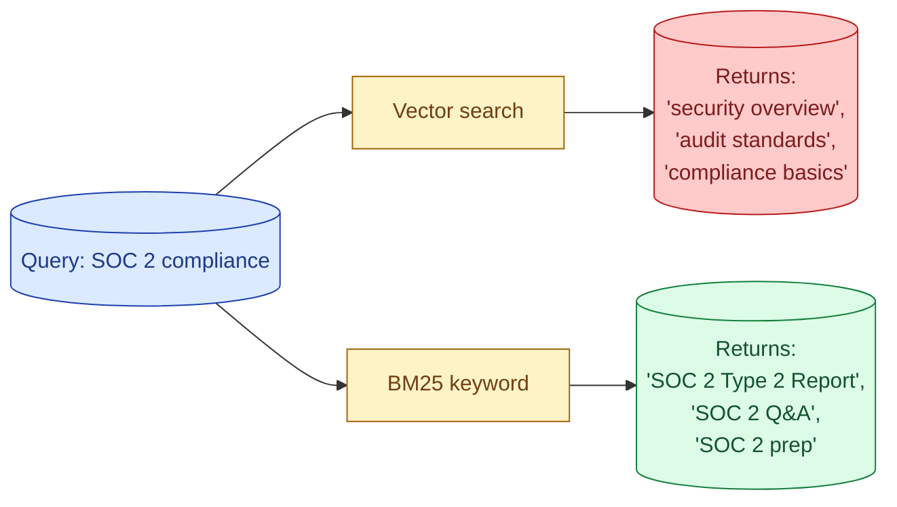
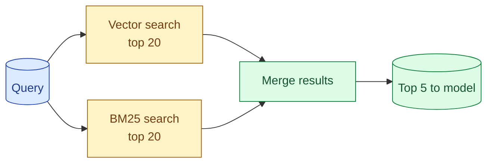
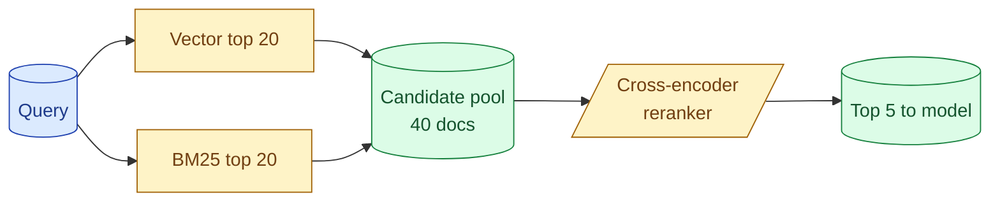

Vector search finds documents similar in meaning to the query. Keyword search finds documents that contain the exact terms in the query. Each one fails where the other shines. Hybrid search combines both: run the two searches in parallel, merge the results. For most production RAG, hybrid is a clear win. Pure vector search is what tutorials show; pure vector search is also why production RAG teams keep complaining "the system cannot find the obvious result."

## Why vector alone fails

A user asks: "Show me the SOC 2 compliance documentation."

Vector search compares the query embedding to chunk embeddings. The closest matches are about "security compliance" and "audit reports" and "data protection." All semantically near. None contain the actual phrase "SOC 2."

The document titled "SOC 2 Type 2 Report 2026" is in the index. But its embedding does not match the query at the top. The exact term "SOC 2" carries information that the embedding model treats as one small signal in a sea of semantic noise.



Keyword search nails this. Anything containing "SOC 2" floats to the top.

Now flip the query: "How do I get a refund?" Keyword search returns documents that say "refund" lots of times, even if they are off-topic. Vector search finds the "Refund Policy" document, the "Cancellation guide," the "Customer support FAQ" on cancellations. Better.

Each strategy wins on different queries. Neither wins all.

## Hybrid in three steps



Run both searches. Each returns its top N (say, 20 each). Combine the lists, deduplicate, and pick the top K for the model.

The combination step is where you have choices. Three common patterns.

## Pattern 1: weighted score combination

Each retrieval method gives a score. Combine them with weights.

```python
def hybrid_search(query: str, top_k: int = 5, vector_weight: float = 0.5) -> list:
    vec_results = vector_search(query, top_n=20)
    bm25_results = bm25_search(query, top_n=20)

    # Normalize scores to 0-1
    vec_normed = normalize_scores(vec_results)
    bm25_normed = normalize_scores(bm25_results)

    combined = {}
    for doc_id, score in vec_normed.items():
        combined[doc_id] = vector_weight * score

    for doc_id, score in bm25_normed.items():
        combined[doc_id] = combined.get(doc_id, 0) + (1 - vector_weight) * score

    sorted_results = sorted(combined.items(), key=lambda x: x[1], reverse=True)
    return sorted_results[:top_k]
```

The catch: vector scores and BM25 scores are on different scales. Normalising both to 0-1 before combining is important.

The weight is a tunable. Start with 0.5/0.5 and adjust based on eval.

## Pattern 2: reciprocal rank fusion (RRF)

A simpler combination that often works better in practice. See concept 31 for the full story.

```python
def rrf_combine(results_a: list, results_b: list, k: int = 60) -> list:
    scores = {}
    for i, doc_id in enumerate(results_a):
        scores[doc_id] = scores.get(doc_id, 0) + 1 / (k + i + 1)
    for i, doc_id in enumerate(results_b):
        scores[doc_id] = scores.get(doc_id, 0) + 1 / (k + i + 1)
    return sorted(scores.keys(), key=lambda d: scores[d], reverse=True)
```

You combine ranks, not scores. No normalisation needed. Robust across different scoring scales.

RRF is the safer default when you do not want to tune.

## Pattern 3: rerank after merge

Run both searches. Combine into a candidate pool. Pass the candidates to a reranker model.



This is the strongest of the three patterns and the most expensive. The reranker scores every candidate against the query and orders them. See concept 32 for rerankers.

For high-stakes RAG, the rerank-after-merge pattern is the default in 2026. For simpler cases, RRF or weighted combination is enough.

## Implementing BM25

BM25 is the long-standing keyword scoring algorithm. Most search libraries implement it.

**With Postgres.** Use `tsvector` and `tsquery`:

```sql
SELECT id, ts_rank(to_tsvector('english', body), plainto_tsquery('SOC 2')) AS score
FROM documents
WHERE to_tsvector('english', body) @@ plainto_tsquery('SOC 2')
ORDER BY score DESC
LIMIT 20;
```

**With Elasticsearch or OpenSearch.** Built in. The default scoring is BM25.

**With Python only.** Libraries like `rank-bm25` or `tantivy` give you in-process BM25.

For a stack that already has search infrastructure (ES, OpenSearch, Postgres FTS), use what is there. Adding a second search system for BM25 when you already have one is overkill.

## Setting it up in Weaviate, Qdrant, Pinecone

The big vector DBs all support hybrid search as a built-in feature in 2026.

**Weaviate:** Native hybrid search with weight tuning.

```python
result = weaviate_client.query.get("Document", ["title", "body"]).with_hybrid(
    query="SOC 2 compliance",
    alpha=0.5  # 0 = pure BM25, 1 = pure vector
).with_limit(5).do()
```

**Qdrant:** Sparse vectors (for BM25-like behaviour) alongside dense vectors. Combine in the query.

**Pinecone:** Hybrid index type that supports both sparse and dense vectors. The SDK handles the merge.

If your DB supports it, use the built-in. It is tuned, fast, and one fewer thing for you to maintain.

## Tuning the weight

The vector-vs-BM25 weight needs measurement.

Build a small eval set of queries where you know what the right document is. Run hybrid search with weights 0.0, 0.2, 0.4, 0.6, 0.8, 1.0. Measure recall at 5 for each.

You usually see a curve with a peak somewhere in the middle:

```
weight  recall@5
 0.0      62%   (pure BM25)
 0.2      68%
 0.4      78%   (peak)
 0.6      76%
 0.8      70%
 1.0      65%   (pure vector)
```

Pick the peak. In most corpora it lands between 0.3 and 0.6, slightly favouring vectors. Not always; measure on your data.

## When hybrid does not help

Three cases.

**Pure semantic queries.** A chatbot that always gets natural-language questions about meaning, no proper nouns or codes. Pure vector is fine, BM25 adds noise.

**Pure keyword queries.** An exact-match lookup tool. "Find document with ID XYZ-123." Pure BM25 is faster and simpler.

**Tiny corpora.** A few hundred documents. BM25 and vector both find the right answer; the extra complexity does not buy anything.

For everything in between, hybrid wins. Most production RAG is in between.

## Common mistakes

- **Pure vector search in production.** Misses exact terms. Surprises users on simple queries.
- **Pure keyword.** Misses semantic matches. Users phrase questions naturally, not in the document's exact words.
- **Combining unnormalised scores.** Vector cosines are 0-1, BM25 scores can be 0-50. Combining them directly is a bug. Normalise first or use RRF.
- **No tuning.** 50/50 is a starting point, not an answer. Tune on your queries.
- **Skipping rerank for high-stakes RAG.** Hybrid is a good default. Hybrid plus reranker is the strong pattern.

## Quick recap

- Vector search wins on meaning; BM25 wins on exact terms.
- Hybrid runs both and merges the results.
- Three combination patterns: weighted score, reciprocal rank fusion, rerank after merge.
- RRF is the safer default when you do not want to tune.
- Modern vector DBs (Weaviate, Qdrant, Pinecone) have hybrid built in.
- Tune the weight on a small eval set. The peak is usually in the middle.

This concept sits in **Stage 3 (RAG and retrieval)** of the [AI Engineering Roadmap](/practice/ai-engineering/roadmap/).
