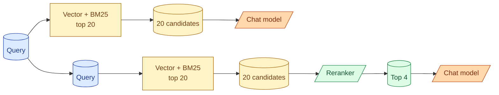

A reranker is a second-pass model that takes a list of candidate documents and reorders them by relevance to the query. The first pass (vector + BM25, fused with RRF) gets you a pool of plausible candidates. The reranker decides which ones actually belong at the top. This two-stage pattern almost always beats single-stage retrieval. For most production RAG, adding a reranker is the largest quality lift you can buy for the smallest engineering investment. This concept is about how rerankers work, when they help, and how to wire them into your pipeline.

## Why retrieval alone is not enough



Vector search uses one embedding per chunk and one embedding per query, then compares them. That comparison is cheap but coarse. The cosine score does not understand the specific question; it only knows the chunk is in the right neighborhood.

A reranker does the comparison differently. It takes the query and one chunk together and scores how well the chunk answers the query. It reads them jointly. The scoring is slower but much more accurate.

Run the reranker on the 20 candidates from first-pass retrieval, take the top 4 or 5, and pass those to the chat model. The model now sees the best matches, not the merely-plausible ones.

## Bi-encoders vs cross-encoders

Two model families that both look like rerankers but work differently.

**Bi-encoders.** Embed the query and chunk separately, compare with cosine. This is what regular embedding search does. Fast (precompute chunk embeddings; only the query embedding is computed at query time). Less precise.

**Cross-encoders.** Take the query and chunk as one combined input, run them through a transformer together, output a relevance score. Cannot precompute (the chunk score depends on the specific query). Slower. Much more precise.

For reranking, you want cross-encoders. The slowness is acceptable because you only run them on 20 candidates, not the whole corpus.

## The pattern in code

```python
def retrieve_and_rerank(query: str, top_k: int = 4) -> list:
    # First pass: cheap retrieval, larger candidate pool
    vector_top = vector_search(query, top_n=20)
    bm25_top = bm25_search(query, top_n=20)
    candidates = rrf([vector_top, bm25_top], k=60)[:30]

    # Second pass: cross-encoder reranking
    pairs = [(query, fetch_chunk_text(c)) for c in candidates]
    scores = cross_encoder.predict(pairs)
    reranked = sorted(zip(candidates, scores), key=lambda x: x[1], reverse=True)

    return [c for c, _ in reranked[:top_k]]
```

Twenty to thirty candidates from first pass. Score each pair with the cross-encoder. Sort. Return the top few.

The cross-encoder call is the new latency. On a small reranker model, scoring 30 pairs is 100-500ms. Worth it for the quality lift.

## Picking a reranker

Three options that matter in 2026.

**Cohere Rerank API.** Closed, hosted. Easiest. Strong quality. Pay per call.

**BGE Reranker open source (BAAI/bge-reranker-v2-m3).** Self-hosted on a small GPU. Strong quality. Free after infra cost. Good multilingual.

**Mixedbread mxbai-rerank.** Open source. Lean and fast. Good general purpose.

For most production setups: Cohere if you want zero ops, BGE if you self-host. Cohere is the easier starting point.

```python
import cohere

co = cohere.Client(api_key="...")
results = co.rerank(
    model="rerank-multilingual-v3.0",
    query="How do I reset my password?",
    documents=[c.text for c in candidates],
    top_n=5
)
top_candidate_ids = [candidates[r.index].id for r in results.results]
```

Three lines. The reranker scores the documents, returns the top 5.

## What rerankers fix

The honest list of failure modes that reranking improves.

**Vector matches that look right but are off.** Cosine put the wrong document at the top because it was semantically similar. The reranker reads the query carefully and bumps the actually-relevant document up.

**Order within the top K.** Vector search finds the right document but ranks it 4th. The model gets a less-relevant document in the top 1 or 2 and starts with the wrong context. The reranker fixes the order.

**Negated queries.** "Show me users who did NOT subscribe." Embeddings treat "did" and "did not" similarly. Cross-encoders read the negation and rank correctly.

**Long, specific queries.** "What is the refund policy for European customers on annual subscriptions purchased before 2024?" Embeddings smooth out the specifics. Cross-encoders attend to them.

For these failure modes, reranking is often the difference between RAG that mostly works and RAG that holds up under real user queries.

## What rerankers cannot fix

They are not magic.

**Missing documents in first-pass results.** The reranker only sorts what it is given. If the right document was not in the first-pass top 20, the reranker cannot promote it.

The fix is wider first-pass retrieval. Increase top-N to 50 or 100 if the reranker can handle it.

**Hallucination in the chat model.** Reranking improves what the model sees. The model can still ignore the context or invent information. See concept 19.

**Cost from too many candidates.** Each reranking call is N model invocations (one per candidate). With 100 candidates, you are paying for 100 model calls per user query.

## Picking the candidate pool size

A trade-off.

Too few (e.g., 10 candidates) means the reranker has no choice. If the right document was at rank 15 in vector search, you missed it.

Too many (e.g., 100) means you pay for 100 reranker calls per user query. Latency and cost climb.

A reasonable starting point: 20 candidates. Tune up if you see "right document was just outside the pool" failures. Tune down if cost is the concern and quality holds.

## Latency budget

A typical hybrid + rerank pipeline, in milliseconds:

```
Query embed:           50-100ms
Vector search top-20:  20-50ms
BM25 search top-20:    10-30ms
RRF merge:             < 1ms
Reranker on 30:        150-400ms
Total before LLM:      230-580ms
```

For a chat UI where the LLM takes 2-5 seconds anyway, this is a small extra. For a search-as-you-type UI, it can be noticeable.

If latency matters, two patterns help.

**Run vector and BM25 in parallel.** They are independent. Use `asyncio.gather` or its equivalent.

**Cache reranker scores.** If queries repeat (FAQs do), cache by `(query, doc_id)` pair.

## Smaller candidate pools, more pools

For very large corpora, an alternative pattern: instead of one large candidate pool, run multiple narrower pools and merge.

```python
# Two narrower retrievals
top_by_recency = vector_search_filter(query, where="created_at > date - 30d", top_n=10)
top_by_relevance = vector_search(query, top_n=10)

# Merge and rerank
all_candidates = rrf([top_by_recency, top_by_relevance])[:20]
reranked = cross_encoder_rerank(query, all_candidates, top_k=5)
```

Each pool focuses on a different signal. The reranker picks among the best of each. Useful for time-sensitive or tenant-isolated corpora.

## Cost math

A representative example. 100,000 queries per day. Hybrid retrieval + reranker on 30 candidates.

Cohere Rerank API at ~$2 per 1000 searches: 100,000 / 1000 = 100 search units per day at the right scale, roughly $200/day, $6000/month.

Self-hosted BGE on an A10G: ~$1-2 per hour of GPU time. A single GPU can serve maybe 30,000-50,000 rerank queries per day. ~$30-60/day, $900-1800/month.

For most teams under 50,000 queries/day, the Cohere API is fine. Past that, self-hosting saves real money.

## Reranking as a quality investment

The senior framing: a reranker is not a tax, it is the largest lift-per-engineering-hour you can buy in RAG.

A team building RAG without reranking typically lands at 65-75% recall@5 on a real eval set. The same team with reranking lands at 80-90%. The work to add it: one library, 30 lines of code, a config to call the API.

If the team is debating "should we add a reranker" the answer is almost always yes, then move on.

## Common mistakes

- **Reranking the whole corpus.** Reranker is slow. Use it on a small candidate pool, not the full database.
- **Top-N too small.** If only 5 candidates are passed to the reranker, the right document might not be among them.
- **Bi-encoder for reranking.** That is just embedding search again. Use a cross-encoder.
- **No latency budget.** Adding reranking can push interactive latency past 500ms. Plan for it.
- **Skipping it on "good enough" RAG.** Good enough often is not, under real user load.

## Quick recap

- Rerankers reorder a candidate list by reading query and document together.
- Cross-encoders are the reranker class to use. Slow per pair, but you only run on 20-30 candidates.
- Pattern: retrieve 20 candidates with hybrid (vector + BM25 + RRF), rerank to top 5, pass to chat model.
- Cohere Rerank API or self-hosted BGE are the main 2026 picks.
- Quality lift is large and the engineering cost is small. Add reranking to any production RAG.

This concept sits in **Stage 3 (RAG and retrieval)** of the [AI Engineering Roadmap](/practice/ai-engineering/roadmap/).
