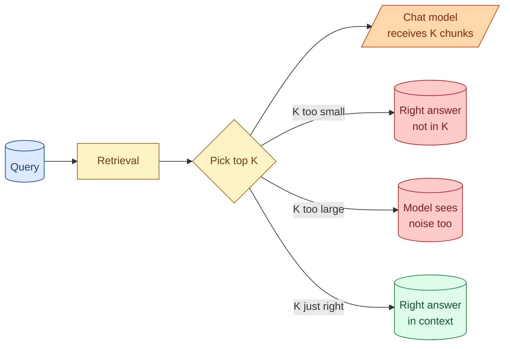

Top-K is how many candidate chunks you pass to the chat model after retrieval. Pick too few and the right answer never gets there. Pick too many and the model wades through noise and your bill grows. Recall@K is the metric that tells you whether your K is large enough. Together, K and recall are the operating handles you tune to make a RAG that works. This concept is the practical guide to setting them.

## What top-K decides



Three things scale with K.

**Context size.** Each chunk added is more tokens to the chat model. K=10 with 500-token chunks is 5000 tokens of context. K=20 is 10,000. Cost and latency grow.

**Recall.** More chunks means more chance the right one is in the set. Recall@K rises with K, fast at first, then plateaus.

**Quality of the answer.** Too few chunks means the model sometimes has no relevant context. Too many means the model has to find the relevant chunk inside noise.

The right K is where recall is high enough but noise has not yet hurt quality.

## What recall@K actually measures

For a single query, "recall@K = 1 if the correct chunk is in the top K, else 0."

For an eval set, "recall@K is the fraction of queries where the correct chunk is in the top K."

```python
def recall_at_k(eval_set, retrieval_fn, k):
    hits = 0
    for query, correct_chunk_ids in eval_set:
        results = retrieval_fn(query, top_k=k)
        result_ids = [r.chunk_id for r in results]
        if any(c in result_ids for c in correct_chunk_ids):
            hits += 1
    return hits / len(eval_set)
```

For a 50-query eval set with 40 hits at K=10, recall@10 = 80%.

This is the single most important RAG metric. It tells you whether the model is even seeing what it needs.

## A typical recall-vs-K curve

```
K     recall@K
1      55%   (model only ever sees one chunk)
3      72%
5      80%
10     87%
20     92%
50     96%
100    98%
```

Two patterns to notice.

**Diminishing returns.** Each extra chunk past K=10 adds less. The curve flattens.

**Long tail.** Some queries never get the right chunk in even K=100. Those are bugs in chunking, embedding, or query itself, not solvable by upping K.

The senior question is "what K is the smallest where recall is acceptable?" Past that, you are paying for context with little quality gain.

## Picking K for the chat model

If you have a reranker (concept 32), the picture is two-stage.

**First-pass K.** How many candidates to retrieve before reranking. This should be larger to give the reranker room. 20-50 is typical.

**Final K.** How many chunks to pass to the chat model after reranking. This is smaller. 3-7 is typical.

Without a reranker, the chat model sees the first-pass top K directly. K is usually 4-8 here.

```python
def retrieve_for_model(query: str) -> list:
    first_pass = hybrid_search(query, top_k=30)  # broad
    reranked = rerank(query, first_pass, top_k=5)  # narrow
    return reranked
```

The reranker bridges first-pass K (wider) and final K (narrower) without dumping noise on the model.

## When K should be small

Three signs you want K closer to 3-4.

**Simple lookup queries.** "What is the API rate limit?" One chunk holds the answer. More chunks add noise.

**Tight context budget.** The chat model's context is shared with the system prompt and conversation history. K of 10 with 1000-token chunks blows the budget.

**Expensive chat model.** When the chat model is large and per-call cost matters, K=3 saves real money.

## When K should be larger

Equally specific cases.

**Synthesis queries.** "Summarise everything we have on user retention." The model needs many chunks to synthesise from. K=10 or 20.

**Comparative questions.** "Compare our pricing in 2024 and 2025." Multiple chunks need to be present for the model to compare.

**Long-context models.** Claude with extended context (200k+) does not strain on K=20. Use the capacity when it helps.

## The "no answer in any chunk" case

What if the right answer truly is not in any chunk in the corpus? K is irrelevant; recall is zero for this query no matter what.

This is when retrieval should answer "I do not know" honestly. See concept 36.

Tracking the "no answer" rate is part of measuring RAG. A high rate suggests either gaps in the corpus or queries the corpus is not built for.

## Measuring without ground truth

The example above assumed labelled data (queries with known correct chunks). For new RAG without an eval set, two ways to bootstrap.

**LLM-as-judge.** Run a query, get the top K chunks, ask a judge model "does the correct answer exist in these chunks?" The judge gives a yes/no. Aggregate over many queries.

**User feedback.** A thumbs-up/down on the chat answer is a proxy. Thumbs-down often correlate with retrieval failures. Sample these and look for patterns.

Neither is as good as a hand-labelled eval set, but they get you started.

## Compose K with confidence thresholds

A pattern that often works: take top-K but stop if confidence drops below a threshold.

```python
def retrieve_with_threshold(query: str, k_max: int = 10, min_score: float = 0.7):
    candidates = vector_search(query, top_n=k_max)
    return [c for c in candidates if c.score >= min_score]
```

For some queries you return 8 chunks. For others 1 or 2. Noise is reduced because low-confidence chunks are dropped.

The trade-off: you need scores you can trust. With a reranker, the scores are meaningful. Without one, cosine scores vary by query and may not be comparable across queries.

## Cost-aware K choice

A rough calculation. 100,000 queries a day. Each chunk is 500 tokens. Chat model at $3/M input tokens.

```
K = 5:   100,000 × 5 × 500 × $3 / 1,000,000 = $750/day
K = 10:  100,000 × 10 × 500 × $3 / 1,000,000 = $1,500/day
K = 20:  100,000 × 20 × 500 × $3 / 1,000,000 = $3,000/day
```

Doubling K doubles this slice of cost. The cost vs quality decision needs to be made deliberately.

For most production RAG, K=5 with a reranker is the cost-quality sweet spot. K=10 is the next step up. K=20+ is for synthesis-heavy tasks.

## Common mistakes

- **K is whatever the tutorial said.** Tutorials picked K=4 or K=10 without context. Measure on your data.
- **K=1 in production.** The single top chunk is often almost-right; the second chunk is the actual answer.
- **K=20 always.** Wastes tokens on noise; harms quality on simple queries.
- **No recall@K measurement.** You cannot improve what you cannot measure.
- **Same K everywhere.** Different query types benefit from different K.

## Quick recap

- Top-K is how many chunks pass to the chat model.
- Recall@K is the fraction of queries where the right chunk is in the top K.
- Recall rises with K but plateaus. The senior K is the smallest where recall is acceptable.
- With a reranker: wider first-pass K (20-50), narrower final K (3-7).
- For simple lookups, K=3 to 5. For synthesis, K=10 to 20.
- Measure recall@K on a real eval set. K choices made without numbers are guesses.

This concept sits in **Stage 3 (RAG and retrieval)** of the [AI Engineering Roadmap](/practice/ai-engineering/roadmap/).
