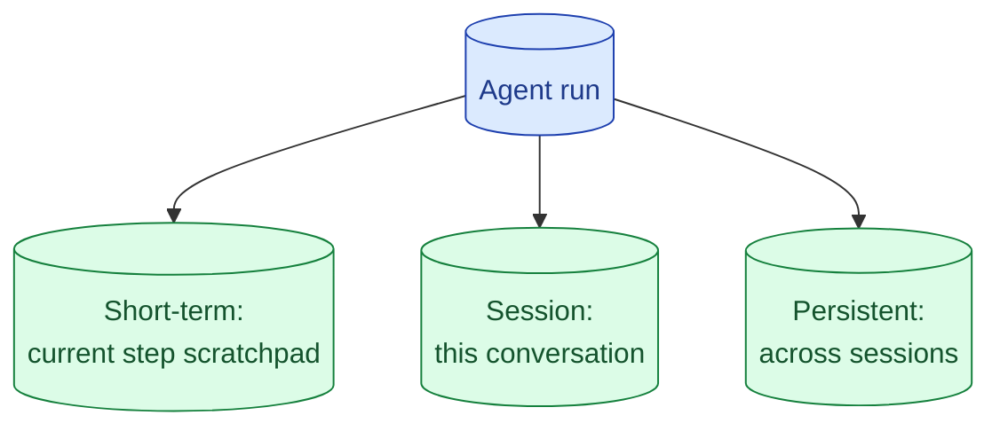

Agents have three kinds of memory: the current scratchpad, the current session, and persistent user-level memory. Most teams build the first one accidentally, the second one badly, and the third one not at all. Each has a different purpose and a different storage choice.

**What this page will cover.**

- Three layers of memory and what each one is for
- When session memory needs summarisation vs full retention
- Persistent memory: when it earns the privacy headache
- Memory as retrieval: embedding past turns and looking them up
- Forgetting on purpose: TTLs and explicit deletion

*Page coming soon.*

This concept sits in **Stage 4 (Agents and tool use)** of the [AI Engineering Roadmap](/practice/ai-engineering/roadmap/).
