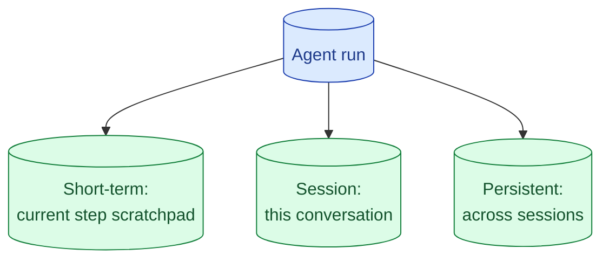

Agents have three kinds of memory: the current scratchpad, the current session, and persistent user-level memory. Most teams build the first one accidentally, the second one badly, and the third one not at all. Each has a different purpose and a different storage choice.



## The three layers and what each one is for

**Short-term memory** is the working scratchpad inside one agent run. The agent is reasoning, calling tools, getting results, deciding next steps. The scratchpad holds the reasoning trace and intermediate tool outputs. It lives in the prompt itself: each turn includes what came before.

**Session memory** is everything in the current conversation. The user said "I prefer email over Slack" three turns ago. The agent needs that on turn 7. This memory lives in the conversation history you ship with each call.

**Persistent memory** is what survives across sessions. The user's preferences, past tasks, accumulated facts about them. This lives in your database, keyed by user_id, fetched at session start.

Each layer has a different storage and a different cost profile. Mixing them is the most common bug.

## When session memory needs summarisation vs full retention

Session memory grows linearly with conversation length. By turn 50, you are shipping 30,000 tokens of history every call (see concept 17).

Two strategies.

**Full retention.** Keep every turn verbatim. Simple. Works until conversations get long. Cost and latency suffer.

**Rolling summarisation.** After 20 turns, summarise turns 1 to 20 into a 300-token block. Keep the summary plus the last 10 turns. The summary covers important facts; the recent turns cover the live conversation.

```python
def manage_session_memory(turns: list, summariser_model) -> list:
    if len(turns) < 30:
        return turns
    old, recent = turns[:-10], turns[-10:]
    summary = summarise(old, summariser_model)
    return [{"role": "system", "content": f"Earlier context: {summary}"}] + recent
```

Run summarisation in the background after each call so the next call uses the new shorter history.

## Persistent memory: when it earns the privacy headache

Persistent memory is a database that remembers user-level facts. "Amirul prefers Python." "Sarah works in healthcare and her client data is HIPAA." "Mike's last order was on May 5."

It earns its place when the user benefits from being remembered across sessions. A coding assistant that already knows the user prefers tabs. A support bot that already knows the user's plan tier.

It costs you. PII handling. Right-to-be-forgotten requests (delete by user_id). Update conflicts (the user changed their mind). Storage that grows linearly with users.

A reasonable approach: opt-in by feature. Persistent memory exists only for users who explicitly enabled "remember things about me." Users who do not opt in get session-only memory and a fresh start every conversation.

## Memory as retrieval: embedding past turns and looking them up

For long-lived agents (think: an assistant a user has used for two years), conversation history becomes a dataset. Instead of summarising or dropping, you embed each turn and retrieve the relevant ones for the current question.

```python
def relevant_history(query: str, user_id: str, top_k: int = 5) -> list:
    q_vec = embed(query)
    matches = vector_search(
        q_vec,
        filter={"user_id": user_id, "type": "history"},
        top_k=top_k
    )
    return [m.turn for m in matches]
```

The agent gets just the relevant past turns, not all of them. A user asking about taxes today gets the tax conversation from six months ago, not the unrelated weather chats from yesterday.

This is the heaviest pattern, useful for production assistants where users have rich, long-term context.

## Forgetting on purpose: TTLs and explicit deletion

Persistent memory is not write-only. You need a forgetting strategy.

**TTLs on facts.** "Amirul's current project is X" expires after 90 days unless reaffirmed. Saves you from confidently remembering outdated facts.

**Explicit user control.** A "what do you remember about me?" view and a "forget this" button. Builds trust; required by some regulations.

**Right-to-be-forgotten.** A single delete-by-user_id sweeps all memory. Tested in CI: delete a test user, confirm no remaining records.

A memory layer without a forgetting layer becomes a liability. Build both at the same time.

## Where each layer is implemented

| Layer | Storage | Lifetime |
| --- | --- | --- |
| Short-term | The prompt itself (within one agent run) | Until the run ends |
| Session | List of messages in your app, sent with each call | This conversation |
| Persistent | Database keyed by user_id, retrieved per session | Until user deletes or TTL expires |

Mixing layers (session memory in the database, short-term in a global cache) is a common bug. Each layer has its place.

## Common mistakes

- **Stuffing facts into the system prompt forever.** Bloat without intentional structure.
- **Full retention by default.** Cost grows; quality drops on long conversations.
- **Persistent memory without privacy controls.** Becomes a compliance problem.
- **Mixing memory layers.** Session data in the database, persistent data in the prompt; confusion.
- **No forgetting strategy.** Memory becomes wrong over time.

## Quick recap

- Three layers: short-term (scratchpad), session (this conversation), persistent (across sessions).
- Session memory needs summarisation past ~20 turns to keep cost bounded.
- Persistent memory is opt-in by feature; comes with PII and compliance work.
- Memory-as-retrieval works for long-lived assistants with rich history.
- Forgetting is a feature, not an oversight. Build it with the memory.

This concept sits in **Stage 4 (Agents and tool use)** of the [AI Engineering Roadmap](/practice/ai-engineering/roadmap/).
