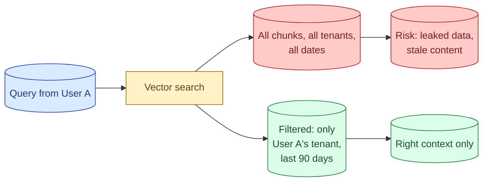
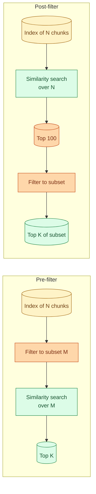

Metadata filtering restricts vector search to a subset of the corpus based on non-vector criteria. "Only documents this user can see." "Only docs from the last 90 days." "Only items in the API category." Without filtering, you risk leaking data across tenants, surfacing outdated content, and wasting compute searching irrelevant chunks. With filtering, retrieval becomes faster, safer, and more accurate. This concept is about how to set up metadata, when to filter pre-search vs post-search, and how the choice affects results.

## Why filtering matters



Three real reasons to filter.

**Privacy.** In a multi-tenant system, user A must never see user B's data. Filtering by tenant is non-negotiable.

**Freshness.** Old documents are sometimes wrong. Filtering by date keeps stale content out of the top results.

**Topic boundaries.** A user asking about API rate limits should not see chunks from the marketing handbook. Filtering by category or document type sharpens results.

Without filtering, vector search returns the semantically closest chunks regardless of who owns them or how old they are. That is almost never what you want in production.

## What metadata to store

Per chunk, store:

```python
{
    "chunk_id": "doc_43_chunk_12",
    "doc_id": "doc_43",
    "embedding": [0.1, 0.2, ...],

    # Identity / access control
    "tenant_id": "company_xyz",
    "owner_id": "user_42",
    "visibility": "internal",

    # Freshness
    "created_at": "2026-03-14",
    "last_updated": "2026-05-01",
    "doc_version": 3,

    # Topic / taxonomy
    "category": "api_documentation",
    "tags": ["rate-limits", "authentication"],
    "language": "en",
    "doc_type": "guide",

    # Source
    "source_url": "https://docs.example.com/api/rate-limits",
    "section": "Rate Limiting"
}
```

You will not always use all of these. The principle: store more than you think you need. Adding metadata later means re-ingesting; storing it now is cheap.

## Pre-filter vs post-filter

Two ways to apply filters.

**Pre-filter.** Restrict the search to matching chunks before computing similarity. The vector index is asked "find the top K among the chunks matching this filter."

**Post-filter.** Run the similarity search across the full index, then drop results that do not match the filter.



**Pre-filter** is faster when the filter is selective (cuts the search space significantly). Most modern vector DBs do this with attribute indexes.

**Post-filter** is faster when the filter matches a large fraction (most chunks pass). You can also use it when the DB cannot pre-filter on your specific attribute.

The trap: post-filtering with a tight filter can return fewer than K results, because most top-100 vector matches got filtered out. You have to know whether to expand the search or accept fewer results.

## In practice, prefer pre-filter

For most production cases, pre-filter is the right default.

**Why:** privacy filters (like tenant_id) usually select a small fraction of the corpus. Searching only that slice is faster and more accurate. You never risk leaking data.

**How:** modern vector DBs (Pinecone, Weaviate, Qdrant, pgvector) all support metadata filters as first-class. The DB combines the vector search with the filter in one query.

```python
# Pinecone
results = index.query(
    vector=query_embedding,
    top_k=10,
    filter={
        "tenant_id": user.tenant_id,
        "created_at": {"$gte": "2025-06-01"}
    }
)
```

```sql
-- pgvector
SELECT id, text
FROM chunks
WHERE tenant_id = 42
  AND created_at >= '2025-06-01'
ORDER BY embedding <=> '[...]'::vector
LIMIT 10;
```

Both are pre-filtered queries. The DB handles the combination efficiently.

## Filter selectivity matters

Filters dramatically change query performance.

**Selective filters** (tenant_id, date range, category) reduce the search space by 10x to 1000x. Pre-filter is fast.

**Non-selective filters** (language = "en" in a mostly-English corpus) cut almost nothing. The overhead of pre-filter may exceed the post-filter alternative.

For most filters used in practice (privacy, freshness, topic), they are selective. Pre-filter wins.

## Tenant isolation is a security boundary

In a multi-tenant system, tenant_id filtering is not a "nice to have." It is the line between your product and a data leak.

**Defense in depth.** Filter at the DB level (vector search). Filter at the application level (data layer). Audit logs of every query. Tests that verify cross-tenant queries return zero results.

```python
def search_for_user(query: str, user: User) -> list:
    assert user.tenant_id is not None, "no tenant_id, refuse the query"
    results = vector_search(
        query,
        filter={"tenant_id": user.tenant_id}
    )
    # Defense in depth: re-check at the application level
    for r in results:
        assert r.tenant_id == user.tenant_id, "tenant mismatch, abort"
    return results
```

Belt and suspenders. If the vector DB ever misbehaves, the assertion catches it before data leaves the server.

## Date range filters

For knowledge that goes stale, time-based filters keep retrieval honest.

**Hard cutoff.** "Only documents from the last 12 months." Anything older is invisible. Simple, but loses access to older docs that might still be relevant.

**Soft cutoff.** Search broadly, but boost recent documents in the final ranking. Older documents can still appear if they are uniquely relevant.

```python
def time_aware_search(query: str, top_k: int = 5) -> list:
    candidates = vector_search(query, top_n=20)
    for c in candidates:
        age_days = (now() - c.created_at).days
        recency_boost = max(0, 1 - age_days / 365)
        c.combined_score = c.similarity_score + 0.2 * recency_boost
    candidates.sort(key=lambda c: c.combined_score, reverse=True)
    return candidates[:top_k]
```

Soft cutoffs are more honest for content where recency is valuable but not mandatory.

## Filtering by topic or category

Tag your chunks with category metadata. At query time, optionally restrict by category.

```
User on "Billing" page asks "how do I cancel?"
Filter: category = "Billing"
Result: Only billing-related chunks are searched. The cancellation policy.
```

```
User on "API Docs" page asks "how do I cancel a request?"
Filter: category = "API"
Result: Only API chunks are searched. The cancel-request endpoint.
```

Same query, different contexts, different right answers. The category filter routes the query correctly.

## Dynamic filters from user intent

Sometimes the right filter is itself extracted from the query.

User asks: "What does the 2024 contract say about termination?"

Parse the query, extract "2024" as a year filter, "contract" as a doc_type filter. Search within `doc_type=contract AND year=2024`.

A small parsing step (regex, or a quick LLM call) extracts the filter from natural language. The search becomes much more accurate.

This pattern is heavier than static filtering but earns its complexity on queries with structure.

## Filter logging for debugging

When retrieval surprises you, log what filters were applied.

```python
log.info("retrieve", extra={
    "query": query,
    "filters": filters_dict,
    "result_ids": [r.id for r in results],
    "result_count": len(results)
})
```

A common bug: a filter accidentally excludes everything. Search returns zero results. The chat model gets no context. The user sees "I do not know."

Without logging, you investigate by hand. With logging, you query: "show me queries where results = 0 and filters were applied." The pattern jumps out.

## Common mistakes

- **No tenant filter.** Cross-tenant data leaks. Worst-case privacy bug.
- **Post-filtering with tight filters.** Returns less than K results sometimes; users see "no answer."
- **Filter logic only at vector DB.** Defense in depth: verify at application layer too.
- **Static date cutoff.** Older relevant content disappears. Use soft cutoffs.
- **Not logging filters.** Debugging weird retrieval becomes a guessing game.

## Quick recap

- Metadata filters restrict vector search to relevant subsets: by tenant, by date, by category.
- Pre-filter is the default for selective filters (privacy, dates). Post-filter for broad filters.
- Tenant isolation is a security boundary. Filter at the DB, re-check at the app, log everything.
- Soft date filters preserve older relevant content. Hard cutoffs hide it.
- Topic filters route queries to the right slice; same query, different filters, different answers.
- Log filters with every query. Debugging zero-result queries depends on it.

This concept sits in **Stage 3 (RAG and retrieval)** of the [AI Engineering Roadmap](/practice/ai-engineering/roadmap/).
