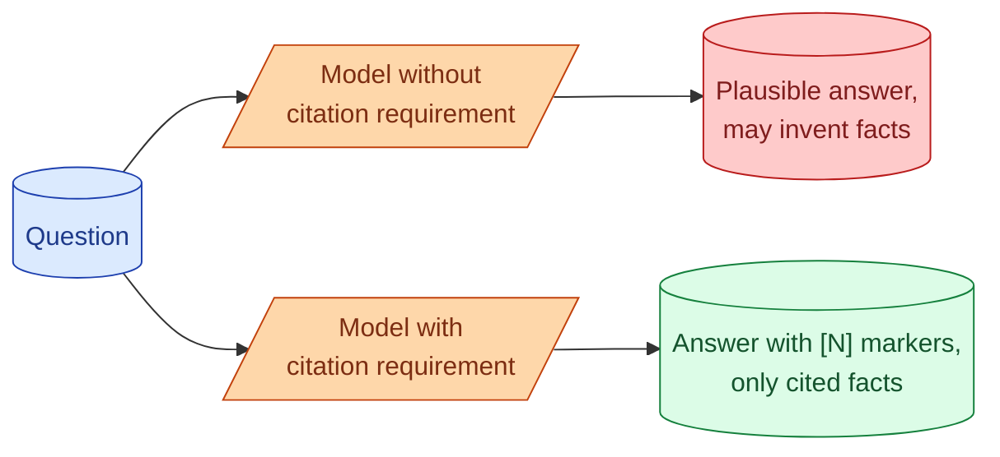

A citation says "this part of the answer came from this part of the corpus." Without citations, RAG output is just text. The user has to trust the model. With citations, the user can verify, the system is debuggable, and hallucinations get pushed down because the model has to point at a real source. This concept is about how to get citations from a model that does not naturally produce them, how to surface them in the UI, and why grounding the answer to specific chunks is one of the highest-leverage RAG patterns.

## What a good citation looks like

```
Q: What is the refund window for annual subscriptions?

A: Annual subscriptions can be refunded within 14 days of purchase. [1]
   Pro-rated refunds for cancellations after 14 days are not offered. [2]

Sources:
[1] Refund Policy, section "Annual Plans" - https://docs.example.com/refunds#annual
[2] Cancellation Guide, section "After the trial period" - https://docs.example.com/cancellation
```

Every claim is tied to a source. The source is identifiable enough for the user to look it up. The presentation is clean.

This is achievable with prompting. It does not require special models.

## The prompt pattern

```
You are a support assistant. Use only the provided context to answer.
If the answer is not in the context, say "I do not see that in our docs."

When you make a factual claim, cite it with [N] where N matches the
source number below. Do not make claims you cannot cite.

Sources:
[1] {title_1}: {chunk_1_text}
[2] {title_2}: {chunk_2_text}
[3] {title_3}: {chunk_3_text}

User question: {question}
```

The model writes its answer interleaving `[1]`, `[2]`, `[3]` markers. The UI renders these as clickable citations.

The discipline of "do not make claims you cannot cite" pushes down hallucination (see concept 19). The model literally cannot say something the cited context does not support.

## Why citations reduce hallucination

The mechanism is interesting. When the model is asked to cite, it cannot say things that have no source. The act of pointing at a citation forces the claim to come from the context.



Without the constraint, the model produces fluent text where some claims are right and some are made up. With the constraint, the model is forced to skip claims that have no source. The output is shorter sometimes, but trustworthy.

This is one of the cheapest hallucination reduction techniques. Two lines added to the prompt.

## Structured citations with schemas

For more reliable citation, use structured outputs.

```python
from pydantic import BaseModel

class Citation(BaseModel):
    source_index: int       # which source [N] this refers to
    quote: str              # exact substring from the source

class Answer(BaseModel):
    text: str               # the answer with [N] markers
    citations: list[Citation]
    confidence: float       # 0 to 1, the model's confidence

resp = client.responses.parse(
    model="...",
    response_format=Answer,
    messages=[...]
)
```

The model returns an answer plus a list of citations. Each citation includes the exact quote from the source. You can verify the quote actually appears in the chunk (regex or substring check) before showing the citation to the user.

This validates the citation: the model cannot invent a citation that does not exist in the source.

## Surfacing citations in the UI

Two patterns.

**Inline footnotes.** `[1]`, `[2]` markers in the text. Clicking opens a panel with the source. Familiar to anyone who has read Wikipedia.

**Highlight on hover.** Each cited statement gets a subtle underline or background color. Hovering shows the source. Less visual clutter than footnotes.

Both work. The choice depends on the product's style. The key is that the user can verify any claim with one click.

## Citation granularity

How specific should a citation be?

**Whole document.** "From the Refund Policy." Lowest effort. Least useful; the user has to read the whole doc.

**Chunk.** "From the Refund Policy, section Annual Plans." Useful. The user can find the specific paragraph.

**Sentence.** "Refunds are allowed within 14 days [exact sentence here]." Most useful. The user can verify the specific claim.

Sentence-level citations require the structured output pattern above. The model emits the exact quote. The UI highlights it.

For most production RAG, chunk-level citations are the right level. Sentence-level is worth it for legal, medical, or anywhere accuracy is auditable.

## What to do when the model cannot cite

Sometimes the model concludes nothing in the sources supports an answer.

```
A: I do not see this in the provided documentation.
   The available sources cover [topic A] and [topic B] but not your question.
```

This is the right answer. Trying to force the model to answer would lead to hallucination.

In the UI, surface this honestly. A "no answer in our docs" state with a feedback button is better than a confidently wrong answer.

The metric to track: fraction of queries where the model returns "no answer." A high rate suggests gaps in the corpus or queries the corpus is not built for.

## Edge case: multiple sources for one claim

Sometimes a claim is supported by multiple sources. The model should cite both.

```
Refunds are processed within 5-7 business days. [1] [3]
```

Two sources mentioned the same fact. The model cites both. This is the cleanest pattern; readers see redundant support and trust grows.

In some cases, the sources disagree. The model should surface that too.

```
The default rate limit is documented as 100 requests/minute [1]
but the API reference says 60 requests/minute [3]. Please verify
with the current documentation.
```

Acknowledging the conflict is more honest than picking one source and ignoring the other.

## Auditing citation quality

In the eval set, add citation correctness as a metric.

```python
def citation_audit(answer: Answer, sources: list[Chunk]) -> dict:
    valid_citations = 0
    invalid_citations = 0
    for cit in answer.citations:
        source = sources[cit.source_index]
        if cit.quote in source.text:
            valid_citations += 1
        else:
            invalid_citations += 1
    return {
        "valid": valid_citations,
        "invalid": invalid_citations,
        "rate": valid_citations / (valid_citations + invalid_citations)
    }
```

Citation rate should be near 100%. If it drops, the model is inventing quotes. That is a bug worth fixing before users notice.

## Citations are also a debugging tool

When the user reports a wrong answer, the citations tell you exactly what context the model used.

```
User: "Why did the assistant say refunds take 30 days?"
You:  Check the citation. It pointed to a 2019 doc that has been
      superseded. The retrieval pulled an outdated chunk.
```

Without citations, debugging is "the model is wrong" with no information. With citations, you have a specific chunk to inspect, a specific source to update or remove from the corpus.

This makes the system maintainable. RAG without citations is a black box; RAG with citations is debuggable.

## Cost of citations

Citations add output tokens. A 200-token answer becomes a 280-token answer with citation markers and a sources block.

For a small token cost (4-5 cents per 1000 calls at typical pricing), you get user trust, hallucination reduction, and a debugging tool. The trade is overwhelmingly worth it.

## Common mistakes

- **No citation requirement.** Hallucination is harder to catch.
- **Citations on whole documents only.** User cannot find the specific claim.
- **No validation that citations exist in sources.** Model can invent quotes.
- **No "I do not see" path.** Model forced to answer without basis.
- **Hiding citations in production UI.** Trust signal lost.

## Quick recap

- Citations connect claims in the answer to chunks in the corpus.
- Two lines in the prompt achieve basic citation behavior.
- Structured outputs give per-citation quotes you can verify.
- Sentence-level citations for high-stakes uses, chunk-level for general.
- "I do not see this" is a feature; preserve it.
- Citations are the debugging tool for RAG quality issues.

This concept sits in **Stage 3 (RAG and retrieval)** of the [AI Engineering Roadmap](/practice/ai-engineering/roadmap/).
