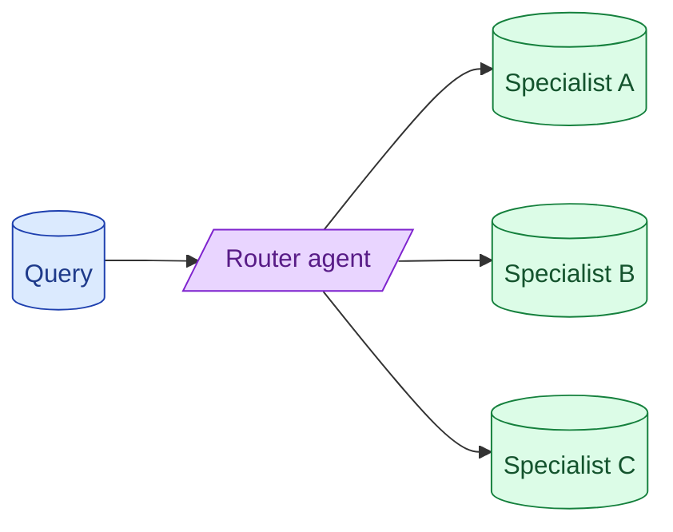

Multi-agent setups are fashionable and usually unnecessary. The pattern that actually pays off is a router: one model classifies the request and dispatches to a specialised handler. Debate, swarm, hierarchical-team designs sound impressive and rarely beat a single well-prompted model.



## Router pattern: the one multi-agent shape that earns its complexity

A router is a tiny first-pass model that reads the user's request and decides which downstream specialist handles it.

```python
def route(user_query: str) -> str:
    resp = small_model.classify(user_query,
        labels=["billing", "support", "code_help", "general"])
    return resp.label
```

Each label maps to a specialist with its own prompt, tools, and context. The billing specialist knows account history. The support specialist knows tickets. They do not need each other's context.

Why this works: specialists can be smaller, focused, and cheaper than one big monolithic agent. The router is a 50-token classification call. The specialist then does the real work with a tighter scope.

This pattern earns its complexity when:

- The product has clearly separable sub-tasks.
- Different sub-tasks need different tools or different context.
- The cost of running every tool on every query is too high.

A single well-prompted agent that has access to all tools can do the same job. It just costs more.

## Why debate and swarm rarely beat a single model

Debate patterns: two agents argue, a judge agent picks the winner. Swarm patterns: many agents propose, a coordinator combines. These look elegant in demos and rarely beat a single chain-of-thought call on real benchmarks.

The reasons:

- Agents pay model costs per turn. A 5-agent debate costs roughly 5x a single call.
- Agents add latency: each step is sequential.
- The quality lift from multi-agent debate is small or zero on most production tasks. Reasoning models (concept 14) deliver similar gains with less complexity.

If you find yourself reaching for debate or swarm, first try: a stronger model, chain-of-thought prompting, self-consistency (multiple reasoning paths, majority vote). These give most of the win at a fraction of the cost.

## Specialist agents with smaller, focused prompts

When you do use multi-agent, the specialists should be smaller in scope, not bigger.

```
Bad: a "billing specialist" with a 2000-token prompt covering every billing scenario.
Good: three focused specialists, each with a 500-token prompt:
  - refund_handler
  - subscription_changer
  - dispute_resolver
```

Each has a narrow job. The prompt is tighter. The tools are fewer. The cost is lower. Quality usually goes up because the specialist is not distracted by adjacent concerns.

The trade-off: more routing decisions. The router needs to be more granular.

## Handoff protocols between agents

When agent A passes work to agent B, the handoff needs structure.

```python
class Handoff(BaseModel):
    target_agent: str
    summary_of_context: str
    intent: str
    required_data: dict
```

Agent A produces a structured handoff. Agent B receives a focused brief, not the full conversation history. Communication is explicit, debuggable, and cheap.

The opposite pattern: agent A dumps its whole context onto agent B. Token cost balloons. Agent B is overloaded. The boundary blurs.

Treat handoffs as API calls between micro-services. Clear contract, focused payload.

## When multi-agent is genuinely the right call

Three cases where multi-agent earns its complexity.

**Truly different specialisations.** A coding assistant that also helps with deployment. The code-writing model and the deploy-orchestrator have different prompts, different tool sets, different review needs. A single agent juggling both is worse than two focused ones.

**Heterogeneous models.** You want a fast cheap model for triage and a slow expensive model for hard problems. Multi-agent is the natural fit.

**Independent parallel work.** Three agents researching three different sub-topics in parallel, results merged. Wall-clock latency drops.

Outside these cases, "let me add another agent" is usually solving the wrong problem.

## Common mistakes

- **Multi-agent because it looks cool.** Single agent with chain-of-thought is the strong baseline.
- **Specialists too big.** A "specialist" with a 3000-token prompt is just an agent in a costume.
- **Handoffs that ship full context.** Cost balloons; communication blurs.
- **Debate patterns in production.** Cost scales with agent count; quality lift is marginal.
- **No measurement.** If you cannot show the multi-agent version beats a single agent on your eval set, it is not earning its place.

## Quick recap

- The router is the multi-agent pattern that pays off: tiny classifier, focused specialists.
- Debate, swarm, hierarchical designs rarely beat a single well-prompted model with chain-of-thought.
- Specialists should be smaller in scope, not bigger.
- Handoffs need structure: a contract, a focused payload, not the whole conversation.
- Multi-agent is right when specialisations are truly different, models are heterogeneous, or work is parallel.

This concept sits in **Stage 4 (Agents and tool use)** of the [AI Engineering Roadmap](/practice/ai-engineering/roadmap/).
