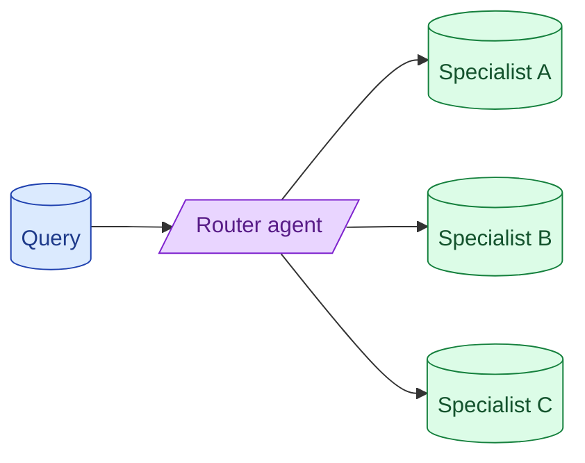

Multi-agent setups are fashionable and usually unnecessary. The pattern that actually pays off is a router: one model classifies the request and dispatches to a specialised handler. Debate, swarm, hierarchical-team designs sound impressive and rarely beat a single well-prompted model.

**What this page will cover.**

- Router pattern: the one multi-agent shape that earns its complexity
- Why debate and swarm rarely beat a single model
- Specialist agents with smaller, focused prompts
- Handoff protocols between agents
- When multi-agent is genuinely the right call

*Page coming soon.*

This concept sits in **Stage 4 (Agents and tool use)** of the [AI Engineering Roadmap](/practice/ai-engineering/roadmap/).
