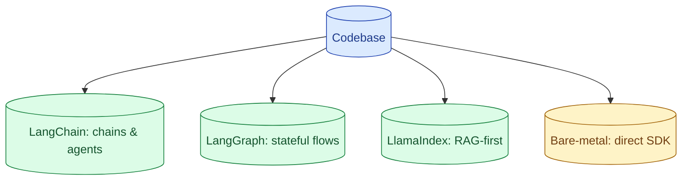

The framework debate is older than the field. LangChain optimises for prototyping. LangGraph optimises for stateful workflows. LlamaIndex optimises for RAG. Bare-metal optimises for understanding what your code does. Most senior engineers ship custom thin wrappers and pick framework pieces sparingly.



## What each framework is actually good at

**LangChain.** A grab-bag of integrations: every model provider, every vector DB, every document loader. The strength is "you can plug anything in." The weakness is that the abstractions are leaky and the code is hard to debug once things go wrong.

Best for: rapid prototyping when you do not care how it works internally.

**LangGraph.** A state-machine framework on top of LangChain. You define nodes (steps) and edges (transitions). It handles checkpointing, branching, retries. Genuinely useful for complex agent workflows.

Best for: real agents with multiple steps, branching logic, human-in-the-loop checkpoints.

**LlamaIndex.** Started as a RAG-first framework. Strong primitives for ingestion, chunking, retrieval. Has expanded but RAG is still the core.

Best for: standing up a non-trivial RAG quickly when you do not want to wire it from scratch.

**Bare-metal (provider SDK + your code).** You call the model directly. You write retries, logging, prompt management, agent loops. 200 lines of code, all yours.

Best for: production systems where you care about debuggability, control, and performance.

## The hidden cost of abstraction layers in LLM code

LLM systems are non-deterministic. When something goes wrong, you need to trace what the model saw, what it returned, why the next step happened. Heavy frameworks add layers between you and that trace.

A LangChain agent that fails: the error includes 12 layers of stack trace through the framework before you see your code. The prompt that was actually sent to the model is hidden behind three abstractions. Debugging means reading framework internals.

The bare-metal version: you wrote the prompt, you sent the call, you see the response. The trace is short and obvious. When it breaks, you know where.

This is not a complaint about bad code. It is the cost of any general-purpose abstraction layer on a system that is inherently messy.

## When LangGraph's state machine is the right tool

LangGraph is the framework most worth its weight. It earns its complexity when:

- Your agent has multiple steps with clear transitions.
- You need checkpointing so a failure can resume from the last step.
- You want human-in-the-loop pauses (the agent stops for review, then continues).
- You want branching logic that is hard to express in straight Python.

A nightly research agent that calls 8 tools, takes 20 minutes, and needs to survive partial failures: LangGraph helps.

A chatbot that calls one tool and replies: LangGraph is overkill.

## When the SDK and 200 lines is the right tool

For most production AI features, a thin custom wrapper beats any framework.

```python
class LLMClient:
    def __init__(self, provider="anthropic"):
        self.provider = provider
        self.client = self._build_client()

    def call(self, prompt: str, system: str = "", model: str = "claude-sonnet") -> str:
        # Single source of truth for retries, logging, prompt caching
        return self._call_with_retry(prompt, system, model)
```

200 lines covers: provider switching, retries with backoff, logging, prompt caching, token counting, basic streaming. After that, your application code is straightforward calls to this wrapper.

The win: you understand every line. Debugging is fast. Adding a new feature is a single file edit.

The cost: more code to write. Less starter-template magic.

For teams that ship and maintain AI features long-term, this trade-off is usually worth it.

## Avoiding the common framework anti-patterns

Three patterns to avoid regardless of which framework you pick.

**Hidden prompts.** The framework constructs the prompt for you. You cannot see it without digging. The model behaves oddly; you cannot tell why. Solution: always log the full prompt sent.

**Abstraction over the LLM call.** The framework wraps the call in 5 levels. Switching providers means digging through framework code. Solution: keep the LLM call thin; switch at the application layer.

**Framework lock-in via custom classes.** Your business logic depends on the framework's `Chain`, `Agent`, or `Document` classes. Switching frameworks means rewriting your code. Solution: build your business logic on plain Python objects; use the framework only at the edges.

## A practical decision rule

For most teams in 2026:

- Prototyping or learning: any framework is fine. Use LangChain for breadth.
- Production RAG: LlamaIndex for fast standup, then refactor pieces to bare-metal as you grow.
- Production agents with complex flow: LangGraph for the state machine, your own code for everything else.
- Production agents with simple flow: bare-metal. 200 lines of yours beats 2000 of theirs.

The senior pattern is to pick parts of frameworks, not whole frameworks. Use LangChain's document loaders; do not use its agent abstractions. Use LangGraph's state checkpointing; do not use its tool routing.

## Common mistakes

- **Adopting a framework wholesale to look modern.** Long-term maintenance pays the price.
- **Bare-metal everything including ingestion.** Sometimes a framework saves real time. Be deliberate.
- **Locking business logic to framework classes.** Switching becomes a rewrite.
- **No logging of the actual prompt.** Debugging is guessing.
- **Believing the demo.** Production is not the demo; trade-offs change.

## Quick recap

- LangChain: broad integrations, weak debuggability, good for prototyping.
- LangGraph: state machine for complex agents, the framework most worth its weight.
- LlamaIndex: RAG-first, useful for quick standup.
- Bare-metal: 200 lines, full control, easy to debug. Wins for production.
- Pick framework pieces, not whole frameworks. Keep your business logic free of framework lock-in.

This concept sits in **Stage 4 (Agents and tool use)** of the [AI Engineering Roadmap](/practice/ai-engineering/roadmap/).
