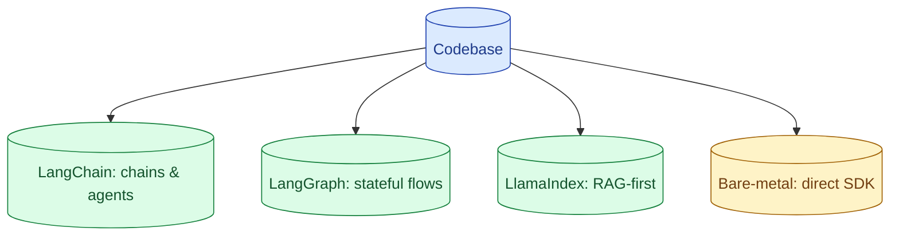

The framework debate is older than the field. LangChain optimises for prototyping. LangGraph optimises for stateful workflows. LlamaIndex optimises for RAG. Bare-metal optimises for understanding what your code does. Most senior engineers ship custom thin wrappers and pick framework pieces sparingly.

**What this page will cover.**

- What each framework is actually good at
- The hidden cost of abstraction layers in LLM code
- When LangGraph's state machine is the right tool
- When the SDK and 200 lines is the right tool
- Avoiding the common framework anti-patterns

*Page coming soon.*

This concept sits in **Stage 4 (Agents and tool use)** of the [AI Engineering Roadmap](/practice/ai-engineering/roadmap/).
