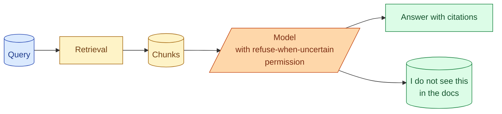

Retrieval will sometimes fail to find the right chunks. The chat model still has to respond. Most models, by default, do their best with what they have, sometimes producing plausible-sounding but wrong answers. The senior RAG pattern is to teach the model that "I do not know" is a valid response and to enforce it through prompting and validation. This concept is about why this matters, how to set it up, and how to track when the system is honestly refusing vs incorrectly refusing.

## The problem in one example

```
Query: "What is the rate limit on the v3 API?"

Retrieved chunks: 
[1] "The v2 API supports 100 requests per minute."
[2] "Authentication uses OAuth 2.0..."
[3] "Rate limits are documented per endpoint..."

Model's default answer: "The rate limit on the v3 API is 100 requests
per minute, as per the rate limiting documentation."
```

The chunks did not contain v3 information. The model saw v2 and rate limits generally, and confidently extrapolated. The answer is wrong and the user has no way to know.

This is the most common failure mode of RAG. The model wants to be helpful. It fills gaps with plausible content.

## The fix is a permission to refuse



Two lines in the prompt:

```
Answer using only the provided context.

If the context does not contain the answer, respond:
"I do not see this information in our documentation."

Do not guess. Do not extrapolate from partial information.
```

The model now has explicit permission to say it does not know. Many models take this option more often than you would expect.

The hallucination rate on these queries drops dramatically. The user sees an honest "we do not have this" instead of a confidently wrong answer.

## The output schema version

Stronger: force the choice into the schema.

```python
class RagResponse(BaseModel):
    found_answer: bool
    answer: str | None
    citations: list[Citation] = []

    @model_validator(mode="after")
    def check_consistency(self):
        if self.found_answer and not self.answer:
            raise ValueError("found_answer is true but no answer provided")
        if self.found_answer and not self.citations:
            raise ValueError("answers must have citations")
        return self
```

The model has to set `found_answer` to true or false. If true, the answer must have content and citations. If false, the application surfaces the "no answer" state.

This makes the refusal a structured signal, not a phrase to detect.

## What happens when the model refuses

The UI should handle refusal gracefully.

```
[empty answer state]

I could not find an answer to your question in our documentation.

Options:
- Try a different search term
- Browse our docs by topic [link]
- Contact support [link]
- Was this question hard to answer? [feedback button]
```

Three things happen here.

The user gets honest feedback instead of a wrong answer.

The user has a path forward (rephrase, browse, contact support).

The product gets feedback on questions the RAG cannot answer. These are signal for improving the corpus or the retrieval.

## Measuring refusal rates

Track two numbers.

**Refusal rate.** What percentage of queries get "I do not know" responses. A reasonable range is 5-15% for a well-built RAG. Higher suggests gaps. Lower suggests the model is too willing to answer.

**False refusal rate.** Among queries where the answer was in fact in the corpus, what percentage got refused. This is the false-negative rate. You measure it on a labelled eval set. Target under 5%.

```python
def measure_refusal(eval_set, retrieval_fn, answer_fn):
    counts = {"answered_correctly": 0, "answered_wrong": 0, "refused_correctly": 0, "refused_wrong": 0}
    for query, ground_truth in eval_set:
        chunks = retrieval_fn(query)
        answer = answer_fn(query, chunks)
        if answer.found_answer:
            if check_correct(answer.text, ground_truth.answer):
                counts["answered_correctly"] += 1
            else:
                counts["answered_wrong"] += 1
        else:
            if ground_truth.answer_in_corpus:
                counts["refused_wrong"] += 1
            else:
                counts["refused_correctly"] += 1
    return counts
```

The four categories tell you where the system is failing. Tuning is targeted.

## When to retrieve more

If the model is refusing too often, the retrieval may be missing chunks. Two responses.

**Increase top-K.** Pass more candidates to the model. The right chunk may have been just outside the K limit.

**Lower the similarity threshold.** Some retrieval systems threshold out chunks below a confidence. Lowering or removing the threshold surfaces more candidates.

**Add reranking.** If you do not have a reranker, add one. It often pulls the right chunk into the top K from a wider candidate pool.

But also: sometimes the right answer is genuinely not in the corpus. Tuning the retrieval to find it will not help; you need to add it to the corpus.

## When the model refuses correctly but the user is unhappy

A user types a vague question. The retrieval returns nothing relevant. The model refuses. The user is frustrated.

This is a user-experience problem more than a RAG problem. Patterns that help:

**Suggest follow-up questions.** "Could you tell me which version of the API you mean?" Disambiguates without forcing a guess.

**Show related but not exact results.** "I do not see your exact question, but here are some related topics."

**Offer a fallback.** "I can connect you to support if this is urgent."

These are mostly UI choices. The underlying refusal is correct.

## A two-pass refusal check

For high-stakes uses, run a second model pass to verify the answer is actually supported.

```python
def verified_answer(query: str, chunks: list[Chunk]) -> Answer | None:
    answer = primary_model(query, chunks)
    if not answer.found_answer:
        return None
    is_supported = verifier_model(
        question=query,
        answer=answer.text,
        context=chunks
    )
    if not is_supported:
        return None  # The primary model produced an unsupported answer; refuse
    return answer
```

The verifier is a cheap model with a focused job: "is this answer fully supported by this context, yes or no." It catches cases where the primary model produced a confident-but-unsupported answer.

This adds a model call (cost and latency). Worth it for medical, legal, financial, or any domain where a wrong answer is expensive.

## "Confidence" is not enough

A common pattern: model outputs a confidence score, the system thresholds. If confidence < 0.5, refuse.

This often does not work. Model self-confidence is unreliable. The model can be 0.9 confident about a wrong answer or 0.5 confident about a right one.

Better to rely on:

- Explicit structured choice (found_answer: true/false).
- Citation existence (no citations = no answer).
- Verifier model agreement.

The model's claimed confidence is the weakest signal of these.

## Common mistakes

- **No "I do not know" permission.** Model fills gaps with plausible-but-wrong content.
- **Treating refusals as failures.** Honest refusals are correct behavior; track and improve.
- **Self-confidence thresholding alone.** Unreliable.
- **No UI path for refusal.** User sees a dead-end without alternatives.
- **Tuning retrieval to never refuse.** Lowers refusal rate but raises wrong-answer rate.

## Quick recap

- The model needs explicit permission to refuse when the context is insufficient.
- Two lines in the prompt or a structured `found_answer` field; either works.
- Refusal is a feature: it protects users from wrong answers and signals gaps in the corpus.
- Track refusal rate and false-refusal rate as separate metrics.
- Verifier pass on high-stakes outputs catches confident-but-unsupported answers.
- Self-confidence is the weakest signal; prefer structured choice and citation requirements.

This concept sits in **Stage 3 (RAG and retrieval)** of the [AI Engineering Roadmap](/practice/ai-engineering/roadmap/).
