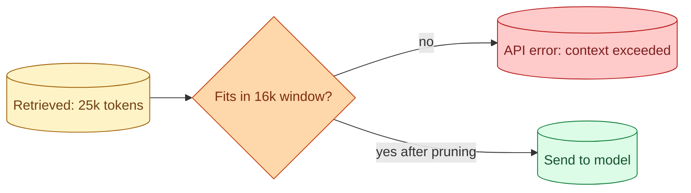

The retrieval is great. The reranker is precise. The top 10 chunks total 25,000 tokens. The chat model has a 16,000-token context window. Plus you need room for the system prompt and the output. You have a context overflow problem. This is a daily issue in RAG. The fix is not "switch to a model with a bigger window." It is to manage the context you have. This concept is about the patterns: drop, summarise, compress, route.

## Why this matters



Overflow is not a quiet failure. The API returns an error. Your feature breaks for that user, that query, that moment. The user sees a generic error message and bounces.

Even when you fit, quality drops as the context grows. Models pay less attention to the middle of long inputs (concept 1). A 100k-token prompt is technically allowed by Claude or Gemini but rarely better than a focused 10k-token prompt.

The pattern is the same in both cases: trim before sending.

## Step 1: budget the window

Calculate what you have to spend.

```
Model context window:        128,000 tokens   (e.g., Claude Sonnet)
- System prompt:             - 800
- Conversation history:      - 2,000 (recent turns)
- Output budget:             - 2,000 (set max_tokens to 2000)
Available for retrieved context: 123,200 tokens
```

Most cases are simpler than this with smaller windows and smaller margins. The point is to know your number.

If retrieved chunks fit, send them all. If not, you trim.

## Step 2: drop in reverse rank order

The simplest trim: keep the top-ranked chunks until you run out of budget.

```python
def fit_to_budget(chunks: list[Chunk], budget: int) -> list[Chunk]:
    kept = []
    used = 0
    for chunk in chunks:  # already ranked
        if used + chunk.token_count <= budget:
            kept.append(chunk)
            used += chunk.token_count
        else:
            break
    return kept
```

Take chunks in order until the next one would push over the limit. Stop.

This works when retrieval ranking is good and you have a reranker giving meaningful order. The top chunks are the most useful; dropping the bottom ones is acceptable.

## Step 3: chunk-level summarisation

When the top chunks themselves are too long, summarise them.

```python
def summarise_chunk(chunk: Chunk, target_tokens: int) -> str:
    resp = client.messages.create(
        model="claude-3-7-haiku",
        max_tokens=target_tokens,
        messages=[{
            "role": "user",
            "content": f"Summarise the following text in {target_tokens} tokens or fewer, preserving key facts:\n\n{chunk.text}"
        }]
    )
    return resp.content[0].text
```

A cheap model compresses each chunk. The summarised version goes to the main chat model.

Cost: one extra cheap-model call per chunk. Quality: usually preserves enough to answer most questions; misses fine detail.

For tasks where every word matters (legal contract details, precise specifications), summarisation is the wrong move; drop instead.

## Step 4: prompt compression

A more advanced pattern: compress the prompt itself, not just the chunks.

```python
# Library example: LLMLingua
from llmlingua import PromptCompressor

compressor = PromptCompressor()
compressed = compressor.compress_prompt(
    long_context,
    target_token=10000
)
```

Specialised models analyse the prompt and remove low-information tokens (filler words, redundant clauses). The semantic content stays; the verbose phrasing is cut.

Can compress 50-70% with minimal quality loss on typical RAG prompts.

The cost: one extra model pass. The benefit: the chat model sees compressed input, lower cost and latency.

This is a Stage 6 production pattern. For simpler use cases, just drop chunks.

## Step 5: pick a different model

If you keep overflowing, the underlying issue might be model choice.

Models with larger context windows (Claude with 200k+, Gemini with 1M+) accept more chunks without trimming. The trade-off: bigger windows often mean higher latency and cost per call.

For RAG over very long documents (legal contracts, full books), bigger windows can be the right answer. For most knowledge-base RAG, 16k-32k models with disciplined trimming work fine and are cheaper.

## When to drop vs summarise

A quick decision rule.

**Drop** when the lowest-ranked chunks are not strongly relevant. The reranker did its job; the bottom 2 of 10 chunks are nice-to-have, not essential.

**Summarise** when many chunks are individually long. Each chunk has useful content but consumes too much space verbatim.

**Compress** when the system prompt or framing is verbose. Repeated boilerplate compresses well.

In practice, drop is the most common move. Summarisation and compression earn their place on large contexts (long documents) and high-volume traffic (where reduced tokens add up to real savings).

## Conversation history vs retrieval

In multi-turn RAG, the context budget has to be split between conversation history and retrieved chunks.

```
Total budget: 16,000 tokens
- System prompt:        500
- Conversation history: ???
- Retrieved chunks:     ???
- Output reserve:       2,000
Available for context: 13,500 tokens, split between history and retrieval
```

Two patterns.

**Fixed split.** Always reserve, say, 4,000 tokens for history and 9,500 for retrieval. Simple. Sometimes wasteful (a short conversation does not need 4,000 tokens).

**Dynamic split.** Use what history needs (up to a cap), give the rest to retrieval. Adapts to the conversation; needs slightly more code.

Most production RAG uses dynamic split with a cap on history (say, 6,000 tokens). Past the cap, summarise old turns (see concept 17).

## Tracking overflow incidents

Log every time you trim or refuse a chunk for budget reasons.

```python
log.info("context_management", extra={
    "retrieved": len(chunks),
    "kept": len(kept_chunks),
    "dropped": len(chunks) - len(kept_chunks),
    "budget_used": used_tokens,
    "budget_total": budget
})
```

After a week, queries to look at:

- Average drop rate (chunks retrieved minus chunks kept).
- Maximum chunks retrieved.
- Queries where >50% of retrieved chunks were dropped (probably bad retrieval ranking or oversized chunks).

Patterns emerge. Some queries are routinely too big; specific chunks are too long. Fix the underlying issue (smaller chunks, better ranking) instead of just trimming harder.

## The "go to a long-context model" trap

When overflow becomes regular, the temptation is to switch to a 1M-token-window model.

That solves the symptom. The disease is that retrieval is dumping too much. A 1M-token prompt is slower, more expensive, and the model attention spread is worse.

Diagnose first. Better chunking, reranking, or fewer chunks usually fixes the issue without changing model.

Use long-context models when the task genuinely needs long context (whole-document analysis, long-form summarisation). For typical RAG, smaller windows with disciplined trimming win.

## A complete pipeline

```python
def build_rag_context(query: str, conv_history: list, system_prompt: str, budget: int) -> str:
    # 1. Retrieve generously
    candidates = hybrid_search(query, top_k=20)
    ranked = rerank(query, candidates, top_k=10)

    # 2. Calculate space available for chunks
    sys_tokens = count(system_prompt)
    hist_tokens = count(conv_history)
    output_reserve = 2000
    chunk_budget = budget - sys_tokens - hist_tokens - output_reserve

    # 3. Fit chunks to budget
    chunks_to_send = fit_to_budget(ranked, chunk_budget)

    # 4. If still over, summarise the weakest chunks
    if total_tokens(chunks_to_send) > chunk_budget:
        chunks_to_send = summarise_weakest(chunks_to_send, target=chunk_budget)

    return format_prompt(system_prompt, conv_history, chunks_to_send, query)
```

This is the production-ready pattern. Generous retrieval, narrow filter through ranking and budget. Cheap pre-call summarisation only when budget forces it.

## Common mistakes

- **No budget calculation.** First overflow is in production at 2 AM.
- **Fixed K regardless of chunk size.** A K=10 with long chunks blows the budget; a K=10 with short chunks wastes capacity.
- **Switching to long-context model as the only fix.** Often the underlying issue is over-retrieval.
- **No logging of trim events.** You cannot tell whether trim is rare or common.
- **Summarising every chunk by default.** Adds cost and quality loss on chunks that fit fine.

## Quick recap

- Context overflow is an API error. Manage the window before sending.
- Step 1: budget. Know your numbers (window, system, history, output reserve).
- Step 2: drop in reverse rank order. Simplest and usually enough.
- Step 3: summarise long chunks if dropping cuts too much information.
- Step 4: prompt compression libraries for large-scale production.
- Long-context models help but often mask the real problem; diagnose first.
- Track trim events. Patterns tell you whether to fix retrieval, chunking, or model choice.

This concept sits in **Stage 3 (RAG and retrieval)** of the [AI Engineering Roadmap](/practice/ai-engineering/roadmap/).
