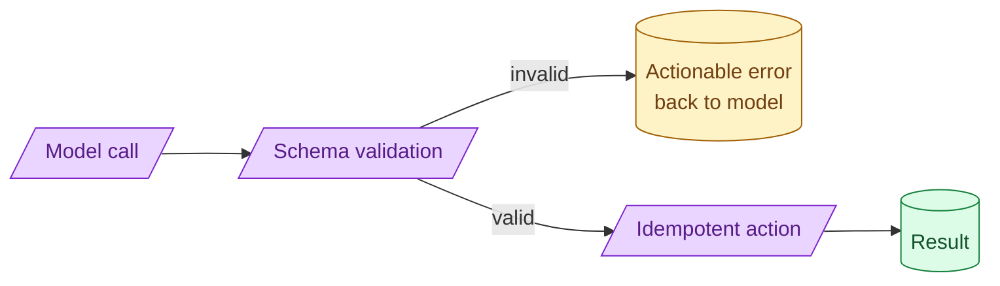

Tool design is API design with a model as the caller. The model retries, gets the schema wrong, and reads your error messages. Tools should be idempotent, validate their inputs aggressively, and return errors that tell the model how to fix the call. Most tool failures are tool-design failures.

**What this page will cover.**

- Why every tool needs an idempotency key
- Input validation messages that the model can act on
- Naming and description: what the model is reading
- Side-effecting tools and the dry-run pattern
- Per-tool authorisation and least-privilege

*Page coming soon.*

This concept sits in **Stage 4 (Agents and tool use)** of the [AI Engineering Roadmap](/practice/ai-engineering/roadmap/).
