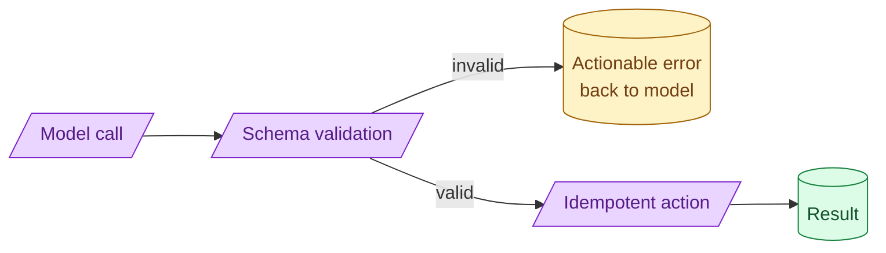

Tool design is API design with a model as the caller. The model retries, gets the schema wrong, and reads your error messages. Tools should be idempotent, validate their inputs aggressively, and return errors that tell the model how to fix the call. Most tool failures are tool-design failures.



## Why every tool needs an idempotency key

Models retry. Networks fail. Agents loop. A tool can be called more than once with the same input.

For pure-read tools (search, lookup), this is harmless. For side-effecting tools (send email, charge card, create record), a double-call is a real problem.

The fix is an idempotency key.

```python
def send_email(to: str, subject: str, body: str, idempotency_key: str):
    if already_sent(idempotency_key):
        return previous_result(idempotency_key)
    result = actually_send(to, subject, body)
    record_sent(idempotency_key, result)
    return result
```

The model includes a stable key derived from the action. A retry of the same call returns the same result without sending the email twice.

For tools where idempotency is inherent (pure SQL select), you do not need the key. For everything else, you do.

## Input validation messages that the model can act on

The model writes tool calls. Sometimes the arguments are wrong. The tool should reject them with a message the model can read and correct.

Bad error:

```
ValidationError: invalid input
```

The model cannot fix this. It does not know what was wrong.

Good error:

```
{
  "error": "validation_failed",
  "message": "The 'amount' field must be a positive number. Got: -50.",
  "field": "amount",
  "expected": "positive number"
}
```

The model reads "amount must be positive, got -50" and produces a corrected call. The agent loop recovers without human intervention.

Treat your error messages as instructions to the model. Specific, actionable, blame-free.

## Naming and description: what the model is reading

The model picks tools based on their names and descriptions. Sloppy naming leads to wrong tool selection.

```python
# Bad
@tool
def query(q: str) -> str: ...

# Good
@tool
def search_customer_database(query: str) -> list[Customer]:
    """Search the customer database by name, email, or ID.
    Returns matching customers with their account details."""
```

The name describes what the tool does. The docstring explains when to use it. The return type is structured.

Models follow these signals strongly. A well-named tool with a clear description is picked correctly almost all the time. An ambiguously named tool gets called for the wrong scenarios.

For multi-tool agents, the difference in description quality often dominates everything else.

## Side-effecting tools and the dry-run pattern

For high-stakes tools (deletes, charges, irreversible changes), the safe default is a two-step pattern.

```python
@tool
def preview_delete_records(filter: dict) -> DeletePreview:
    """Preview what would be deleted without actually deleting."""
    return DeletePreview(count=count_matching(filter), sample=sample_matching(filter))

@tool
def confirm_delete_records(filter: dict, confirmation_token: str) -> DeleteResult:
    """Actually delete. Requires a confirmation_token from preview_delete_records."""
    if not is_valid_token(confirmation_token, filter):
        return {"error": "invalid_token"}
    return execute_delete(filter)
```

The agent calls preview first, reviews what would happen, then confirms. A human can be inserted between preview and confirm for review.

This pattern prevents "the model deleted all customers because the filter was malformed" outages.

## Per-tool authorisation and least-privilege

Not every agent needs every tool.

A research agent reading data does not need the "delete records" tool. A customer-facing agent does not need the "modify any user" tool. A developer-facing agent does not need the "send marketing email" tool.

Authorisation is per-agent (or per-session) and per-tool. The agent's tool list at runtime contains only what it needs for this task.

```python
def build_agent(role: str) -> Agent:
    base_tools = [search_docs, read_user_profile]
    if role == "support":
        tools = base_tools + [send_email, escalate_ticket]
    elif role == "admin":
        tools = base_tools + [modify_user, refund_charge, send_email]
    else:
        tools = base_tools
    return Agent(tools=tools)
```

Defence in depth. Even if the agent goes off-script, it cannot do what its role does not allow.

## A safe tool template

```python
class SendEmail(BaseModel):
    to: EmailStr
    subject: str = Field(min_length=1, max_length=200)
    body: str = Field(min_length=1, max_length=10000)
    idempotency_key: str

def send_email(call: SendEmail) -> EmailResult:
    # Already validated by Pydantic. Schema mismatch = clear error to model.

    if has_been_sent(call.idempotency_key):
        return previous_result(call.idempotency_key)

    if call.to in blocked_recipients():
        return {"error": "recipient_blocked",
                "message": f"{call.to} is on the blocked list. Pick a different recipient."}

    try:
        result = email_service.send(call.to, call.subject, call.body)
        record_send(call.idempotency_key, result)
        return result
    except RateLimitError:
        return {"error": "rate_limited",
                "message": "Email service rate limited. Retry after 60 seconds."}
```

This tool is idempotent (key), validates strictly (Pydantic), returns actionable errors (each error has a `message` the model can act on), and respects business rules (blocked list).

The pattern is small and consistent. Apply it everywhere.

## Common mistakes

- **No idempotency key on side-effecting tools.** A retry double-acts.
- **Generic error messages.** "validation failed" tells the model nothing.
- **Vague tool names and descriptions.** Wrong tool selected.
- **No dry-run for destructive operations.** One bad call deletes things.
- **All tools for all agents.** No least-privilege, blast radius is the whole system.

## Quick recap

- Tools are APIs called by an unpredictable model. Idempotency is the safety net.
- Validate aggressively. Return errors the model can read and correct.
- Names and descriptions are how the model chooses. Make them clear.
- For destructive operations, separate preview and confirm. Insert humans where needed.
- Per-agent tool lists. Least-privilege limits the blast radius.

This concept sits in **Stage 4 (Agents and tool use)** of the [AI Engineering Roadmap](/practice/ai-engineering/roadmap/).
