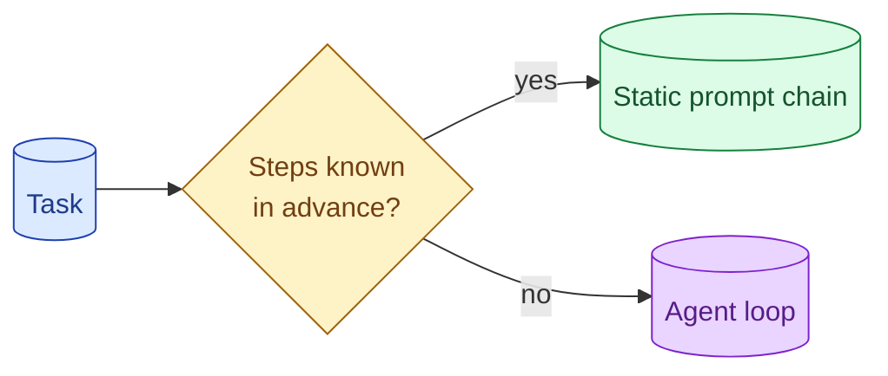

Agents are the most over-applied pattern in AI engineering. A static prompt chain (do A, then B, then C) is cheaper, faster, more debuggable, and produces better results for any task with a known structure. Reach for an agent only when the steps genuinely depend on the previous step's outcome.



## The deterministic-flow test: if steps are known, skip the agent

Before reaching for an agent, ask: can I list the steps in advance?

"First extract the line items. Then validate the totals. Then categorise each line." Three steps, known in advance. This is a chain, not an agent.

"Answer the user's question; you may need to search the web, run code, or ask a follow-up." Unknown structure. This is an agent.

The test is whether your chain would always have the same shape regardless of input. If yes, it is a chain. The "agent" choice adds complexity for no benefit.

## Pipeline vs agent vs router: picking the right shape

Three shapes that cover most production AI work.

**Pipeline.** Fixed sequence of steps. Each step's input is the previous step's output. Deterministic, debuggable, cheap.

```python
def process_invoice(text: str) -> dict:
    extracted = extract_fields(text)
    validated = validate_totals(extracted)
    categorised = categorise_lines(validated)
    return categorised
```

**Router.** A small classification step that picks the right downstream handler. Each handler is itself a pipeline or a small agent.

```python
def handle_request(query: str):
    category = classify(query)
    handlers = {"billing": handle_billing, "tech": handle_tech, "general": handle_general}
    return handlers[category](query)
```

**Agent.** Loop of "reason → act → observe" with no predetermined step count or shape. The model decides what tools to call and in what order.

```python
def research_assistant(query: str):
    return agent_loop(query, tools=[web_search, calculator, fetch_url])
```

Most tasks fit pipeline or router. Agents are the last resort.

## Cost and debuggability differences

The same task, three shapes:

```
Pipeline:        3 LLM calls, predictable cost, 5 second runtime
Router+pipeline: 4 LLM calls (router + 3 handler steps), 6 sec runtime
Agent:           10-20 LLM calls (loop), unpredictable cost, 30+ sec runtime
```

Agents cost more because they loop. They cost unpredictably because the loop count varies. They are harder to debug because the trace is a tree, not a line.

For tasks where any shape works, the agent is the most expensive choice. Pick deliberately.

## Examples where teams reached for agents and regretted it

**Extracting fields from a document.** Pipeline beats agent: known steps, known output shape. The agent version costs 5x as much and is wrong more often because of looping.

**Classifying support tickets.** Router beats agent: pick a category, dispatch to a handler. The agent version sometimes calls 4 tools when it should call 1.

**Generating an SQL query from natural language.** Pipeline beats agent: parse intent, identify tables, write SQL, validate. The agent version sometimes invents tables that do not exist.

**Customer-facing chatbot for a known domain.** Router + handlers beats single big agent: each handler is focused and predictable.

In every case, the team initially built an agent because "the user could ask anything." Then measured: most queries fall into a small number of patterns. A router with handlers ships better quality at a fraction of the cost.

## When the agent is genuinely the right answer

Three cases.

**Open-ended research.** "Find me the latest information on X, gather sources, summarise the consensus." The agent decides what to search next based on what it finds.

**Multi-step coding tasks.** "Write, test, fix, retry." Each step depends on the previous step's outcome (does the test pass?).

**Customer interactions with genuine variability.** The kind of help-desk problem where the agent needs to ask 3 clarifying questions, look up 2 records, and decide whether to escalate.

For these, the agent earns its complexity. The steps cannot be planned in advance because they depend on what each step finds.

## How to migrate from agent to pipeline

If you suspect your agent should be a pipeline, the migration is straightforward.

1. Log a sample of agent runs in production.
2. Pattern-match the actual steps the agent takes.
3. If 80% of runs follow the same shape, that shape is your pipeline.
4. Build the pipeline. A/B test against the agent on the same eval set.
5. If quality matches and cost is lower, switch.

This works because most "agent" tasks turn out to have predictable structure. The agent was the wrong tool; the team did not realise until they looked at the data.

## The decision tree, in one sentence

If you can write down the steps in advance, build a pipeline. If you can classify into a few cases first, build a router with pipelines. If you cannot do either, then maybe an agent. In doubt, start with a pipeline; agents are easy to add later if you need them.

## Common mistakes

- **Defaulting to agent.** Pipeline first; agent if pipeline cannot work.
- **One giant agent for everything.** Router with focused handlers beats it almost always.
- **Agent for a deterministic flow.** Pays the loop tax for no benefit.
- **Not measuring agent vs pipeline.** You miss the chance to ship better and cheaper.
- **Choosing by the demo.** Agents look impressive in demos and underperform in production.

## Quick recap

- Pipeline: known steps, fixed shape. Cheapest and most predictable.
- Router: classify, dispatch. The right answer for many product-facing tasks.
- Agent: open-ended exploration where steps depend on what was found.
- The deterministic-flow test: if you can write the steps down, skip the agent.
- Migrate from agent to pipeline when production runs show predictable patterns.

This concept sits in **Stage 4 (Agents and tool use)** of the [AI Engineering Roadmap](/practice/ai-engineering/roadmap/).
