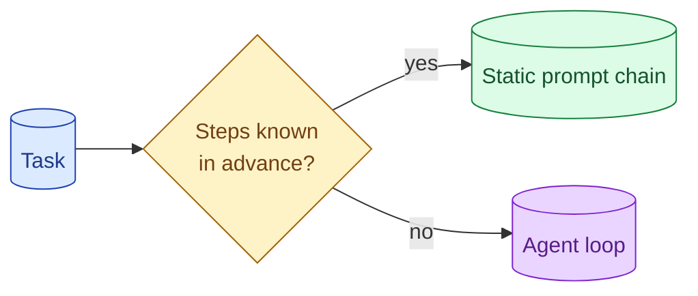

Agents are the most over-applied pattern in AI engineering. A static prompt chain (do A, then B, then C) is cheaper, faster, more debuggable, and produces better results for any task with a known structure. Reach for an agent only when the steps genuinely depend on the previous step's outcome.

**What this page will cover.**

- The deterministic-flow test: if steps are known, skip the agent
- Pipeline vs agent vs router: picking the right shape
- Cost and debuggability differences
- Examples where teams reached for agents and regretted it
- When the agent is genuinely the right answer

*Page coming soon.*

This concept sits in **Stage 4 (Agents and tool use)** of the [AI Engineering Roadmap](/practice/ai-engineering/roadmap/).
