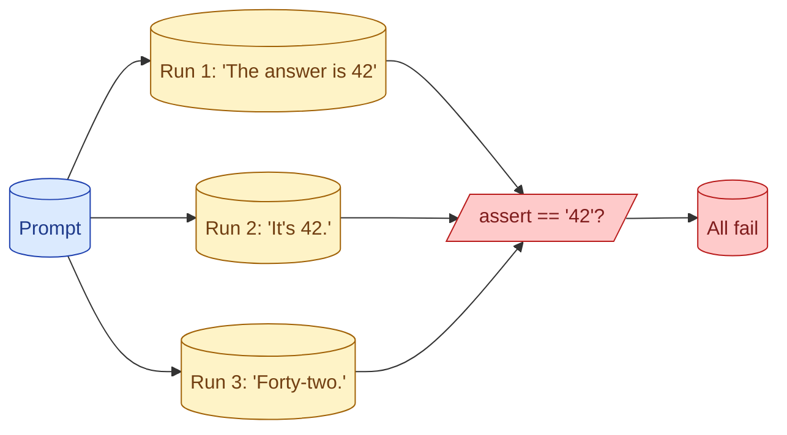

A function returning '42' is easy to test. A model returning 'The answer is 42' or 'forty-two' or 'After some thought, 42' is not. Exact-match assertions break. The whole field of LLM eval exists because the output is text and the test has to be tolerant without being meaningless.

## Why exact-match tests do not work for LLM output

A traditional unit test asserts equality. Same input, same output, every time. Pass or fail is unambiguous.

A model's output varies. Same input on Tuesday gives "The capital is Paris." Same input on Wednesday gives "Paris." Same prompt next month, after a quiet model revision, gives "Paris, France." All three are correct. Exact match breaks on all three.

The traditional test fails the model when it is right. False negative. The fix is not to chase the model with more matchers. The fix is to evaluate differently.

## The three eval families: rule-based, judge-based, reference-free

**Rule-based.** Deterministic checks: does the output parse as JSON, contain a required keyword, match a regex, fall in a length range. Fast, cheap, reproducible. Catches structural failures. Misses content failures. See concept 41.

**Judge-based (LLM-as-judge).** A second model scores the output against a rubric. "Is the answer correct?" "Is it helpful?" "Does it follow the guidelines?" Catches content failures rules cannot describe. Costs a model call per eval. See concept 42.

**Reference-free.** Checks that need only the output and the input. "Did the model refuse when it should have?" "Is the answer grounded in the retrieved context?" Useful when you do not have labelled answers. See concept 43.

Most production eval suites use all three. Rule-based for structure, judge for content, reference-free for safety properties.

## Why temperature=0 does not actually solve this

The first reflex is "set temperature to 0 and the output becomes deterministic." It does not, quite.

Providers ship small sources of randomness even at temperature 0. Batching, GPU non-determinism, silent model revisions (yesterday's `claude-3-sonnet` is not exactly today's). Same prompt, same model, same parameters, slightly different output 5% of the time.

Even if the model were perfectly deterministic, the same prompt could still produce semantically equivalent but textually different outputs across model versions. Pinning to a snapshot helps but does not eliminate the issue.

The senior framing: stop trying to make LLM tests deterministic. Make the eval method tolerant to variation. That is the whole point of LLM eval as a field.

## How to think about flakiness as signal, not noise

A traditional flaky test is a bug. The test should be made deterministic.

A "flaky" LLM eval is signal. If 7 of 10 runs pass and 3 fail, you have learned that on 30% of runs the model fails this case. That is a real quality measurement, not noise to suppress.

Run each eval multiple times in CI. Report pass rate, not pass/fail. A test that goes from "10/10 passing" to "6/10 passing" after a prompt change is a real regression.

This is closer to statistical testing than to traditional unit testing. The mindset shift is part of doing AI engineering well.

## What a 'passing test' even means in an LLM context

The traditional definition does not fit. Pick a new one.

For rule-based evals: pass = the rule held. Same as a unit test.

For judge-based evals: pass = the judge scored above the threshold. The threshold is part of your contract.

For statistical evals: pass = the pass rate is above the target across N runs. "85% pass rate" is a meaningful target; "100% pass on a single run" is not, except on rule-based checks.

Document what "passing" means for each eval. Otherwise, "this test failed" is ambiguous, and the team learns to ignore failures.

## Common mistakes

- **`assert output == "expected"`.** Works for one example, breaks on the next model revision.
- **Setting temperature to 0 and assuming determinism.** Reduces variance, does not eliminate it.
- **Running each eval once.** Misses variance entirely.
- **Same threshold for every eval.** Different evals have different acceptable pass rates.
- **Treating flakiness as noise.** It is data.

## Quick recap

- LLM output varies by run, by model version, by prompt phrasing.
- Three eval families: rule-based, judge-based, reference-free. Use all three.
- temperature=0 reduces variance but does not eliminate it. Plan for it.
- Run each eval N times; report pass rate, not pass/fail.
- Define "passing" per eval. Document it. Otherwise failures get ignored.

This concept sits in **Stage 5 (Evaluation)** of the [AI Engineering Roadmap](/practice/ai-engineering/roadmap/).
