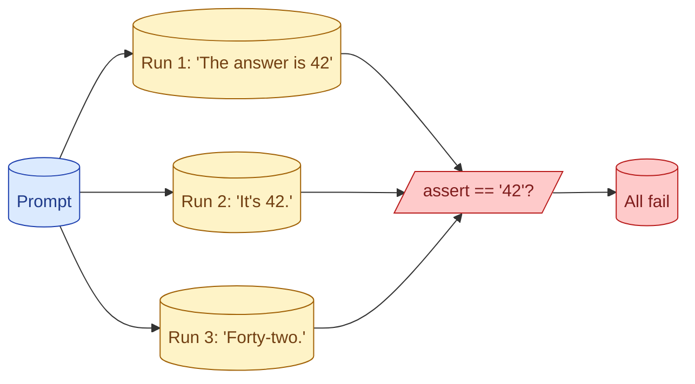

A function returning '42' is easy to test. A model returning 'The answer is 42' or 'forty-two' or 'After some thought, 42' is not. Exact-match assertions break. The whole field of LLM eval exists because the output is text and the test has to be tolerant without being meaningless.

**What this page will cover.**

- Why exact-match tests do not work for LLM output
- The three eval families: rule-based, judge-based, reference-free
- Why `temperature=0` does not actually solve this
- How to think about flakiness as signal, not noise
- What a 'passing test' even means in an LLM context

*Page coming soon.*

This concept sits in **Stage 5 (Evaluation)** of the [AI Engineering Roadmap](/practice/ai-engineering/roadmap/).
