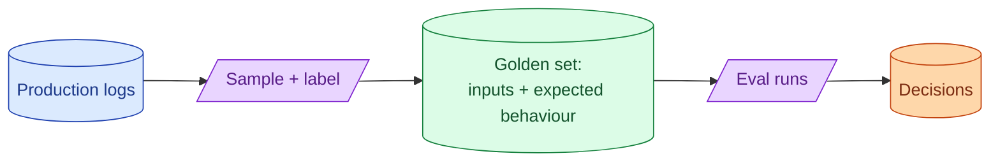

A golden dataset is a curated set of inputs and expected behaviour. It is the closest thing an AI team has to a test suite. Building one is slow, boring, and one of the most useful things a senior can spend a week on. Without it, every prompt change is a vibe check.



## What belongs in a golden set: easy cases, hard cases, regressions

A golden set is not a random sample. It is a curated mix that covers what matters.

**Easy cases.** Smoke tests. Common queries that should always work. "What is your refund policy?" If the model fails these, something is broken at the basic level.

**Hard cases.** Edge cases, ambiguous queries, niche scenarios. "What is the refund policy for educational discount holders who downgraded mid-cycle?" These distinguish a good model from a great one.

**Regressions.** Every bug that ever shipped becomes a permanent golden entry. The query that broke last quarter goes in the set, with its correct answer. Future changes cannot silently re-break it.

A good ratio: 60% common cases, 30% edge cases, 10% regressions. Drift toward edge cases over time as the team learns the failure modes.

## Starting small: 30 examples is enough to begin

The biggest mistake teams make is waiting until they have 500 examples to start. A 30-example golden set is enough to begin.

```python
golden_set_v1 = [
    {"input": "How do I reset my password?", "expected_topic": "auth", "must_contain": ["reset link", "email"]},
    {"input": "Cancel my subscription", "expected_topic": "billing", "should_not_refuse": True},
    # ... 28 more
]
```

30 examples cover a lot of failure modes. They take an afternoon to build. They catch most prompt regressions. They are the foundation you grow on.

The team that starts with 30 and grows weekly ends up with a 500-example set in a year. The team that "waits until we have time for 500" never starts.

## Curating from production logs without leaking PII

Production logs are the best source of real queries. They also contain PII that must not end up in your eval set.

Two patterns to handle this.

**Sample, then strip.** Sample 100 logs. Run a PII scrubber (regex for emails, names, IDs; or an LLM-based scrub). Hand-review each for residual leaks. Keep what is clean.

**Synthesise from logs.** For each real log, generate a synthetic variant that captures the structure without the data. "User asked about a refund for invoice 47823" becomes "User asks about a refund for a specific invoice." Lose specificity, gain shareability.

For internal use only, the first pattern is faster. For shared sets or open source, the second is safer.

## Versioning the golden set as code

A golden set is code. Store it in git. Version it. Review changes via PR.

```
evals/
  classify_ticket.jsonl
  extract_invoice.jsonl
  rag_qa.jsonl
```

Each file is a JSONL of examples. Each line is one test case. The format stays stable; the contents grow.

When the eval set changes, the diff goes through review. New cases are justified ("this query failed in prod on June 4"). Removed cases are justified ("this query no longer represents real traffic").

Treat the golden set with the same seriousness as your test suite. Because that is what it is.

## When to expand and when to prune

The set grows naturally as you learn new failure modes. The set should also be pruned as priorities shift.

**Expand when.** An incident occurs in production (add the failing case). A new feature ships (add cases for the new behaviour). An eval gap is discovered (add cases for what was missed).

**Prune when.** Cases never fail across many runs (they are not stressing the system). Cases test deprecated behaviour. Cases are duplicates that drift over time.

A good cadence: add as needed; prune quarterly. After a year, the set is sized to your priorities, not to historical inertia.

## Common mistakes

- **Waiting for "enough" examples to start.** 30 is enough. Start now.
- **Random sampling from logs.** You miss the rare important cases and double up on common ones.
- **No regression cases.** Bugs that shipped before will ship again.
- **PII in the eval set.** Privacy bug; share-blocker.
- **Eval set in a wiki or spreadsheet.** Drifts. Use git.
- **Set never gets pruned.** Becomes bloated and slow.

## Quick recap

- A golden set is a curated mix of easy cases, hard cases, and regressions.
- Start small. 30 examples is enough. Grow weekly.
- Curate from production logs after stripping PII.
- Store the set in git, version it, review changes by PR.
- Expand when new failure modes appear; prune quarterly.

This concept sits in **Stage 5 (Evaluation)** of the [AI Engineering Roadmap](/practice/ai-engineering/roadmap/).
