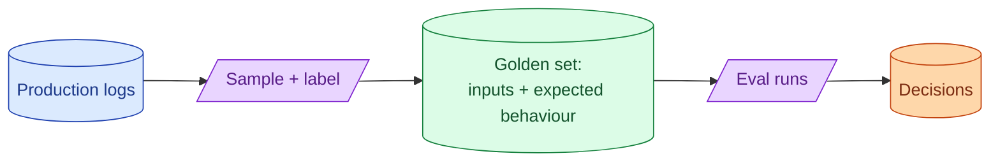

A golden dataset is a curated set of inputs and expected behaviour. It is the closest thing an AI team has to a test suite. Building one is slow, boring, and one of the most useful things a senior can spend a week on. Without it, every prompt change is a vibe check.

**What this page will cover.**

- What belongs in a golden set: easy cases, hard cases, regressions
- Starting small: 30 examples is enough to begin
- Curating from production logs without leaking PII
- Versioning the golden set as code
- When to expand and when to prune

*Page coming soon.*

This concept sits in **Stage 5 (Evaluation)** of the [AI Engineering Roadmap](/practice/ai-engineering/roadmap/).
