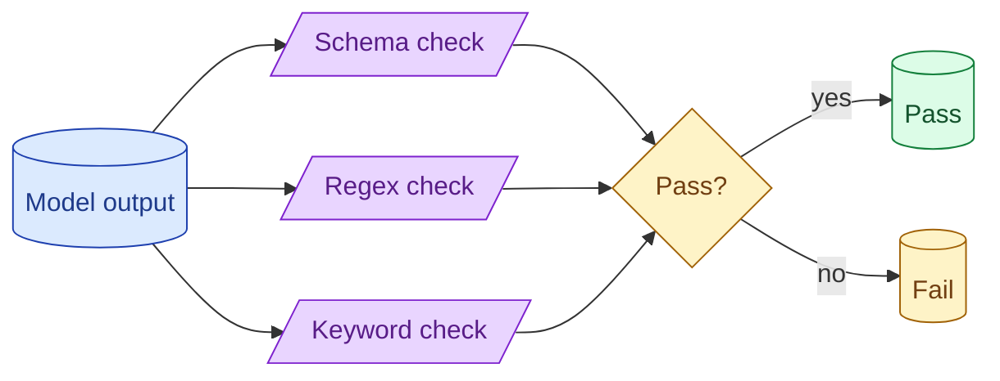

Before reaching for an LLM judge, exhaust the cheap deterministic checks. Does the output parse as JSON? Does it contain a required keyword? Does it match a regex? Rule-based evals are fast, free, reproducible, and catch most regressions. Save the judge for what rules cannot do.

**What this page will cover.**

- When rule-based evals are enough
- Common rules: JSON validity, schema, keyword, length, format
- Composing rules into a single pass/fail per example
- Why rule-based evals belong in CI
- Where they break down and the judge takes over

*Page coming soon.*

This concept sits in **Stage 5 (Evaluation)** of the [AI Engineering Roadmap](/practice/ai-engineering/roadmap/).
