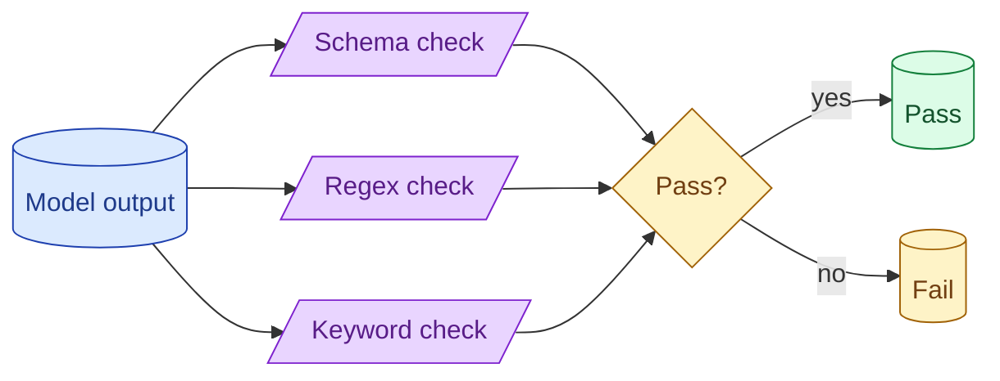

Before reaching for an LLM judge, exhaust the cheap deterministic checks. Does the output parse as JSON? Does it contain a required keyword? Does it match a regex? Rule-based evals are fast, free, reproducible, and catch most regressions. Save the judge for what rules cannot do.



## When rule-based evals are enough

Rule-based evals are enough when "correct" can be expressed as a deterministic check.

**Classification.** The output should be one of N labels. Easy to verify.

**Extraction.** The output should match a schema. Easy to verify.

**Structured output.** JSON validity, required fields, value ranges. Easy to verify.

**Format requirements.** Markdown headings, citation markers, word counts. Easy to verify.

Rules are enough for the bulk of structured AI tasks. The vast majority of "is this output well-shaped?" questions are rule answerable.

What rules cannot answer: "is this paragraph well-written?", "is this code correct in spirit?", "did the model understand the user's intent?" Those need a judge.

## Common rules: JSON validity, schema, keyword, length, format

A starter library of rules.

**JSON validity.** `json.loads(output)` succeeds. Cheapest possible check.

**Schema match.** The parsed JSON conforms to a Pydantic model. Catches type errors, missing fields.

```python
def check_schema(output: str, schema: type[BaseModel]) -> bool:
    try:
        schema.model_validate_json(output)
        return True
    except ValidationError:
        return False
```

**Keyword presence.** The output contains required keywords. "Refund" should mention "30 days" if accurate.

**Keyword absence.** The output does NOT contain forbidden keywords. PII, profanity, leaked internal names.

**Length range.** Output length is between min and max tokens. Catches truncation and verbose preambles.

**Regex pattern.** Output matches a structured pattern. Date format, ID format, etc.

**Exact match.** For classification labels, exact string match against allowed values.

Compose these. A given eval might check JSON validity AND schema match AND no forbidden keywords AND length is reasonable.

## Composing rules into a single pass/fail per example

A test case is a list of rules, each producing a boolean.

```python
@dataclass
class EvalCase:
    name: str
    input: dict
    rules: list[Callable[[str], bool]]

case = EvalCase(
    name="extract_invoice_001",
    input={"text": "..."},
    rules=[
        lambda out: is_valid_json(out),
        lambda out: matches_schema(out, InvoiceSchema),
        lambda out: "invoice_id" in json.loads(out),
        lambda out: len(out) < 5000,
    ]
)
```

The case passes if all rules pass. Any failure means the case failed, and the test framework should log which rule failed.

```python
def run_case(case: EvalCase, model_fn) -> CaseResult:
    output = model_fn(case.input)
    failures = []
    for i, rule in enumerate(case.rules):
        if not rule(output):
            failures.append(f"rule_{i}")
    return CaseResult(case=case.name, passed=len(failures) == 0, failures=failures)
```

This gives you per-rule failure data, not just per-case. When a case fails, you know exactly which check broke. Debugging is fast.

## Why rule-based evals belong in CI

Rule-based evals are cheap, fast, and deterministic. They fit CI perfectly.

```yaml
# .github/workflows/eval.yml
- name: Run rule-based evals
  run: python -m evals.run --type rule_based --fail-on-regression
```

For every PR that touches a prompt, the rule-based suite runs. Total cost: pennies for the model calls. Total time: minutes. Catches structural regressions before merge.

Judge-based evals can also run in CI but cost more and take longer. Run them on a smaller sample, or only on PRs that affect generation. Rule-based runs on everything.

## Where they break down and the judge takes over

Rules cannot evaluate quality, helpfulness, creativity, or correctness of free-form content.

For these, the judge takes over. See concept 42.

The right division: rules check what is checkable; the judge checks what is not. A typical production eval suite has 70-80% rule-based evals and 20-30% judge-based. Rules catch the obvious failures cheaply; the judge catches the subtle ones expensively.

Reach for the judge only when no rule could express the property you care about.

## Common mistakes

- **Skipping rule-based and going straight to a judge.** Wasteful and slower.
- **One rule per case.** Most cases have multiple checkable properties.
- **No failure logging.** A failed case with no per-rule data is hard to debug.
- **Trying to express qualitative properties as rules.** "Is the explanation good?" is not a rule problem.
- **Not running on every PR.** Regressions ship; team learns about it from users.

## Quick recap

- Rule-based evals check what is deterministically checkable: JSON, schema, keywords, length, format.
- Compose multiple rules per case. Track which rules fail.
- Run in CI on every PR. Cheap, fast, catches the bulk of regressions.
- Reserve LLM-as-judge for what rules cannot express.
- A typical eval suite is 70-80% rule-based, 20-30% judge-based.

This concept sits in **Stage 5 (Evaluation)** of the [AI Engineering Roadmap](/practice/ai-engineering/roadmap/).
