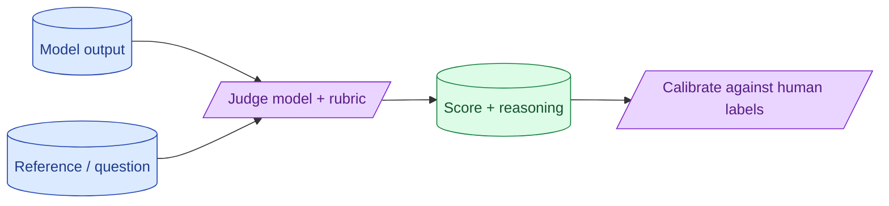

When rules cannot answer 'is this answer good?', a model can. LLM-as-judge is one prompt scoring another model's output. Done well it correlates with human judgement. Done poorly it produces correlated bias and a false sense of progress. The judge is its own product and needs its own evaluation.



## When to reach for a judge vs rules

Reach for a judge when the property you care about cannot be expressed deterministically.

- "Did the explanation cover the key concepts?" — judge.
- "Is the tone appropriate for support?" — judge.
- "Is the answer helpful and accurate?" — judge.

For everything checkable with a rule (schema, presence, length), use the rule. The judge is the expensive layer; rules are the cheap filter.

A common production setup runs rules first, then the judge only on outputs that passed rules. Saves judge calls on broken outputs.

## Picking a judge model: bigger than the system under test

The judge should be at least as capable as the model being evaluated. Otherwise the judge cannot reliably tell good from bad.

A safe rule: use the biggest model you can afford as the judge. If your production model is Claude Sonnet, judge with Claude Opus or GPT-4.5. If production is Haiku, judge with Sonnet.

Same-tier judging (using the same model to judge its own output) introduces a known bias called self-preference. The model tends to favour outputs that match its own style. Use a different model family when possible.

For cost-sensitive cases, a mid-tier model can judge on the cheaper end. Just measure agreement with humans before trusting it.

## Rubric design: clear criteria, calibration examples

A judge needs a rubric. A rubric is the criteria the judge applies.

Bad rubric:

```
Rate this answer from 1 to 5.
```

Good rubric:

```
Rate the answer from 1 to 5 based on these criteria:

5 = Correct and complete. Cites specific facts from the context. No fabrication.
4 = Mostly correct. Minor omissions but no errors.
3 = Partially correct. Has at least one factual error or significant omission.
2 = Mostly incorrect. Multiple errors or unrelated claims.
1 = Entirely wrong or refuses to engage with a valid question.

Examples:
- Answer: "Refunds are 30 days" with context saying 30 days. Score: 5.
- Answer: "Refunds are 30 days" with context saying 14 days. Score: 2.
- Answer: "I do not know" with context that has the answer. Score: 1.

Now rate this answer:
Question: {question}
Context: {context}
Answer: {answer}
Score (1-5):
```

The rubric defines what each score means. Calibration examples anchor the model's judgement.

Good rubrics take iteration. Start broad, see where the judge disagrees with humans, refine the rubric to capture the disagreement.

## Calibrating judge agreement against human labels

A judge is useful only if it agrees with humans. Measure it.

```python
def calibrate(judge_fn, human_labels: list[tuple]) -> dict:
    agree = 0
    for (input, output, human_score) in human_labels:
        judge_score = judge_fn(input, output)
        if abs(judge_score - human_score) <= 1:  # within 1 point on a 5-point scale
            agree += 1
    return {"agreement_rate": agree / len(human_labels)}
```

Target: at least 80% agreement on a 5-point scale (within 1 point).

If agreement is lower, improve the rubric. Add examples for disputed cases. Try a bigger judge. Reduce the score scale (binary vs 5-point is easier).

Without this calibration, the judge could be confidently wrong, and you would trust it.

## Known biases (position, length, self-preference)

LLM judges have specific biases worth knowing.

**Position bias.** When asked to compare two answers, the judge often favours the first one. Mitigate by always shuffling the order, or by running both orderings and averaging.

**Length bias.** The judge often prefers longer, more verbose answers because they appear more thorough. If your system optimises for concision, the judge will fight against it. Mitigate by adding rubric language like "score based on accuracy, not length."

**Self-preference.** When the judge is the same model family as the system, it favours its own style. Mitigate by using a different family for judging.

**Format bias.** A judge sometimes prefers answers in a particular format (markdown, numbered lists). Be specific in the rubric about whether format matters.

Document the biases you have measured. The judge's blind spots are part of using it well.

## A small example

```python
def judge_groundedness(question, context, answer, judge_client) -> int:
    resp = judge_client.messages.create(
        model="claude-3-7-opus",
        max_tokens=200,
        messages=[{
            "role": "user",
            "content": f"""
Rate from 1 to 5 whether the answer is fully supported by the context.

5 = Every claim in the answer appears in the context.
3 = Some claims appear in the context, some are inferences.
1 = The answer contains claims not in the context (hallucination).

Context: {context}
Question: {question}
Answer: {answer}

Reasoning then score (just the number).
"""
        }]
    )
    return parse_score(resp.content[0].text)
```

Run this judge on a sample of production outputs daily. Track the average groundedness score over time. A drop is a quality regression.

## Common mistakes

- **Same model judging itself.** Self-preference bias is real.
- **Small model judging big.** Judge cannot reliably distinguish.
- **Vague rubrics.** "Rate quality 1-5" produces noise.
- **No calibration against humans.** You trust an uncalibrated judge.
- **Forgetting position bias.** A/B comparisons skew toward the first option.
- **Ignoring length bias.** Concise answers get unfairly penalised.

## Quick recap

- Use a judge for properties rules cannot express.
- Judge model should be at least as capable as the system under test. Different family preferred.
- Specific rubric + calibration examples beat vague rating scales.
- Measure judge agreement with human labels. Target 80%+ within 1 point.
- Mitigate position, length, and self-preference biases explicitly.

This concept sits in **Stage 5 (Evaluation)** of the [AI Engineering Roadmap](/practice/ai-engineering/roadmap/).
